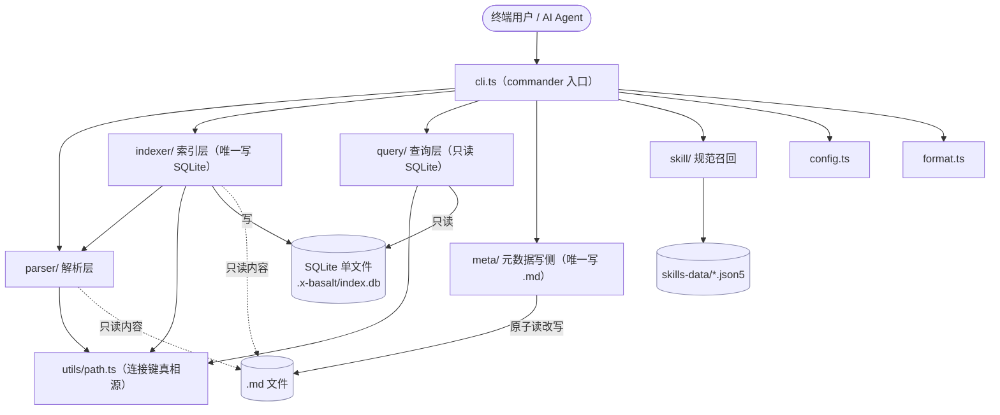
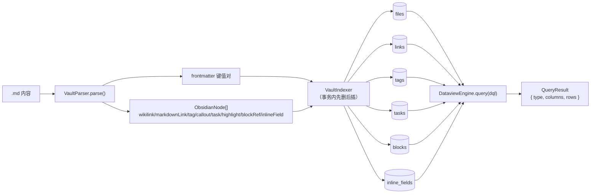
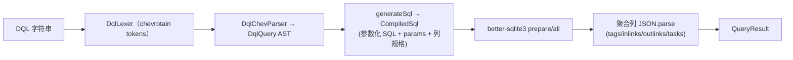
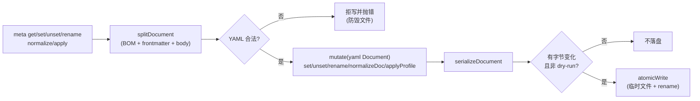
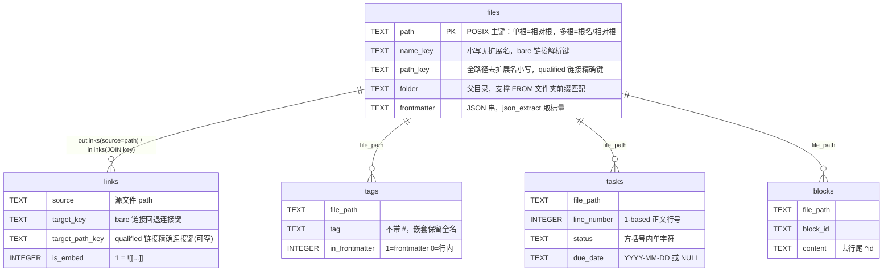

# x-basalt 架构总览

> 目标架构真相源（允许阶段性滞后于实现）。本文是「架构图 + 架构目录」的集中入口。
> 关联：硬约束与目录结构见 [`AGENTS.md`](../../AGENTS.md)；文档路由见 [`docs/README.md`](../README.md)；
> DQL 子集见 [`specs/2026-06-27-dql-subset-frozen.md`](../specs/2026-06-27-dql-subset-frozen.md)；
> meta 写侧子集见 [`specs/2026-06-28-meta-subset-frozen.md`](../specs/2026-06-28-meta-subset-frozen.md)。

## 1. 一句话定位

x-basalt 是**零依赖 Obsidian GUI / 运行时**的 Vault 命令行工具：直接通过文件系统把 Obsidian Markdown
解析为 AST、写入单文件 SQLite 索引、用 Dataview(DQL) 子集查询、按 profile 读改 frontmatter 元数据，并能召回规范 skill。
所有能力都不依赖 Obsidian App、不引入 `obsidian` 包、不启动浏览器。

## 2. 设计约束（决定架构形状的硬边界）

这些约束（见 `AGENTS.md`「项目硬约束」）不是实现细节，而是架构的地基：

| #   | 约束                                                        | 对架构的影响                                                    |
| --- | ----------------------------------------------------------- | --------------------------------------------------------------- |
| 1   | 禁 `import ... from 'obsidian'` / 任何 obsidian 类型        | parser 全自建正则提取，不复用 Obsidian 内部 AST                 |
| 2   | 禁 `obsidian://` URI                                        | 一切操作走 `fs`，无 App 往返                                    |
| 3   | 禁用 `obsidian-dataview` 的 Evaluator/Executor              | query 层自建 DQL→SQL 编译执行（可参考其 AST 类型，执行不依赖）  |
| 4   | 禁 Electron/Puppeteer/Playwright                            | 无 GUI 自动化，纯 Node 进程                                     |
| 5   | 文件操作只经 `fs`/`fs.promises`/`chokidar`                  | I/O 边界收敛在 indexer（读+写 DB）与 meta（写 .md）             |
| 6   | 隐式字段（inlinks/outlinks/tasks…）必须查询期 JOIN 实时计算 | 索引**不物化**反向链接，禁止假设 `app.metadataCache` 等外部缓存 |

## 3. 分层与依赖

六个一级单元，单向依赖、职责互不重叠。CLI 在顶层装配，各库层只做自己的事：



要点：

- **parser 不碰 fs/DB**（纯函数）；**query 不读 .md、只读 DB**；**indexer 是唯一写 DB 的层**；**meta 是唯一写 .md 的层**。
- `utils/path.ts` 是 parser/indexer/query 共用的「连接键真相源」——写入侧与查询侧必须调用同一套 `linkKey`/`pathKey`，否则链接漏命中。
- meta 与 parser/indexer/query **解耦**：写元数据不经过索引，索引也不依赖 meta。

## 4. 读侧数据流：解析 → 索引 → 查询



- parser 编排：`parseFrontmatter → extractWikilinks → 行内 tag/callout/task/highlight/blockRef`，提取 tag/highlight 前先把代码区域**等长掩码**，避免代码块里的 `#`、`==` 被误识。
- callout/highlight 节点**不进索引**（无对应查询字段，仅 `parse` 子命令展示）；frontmatter 的 tags 由 indexer 单独并入 tags 表（`in_frontmatter=1`），parser 不重复产出。

## 5. DQL 编译管线（query 层内部）

自建的 Dataview 子集编译器，把 DQL 字符串编译为**参数化 SQL** 再执行：



不变量：

- **只读**：生产模式以 `readonly` 打开 DB，绝不写表；`:memory:` 仅供测试实例化。
- **防注入**：所有用户输入值走 `?` 占位符绑定；唯一内联是经白名单正则 `^[A-Za-z0-9_]+$` 校验过的 frontmatter 字段名。
- **隐式字段实时 JOIN**：`file.inlinks/outlinks/tags/tasks` 无物化视图，每次查询从 links/tags/tasks 表 JOIN 计算（硬约束 #6）。
- **路径感知（S3.2）**：qualified 链接（含 `/`）按 `path_key` 精确匹配，bare 链接按 `name_key` basename 回退，消除同名异目录串味。
- **越界即报错**：子集外语法 / 不支持字段 → 抛带源串偏移位置的 `DqlSyntaxError`，绝不返回误导性空结果。
- **真值语义对标官方**：WHERE 原子含裸字段真值 `truthy`（`WHERE field`）与一元 `!`（`not(truthy)`）；`generateSql` 用 `json_type` CASE 复刻官方 `Values.isTruthy()`（null/0/空串/空数组/空对象/false 皆 falsy），与显式 `= null`/`!= null`（`IS [NOT] NULL`）语义分离。见 [`../specs/2026-07-01-dql-truthiness-existence-design.md`](../specs/2026-07-01-dql-truthiness-existence-design.md)。

## 6. 写侧数据流：meta 元数据往返



不变量：唯一写 `.md` 的层；非法 YAML 拒写；原子写避免半写损坏；无变化不落盘（不制造虚假 mtime）。
`apply` 中**归一在机械预填之后**执行；profile **只告知不补语义**——机械字段（created/modified/sha256）顺手 top-up，
语义字段（type/title/tags…）由消费者读 `meta profile show` 的规范后经 `--set`/`meta set` 自行补。

## 7. 增量维护：watch 与 scan

两条增量路径共用 indexer 的「先删后插」单文件事务：

- **watch（常驻）**：`chokidar` 监听 → `onAdd/onChange/onUnlink` → `indexer.update()/remove()`；`add/change` 在落库**完成后**才触发 `onEvent` 回调（保证回调看到的索引最新）；监听/单文件失败降级 warn，不崩进程；`awaitWriteFinish` 防编辑器半写。
- **scan（按需）**：`computeDiff`（mtime+size 快判，或 `--rehash` 内容对比）算出新增/改动/删除，分批 (re)build 落库；可中途 break，未写文件下次仍被检出 → 天然断点续扫（无游标）。

## 8. SQLite 数据模型（五表）



隐式字段如何算（查询期 JOIN，不物化）：

- `outlinks` = `links WHERE source = files.path`
- `inlinks` = `links WHERE target_path_key = files.path_key`（qualified）**或** `target_key = files.name_key`（bare 回退）
- `tags` / `tasks` = 对应表按 `file_path` 聚合

## 9. 架构目录（组件清单）

每个一级单元的职责 / 公共出口 / 上游 / 下游 / 关键不变量：

| 单元        | 源                  | 职责                                                        | 公共出口                                                                                              | 上游                   | 下游                                | 关键不变量                                                                            |
| ----------- | ------------------- | ----------------------------------------------------------- | ----------------------------------------------------------------------------------------------------- | ---------------------- | ----------------------------------- | ------------------------------------------------------------------------------------- |
| **cli**     | `src/cli.ts`        | commander 装配 7 命令组，只做参数装配与输出，不内联业务逻辑 | `x-basalt parse/index/scan/query/skills/meta/watch`                                                   | 终端用户 / AI          | 四层库 + config + format            | 逻辑在各层，CLI 不持有状态                                                            |
| **parser**  | `src/parser/`       | 内容 → `ObsidianNode[]`，纯函数零 I/O                       | `VaultParser`、`ObsidianNode`、`ParsedFile`                                                           | indexer                | gray-matter、utils/path             | 不碰 fs/DB；链接类节点含完整文件 line/column/raw；代码区域掩码；inlineField last-wins |
| **indexer** | `src/indexer/`      | 唯一写 SQLite 的边界，全量/增量维护六表                     | `VaultIndexer`(rebuild/scan/scanIter/update/remove/watch/close)、`createSchema`                       | cli、watcher 回调      | parser、better-sqlite3              | 不内联 DQL；隐式字段不物化；links 表写入前去重；先删后插事务；单文件失败跳过          |
| **query**   | `src/query/`        | 自建 DQL 子集 → 参数化 SQL，只读执行                        | `DataviewEngine`(query/close)、`DqlSyntaxError`、`DqlQuery`、`QueryResult`                            | cli                    | better-sqlite3（只读）              | 不读 .md；参数化防注入；隐式字段 JOIN；越界抛带位置错误                               |
| **meta**    | `src/meta/`         | 唯一写 `.md` 的层，frontmatter 读改 + 归一 + profile 套用   | `readMeta`/`editMeta`/`applyProfile`、`set/unset/rename`、`normalizeDoc`、`getProfile`/`listProfiles` | cli                    | yaml、node:fs、node:crypto          | 不碰 SQLite；非法 YAML 拒写；原子写；无变化不落盘；profile 只告知不补语义             |
| **skill**   | `src/skill/`        | json5 加载 + Fuse.js 模糊召回 + 按名取 / 渲染，内置兜底     | `SkillRecall`(list/get/all/recall/resolvedDir)、`loadSkills`、`renderSkill`、`SkillDefinition`        | cli                    | fuse.js、json5、skills-data/\*.json5 | 空目录兜底在 loader；外部目录可 shadow 内置；单文件失败跳过                           |
| **config**  | `src/config.ts`     | cosmiconfig 向上搜 + 全局/项目合并                          | `loadConfig`、`BasaltConfig`                                                                          | cli                    | cosmiconfig、yaml                   | 项目键覆盖全局；解析失败降级 `{}`                                                     |
| **format**  | `src/format.ts`     | 输出序列化 json/yaml                                        | `emit`、`toYaml`                                                                                      | cli                    | yaml                                | 未知 format 静默降级 JSON                                                             |
| **utils**   | `src/utils/path.ts` | 路径归一 + wikilink 连接键真相源                            | `toPosix`、`linkKey`、`pathKey`、`isAssetEmbed`                                                       | parser、indexer、query | node:path                           | 写入侧与查询侧必须共用同一套键函数                                                    |

## 10. 目录映射

```
src/parser/   解析层：内容 → ObsidianNode[]（纯函数）
src/indexer/  索引层：parser → SQLite 五表，chokidar 增量
src/query/    查询层：DQL tokenizer→ast→sql-generator，参数化 SQL
src/meta/     元数据写侧：frontmatter 往返 + CRUD + normalize + profile + 原子写
src/skill/    Skill 召回：json5 加载 + Fuse 模糊匹配 + 按名取 / 渲染 + 兜底
src/utils/    路径与连接键工具
src/cli.ts    commander 入口
skills-data/   运行时 Skill 数据（SkillRecall 加载）
tests/        Node 原生测试 + fixtures/sample-vault
```

## 11. skill 加载 / 召回数据链

`skills` 命令组（`src/cli.ts`）→ `SkillRecall`（`src/skill/index.ts`）→ `loadSkills` / `resolveSkillDir`（`src/skill/loader.ts`）→ 渲染（`src/skill/render.ts`）→ stdout。每次 CLI 调用构造一次 `SkillRecall`、加载一次、查后即用：

1. **目录解析** `resolveSkillDir`：显式 `skillPath`（config）> env `OBSIDIAN_SKILL_PATH` > `~/.obsidian-core/skills`（存在时）> 内置 `skills-data/`（随包发布，`../../skills-data` 上溯两级，src 与 dist 一致）。
2. **加载校验** `loadDir`：读目录下全部 `*.json5` → `JSON5.parse` → 最小校验（须有 `name` + `rules` 数组，否则 warn 跳过，单文件失败不中断）→ `SkillDefinition[]`。
3. **兜底补齐**：`ALWAYS_AVAILABLE`（`obsidian-base-spec` / `x-basalt`）缺失时从内置 `skills-data/` 补回，使基础规范与自我说明书永远可召回；外部目录自带同名则不覆盖（可 shadow）。
4. **召回 / 取数**：构造期建一次 Fuse 索引（`name` 权重 2、`triggers` 权重 1，阈值 0.4）。`recall(kw)` 模糊命中并按相关性排序；`get(name)` 精确取；`all()` 全量；`list()` 取 `name` + `description`；`resolvedDir()` 暴露解析目录。
5. **输出**：读子命令默认经 `renderSkill` / `renderSkills` / `renderSkillList` 渲染为可读 Markdown；`--json` 改走 `emit` 输出结构化 JSON。`get` 未命中 / `recall` 空 → 打印 `✗` + 退出码 1。

## 12. 现状与边界（截至 2026-06-28）

- 读侧（parser/indexer/query/skill/cli）+ 写侧（meta：CRUD/normalize/profile-apply，三套 profile）均已落地，272 测试绿，处于 dogfood 观察期。
- 待 dogfood 暴露真实需求再开的方向（migrate 批量改造、lint schema 校验、watch pipeline 常驻管线）见 [`TODO.md`](../../TODO.md)。
