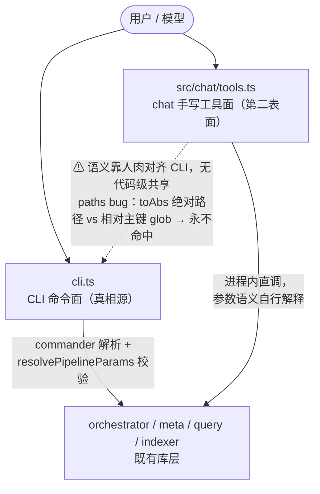
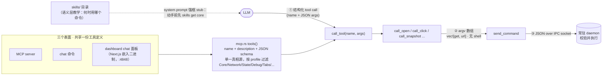

# chat 单 CLI 工具面迁移依据与执行记录

> 归档于 2026-10-02；来源：[docs/design/chat-tool-surface.md](../../design/chat-tool-surface.md) 的下列原章节。仅保留当时过程、提案或观察，不代表当前实现；有效契约与后续义务以来源文档及根 TODO 为准。

保留来源章节的原读数、旧选择与纠偏经过；章节中的“当前”“待实施”均按原阶段基线阅读，不作为归档后的新授权。

## 1. 迁移前的问题：chat 曾手工维护第二张能力表面

- CLI 面的参数语义集中在 `src/orchestrator/params.ts`（`resolvePipelineParams`，声明期报错）；chat 面在 `tools.ts` 里**重新解释**同一批参数（`toAbs`、默认值、源选择）。
- CLI 加能力 → chat 要人工跟进；跟漏、跟错都无声无息。`paths` 在 CLI 里是 glob 路由过滤（文件列表源归 `--stdin`），chat 包装层把它理解成「文件列表」——双重错位，模型一传就静默零处理。
- skills 侧（`skills-data/core.json5`）教的是 CLI 用法，和 chat 工具面描述的又是第三份近似表述。

## 2. 对标：agent-browser 怎么做（chat 与 dashboard）

可迁移的四条纪律（deepwiki 两源核实，调用链以 `call_tool → handler → argv 数组 → send_command → daemon` 为准）：

1. **schema 单一真相源**：`tools()` 一处定义 name/description/JSON schema，MCP、chat、dashboard 三面共享；`McpConfig` 按 profile 过滤暴露子集。不存在第二张手写表面。
2. **模型不见 shell**：LLM 产出结构化 tool call，handler 拼 **argv 数组**直接分发——跨平台不是「教两套引用规则」，而是引用问题不存在。
3. **skills 管语义、schema 管参数**：skills（`skills get core`）教「什么时候用哪个命令」；参数校验是代码层的 JSON schema + 结构化 `ParseError`（UnknownCommand/MissingArguments/InvalidValue），不靠文档防漂移。
4. **容错在分发层**：瞬时错误重试 5 次（200ms 递增退避），daemon 不可达则 `ensure_daemon` 重生——模型侧只看到干净的结构化错误。

> x-basalt 无 daemon，等价物是：spawn `execFile(process.execPath, [cli.js, ...argv])`（参数数组、无 shell），或把 CLI 命令实现抽成库函数进程内分发。两者都满足纪律 2。
>
> **补充实证（2026-07-30 deepwiki）**：agent-browser 的 chat 会话甚至只暴露**一个**工具——`CHAT_TOOLS` 常量定义单个 `agent_browser` 工具（入参一条 `command` 字符串，由 CLI 解析执行）。「全部能力收一个执行口」不是 x-basalt 的激进发明，而是对标库的既验形态；这也顺带解释了它的防递归：模型词表里根本没有能起新 AI loop 的入口（详见 §5）。

## 4. 执行序列（一次到位，四步有先后、无并存）

1. **前置 · CLI 输出契约统一**：全命令 `--json`；统一分页（`offset/size/total/hasMore`）；错误结构化（错误码 + 消息，非零 exit code 分类）。这是唯一起点，契约不齐时切换 = 模型观察面退化。
2. **chat 侧新增 `cli` 工具**：input `{ args: string[] }` → `execFile(process.execPath, [cliEntry, ...args])`；`--vault/--db` 由工具壳注入；超时 + 子命令 allowlist；stdout/stderr 过 `observe(safety, …)`（边界包裹 + 8000 字符截断留在薄壳，**不需要 CLI 本体感知 AI**）。
3. **删除手写工具面、保留 `tools.ts` 框架**（2026-07-30 用户拍板 + 评估确认）：删的是 `buildTools` 里那 ~14 个手写工具定义（schema + execute 全套，约 360 行）；**留的是框架**——`buildTools(ctx, safety)` 装配点（`loop.ts` 的消费签名不变，loop/repl 零改动）、`observe` safety 输出处理、`wrapToolErrors` 错误分类外壳、RECALL 追踪机制（改为解析 `args` 子命令）。「腾出空间」指的是 **ToolSet 条目从 ~14 个收编为个位数**，不是删文件——框架正是未来 AI-native 工具的注册缝。`cli` 工具实现放独立模块（如 `src/chat/cli-tool.ts`），`tools.ts` 只剩装配；`skills_get`/`skills_recall` 保留为独立工具（grounding 是最高风险的第一步，且它们是「模型说明书」元工具、非 vault 能力面——agent-browser 的 `TOOL_SKILLS_GET` 同样单列）。`tool-errors.ts` 分类改为「exit code + stderr 结构化错误」驱动。
4. **回归验证**：用独立场景库在切换前后各跑一遍，对比操作失败率 / 撞顶率——大爆炸切换的质量回归由此兜底（这是「敢直接切」的前提，不是可选项）。

顺手项：`paths` bug 随工具面删除自然消亡——文件列表语义归 CLI 的 `--stdin` 源（或给 `run` 补显式 `--paths` 源），不再有 chat 层 `toAbs`。

## 整理前导言（历史上下文）

# chat 工具面架构：单一真相源评估（对标 agent-browser）

> 初始讨论：2026-07-30；当前单 CLI 工具面已实现，2026-09-30 补充职责与投入边界。
> **实现状态：✅ 已落地（2026-08-03，计划 [2026-08-03-chat-cli-tool.md](../plans/2026-08-03-chat-cli-tool.md)）**——`src/chat/cli-tool.ts` 单工具 + `tools.ts` 收编为 { cli, skills_recall, skills_get } + `X_BASALT_CHAT_CHILD` 防递归。
> 触发：chat 审查实锤 `pipeline_run` 的 `paths` 参数静默失效（`src/chat/tools.ts:467` 把模型给的路径 `toAbs` 成绝对路径，喂给匹配**相对主键**的 glob 路由过滤 `src/orchestrator/route.ts:53`，永不命中）——根因不是某行代码写错，而是 chat 手工维护着第二张能力表面，语义靠人肉对齐 CLI，必漂移。
> 关联：[chat 读写机制](../../design/chat-readwrite.md)、[chat skill grounding](../../design/chat-skill-grounding.md)、对标调研 [`../research/2026-06-30-chat-gap-vs-agent-browser.md`](../research/2026-06-30-chat-gap-vs-agent-browser.md)。
