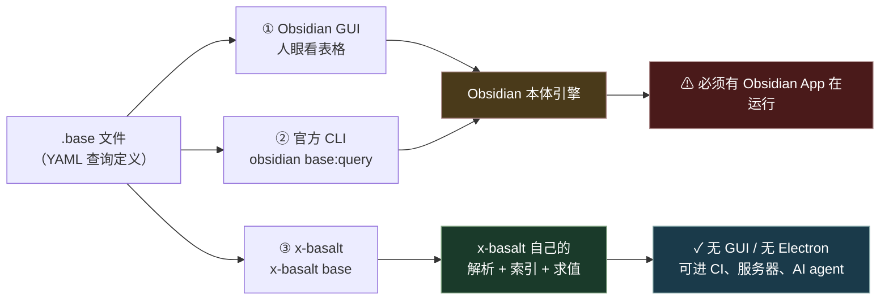
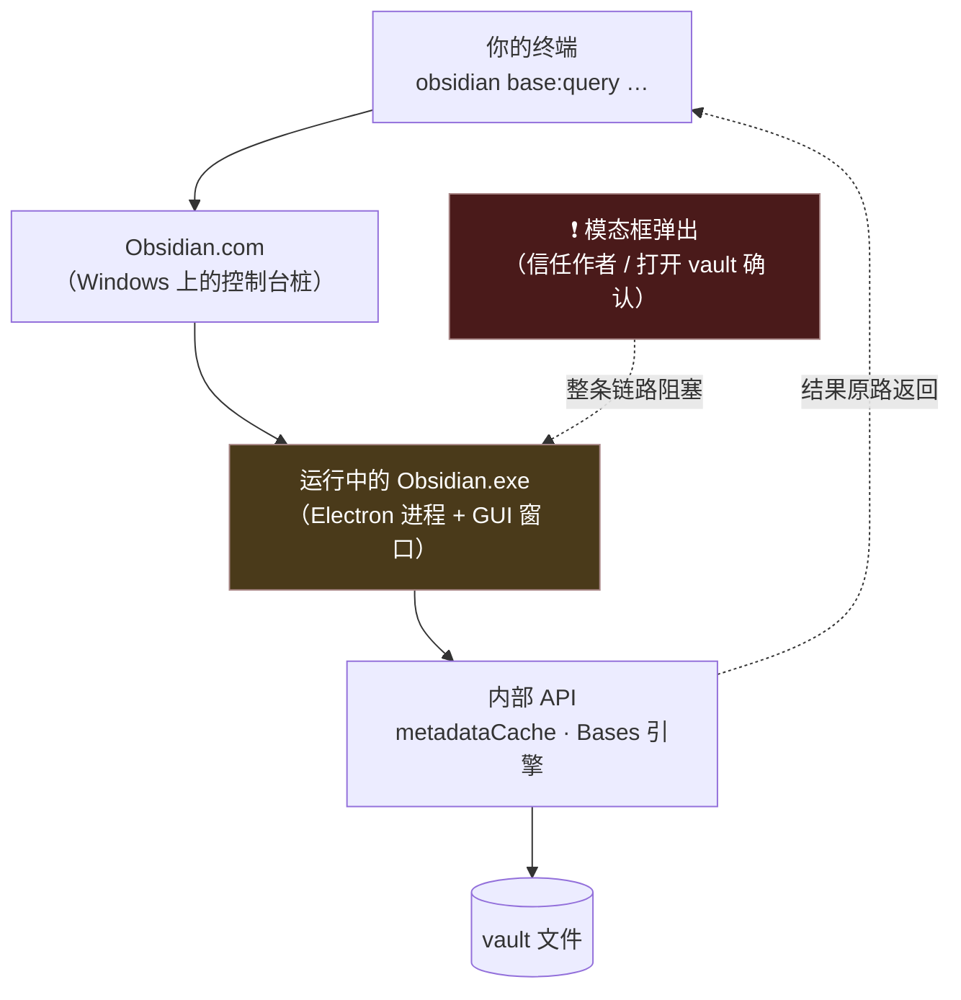
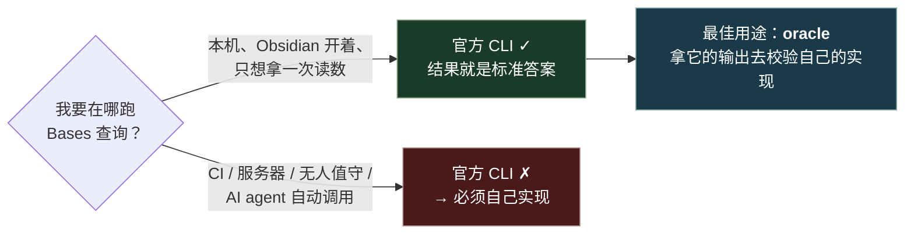
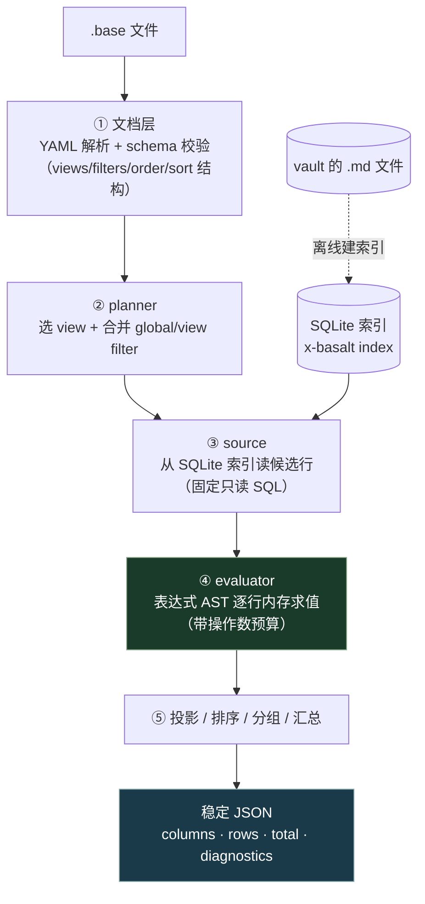
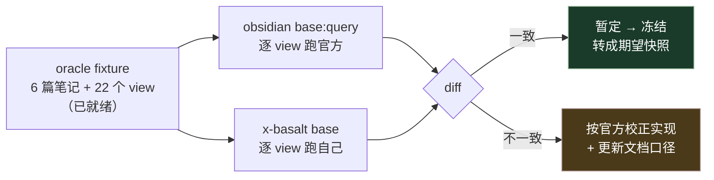

# Bases · 官方怎么做 / 我们怎么做

> **这份讲原理，不讲怎么用。** 想用 → [Bases 使用指南](../use/bases.md)。
>
> 回答三件事：官方 Obsidian 是怎么实现 Bases 查询的、x-basalt 为什么选另一条路、这条路能换来什么。

---

## 0. 一分钟版本

Obsidian **Bases** 是官方内建的「把笔记当数据库查」的功能。查询不写在代码里，而是写成一个 `.base` 文件（纯 YAML）——里面声明"筛哪些笔记、显示哪几列、怎么排序分组"。

同一个 `.base`，有三条路可以跑出结果：



①②走的是**同一个引擎**——官方 CLI 只是给运行中的 App 发遥控指令。真正独立的实现只有③。

**一句话结论**：官方 CLI 是最权威的**语义裁判**（它就是引擎本身），但不是可用的**运行时**（离不开 GUI 进程）。x-basalt 存在的全部理由，就是把 Bases 查询从 GUI 里解放出来——代价是语义要自己对齐。

---

## 1. 官方是怎么实现的

### 1.1 Bases 本体：笔记就是表

一句直觉：**每篇笔记是一行，frontmatter 的每个属性是一列。**

```markdown
---
status: 进行中          ← 这是一列
priority: 2             ← 这是一列
due: 2026-08-10
---
# 登录改版             ← 笔记本身是一行
```

`.base` 文件就是这张表的查询定义：

```yaml
views:
  - type: table
    name: 进行中的高优项
    filters: status == "进行中" and priority <= 2
    order:                       # order = 选哪几列显示
      - file.name
      - due
    sort:
      - property: due
        direction: ASC
```

官方定位很明确：Bases 是**内建核心插件**，用来接替社区插件 Dataview。区别在于 Dataview 写的是类 SQL 的查询语句（DQL），Bases 写的是结构化 YAML——后者更适合被工具读写，也更适合 GUI 编辑器生成。

`.base` 既可以是独立文件，也可以嵌在 Markdown 的代码块里。

### 1.2 官方 CLI 的真实架构

Obsidian 1.12（2026-02）开始随桌面版附带官方 CLI，100+ 命令，在 `设置 → 通用 → 命令行界面` 里打开。

关键在于**它不是无头工具**。官方文档原话：*"Note that the Obsidian app must be running."*



也就是说：**CLI 是 GUI 的遥控器，不是 GUI 的替代品。** 它读到的数据 100% 是 Obsidian 自己的读数——这正是它的价值，也正是它的天花板。

### 1.3 base 相关的三条命令（本机实测 `obsidian help`）

| 命令 | 作用 | 参数 |
|---|---|---|
| `base:query` | **查一个 base 并返回结果** | `file=<名>` / `path=<路径>` / `view=<view 名>` / `format=json\|csv\|tsv\|md\|paths`（默认 json） |
| `base:views` | 列出某个 `.base` 里的所有 view | `file=` / `path=` |
| `base:create` | 在 base 里新建一条（=建一篇笔记） | `file=` / `path=` / `view=` / `name=` / `content=` / `open` / `newtab` |
| `bases` | 列出 vault 里所有 `.base` 文件 | — |

用法形如：

```bash
obsidian base:query vault=my-vault path=views/projects.base view=Active format=json
```

参数是 `key=value`，flag 是裸词。

### 1.4 官方输出长什么样（2026-07-28 实测）

在一个真实 vault 里放这个 `.base`：

```yaml
views:
  - type: table
    name: areas
    filters: type == "area"
    order: [file.name, type]
    sort:
      - property: file.name
        direction: ASC
```

跑 `obsidian base:query format=json`，官方吐出来的是：

```json
[
  { "path": "areas/工作领域.md", "名称": "工作领域", "type": "area" },
  { "path": "areas/学习领域.md", "名称": "学习领域", "type": "area" }
]
```

三个关键差异，都会咬人：

| 观察 | 说明 |
|---|---|
| **裸数组，没有信封** | 没有 `total`、没有诊断、没有 conformance/版本标记。查询出错和查询命中 0 行，从输出上分不出来 |
| **列名是本地化显示名** | `file.name` 出来是 `"名称"`——**跟着界面语言变**。英文界面下会变成 `"Name"`。拿它做快照比对，换个语言就全红 |
| **`path` 是恒附加的** | 没在 `order` 里写，它照样出现 |

这也解释了 x-basalt 为什么不复刻官方输出字节：**官方 JSON 不是稳定 schema**，它是 UI 表格的序列化。

### 1.5 五个必须知道的坑（全部实测撞到）

**坑一：vault 按「名字」定位，不是路径。**
所有场景库的文件夹都叫 `vault` 的话，命令会打到最近聚焦的那一个上。不带 `vault=` 就是"当前活跃 vault"。实测：注册了一个新 vault 后发 `vault=oracle-vault`，命令静默打到了另一个库上，返回 `No base files found` ——**不报错，只是答非所问**。这类静默串库是自动化里最阴的失败。

**坑二：App 一旦弹模态框，CLI 整个挂死。**
实测 `obsidian vault` 这条最简单的命令直接超时无返回，因为 Obsidian 那边有个"信任作者/打开 vault"的确认框在等人点。没有超时，没有错误码，就是挂着。**官方 CLI 无法无人值守**——任何流水线都可能被一个弹窗卡到天荒地老。

**坑三：必须先有 GUI 环境。**
Windows 上 `obsidian` 解析到安装目录的 `Obsidian.com`（控制台桩）。没装 Obsidian、没有显示器的服务器、CI runner、Docker 容器里——这条路根本不存在。

**坑四：`base:query` 查的是「当前打开的那个 base」，`path=` 不足以定位。**
只发 `obsidian base:query path=x.base` 会得到**空输出**——不报错、不提示。必须先 `obsidian open path=x.base` 把它在界面里打开，查询才有结果。help 里 `base:views` 的描述其实已经说了：*"List views in the **current** base file"*。

**坑五：不可重复。**
同一串命令（`open` → `base:views` → `base:query`），第一次拿到了完整结果；紧接着原样重放，`base:views` 照常返回 view 列表，`base:query` **却返回空**。加延时、重新 `open`、显式带 `view=` 都试过，都是空。

坑五最致命：**它意味着官方 CLI 的 base 查询不是一个函数，而是一次对 UI 状态的采样。** 同样的输入不保证同样的输出——这对"当自动化 oracle 用"是个硬伤，跑差分时必须逐条人工确认拿到了非空结果，不能信任批处理的退出码。

### 1.6 所以官方 CLI 该被用在哪



这条判断是 x-basalt 整个 Bases 模块的立项前提：**官方 CLI 进 oracle，不进运行时依赖。**

---

## 2. 我该怎么实现

### 2.1 全景流水线

自己实现意味着不碰 Obsidian 一行代码，从 `.base` 文本一路算到结果 JSON：



要点：**SQLite 只负责"取哪些候选行"，所有 Bases 语义都在内存求值层。** 因为 Bases 的类型系统（Date/Link/List/duration）和 truthiness 规则跟 SQL 的不一样，硬塞进 SQL 会在边界上失真。

### 2.2 六个关键决策，和为什么

| 决策 | 为什么 | 反面案例 |
|---|---|---|
| **独立的表达式 AST**，不复用 DQL 那套 | Bases 和 DQL 是两门语言：`status == "x"` 在两边的类型提升、null 语义都不同 | 复用 = 一边改语义另一边悄悄坏掉 |
| **不用 `eval`** | `.base` 是用户/第三方可写的输入，`eval` 等于把 vault 交出去 | 属性名走白名单，不进 SQL 字符串 |
| **只读，永不写回** | 不改用户 `.base`、不写 `.obsidian/types.json` | 「自动升级旧 base」听着贴心，实际是不可逆的数据损坏面 |
| **版本化 conformance**，不吹"完整兼容" | 官方语义会变，且大半没有公开规范 | 输出里恒带 `conformance: bases-markdown-2026-07`，别人一看就知道口径 |
| **诊断而不是静默** | 不支持的写法必须报出来 | `order` 里有非法项就报错，不能悄悄少一列 |
| **官方 CLI 只当 oracle** | 见 §1.6 | 用官方 CLI 兜底执行 = 把 GUI 依赖偷渡进产品 |

### 2.3 一个具体例子，走完全程

拿仓库里的 oracle fixture 实跑（`tests/fixtures/bases/oracle/`）。笔记 `CaseA.md`：

```markdown
---
explicit_null: null
empty_str: ""
zero: 0
false_prop: false
empty_list: []
sortable: null
---
```

查询 `truthiness.base` 的一个 view：

```yaml
- type: table
  name: truthy-zero
  filters: zero          # 裸属性作条件 —— 0 算真还是假？
  order: [file.name]
```

跑：

```bash
x-basalt index tests/fixtures/bases/oracle --db /tmp/oracle.db
x-basalt base tests/fixtures/bases/oracle/views/truthiness.base \
  --view truthy-zero --vault tests/fixtures/bases/oracle --db /tmp/oracle.db
```

输出（实测）：

```json
{
  "conformance": "bases-markdown-2026-07",
  "base": "views/truthiness.base",
  "view": "truthy-zero",
  "columns": ["file.name"],
  "total": 0,
  "rows": [],
  "diagnostics": [
    { "rule": "base/markdown-only-dataset", "severity": "warning",
      "message": "本次查询为 md-only conformance：仅 Markdown 笔记作为行…" },
    { "rule": "base/default-sort-tiebreak", "severity": "info",
      "message": "view 未显式 sort：按 file.path ASC 稳定排序（x-basalt 扩展，非官方 Bases 语义）" }
  ]
}
```

三个可以直接学走的设计点：

1. **`total` 与 `rows` 分离** —— `total` 是 limit 前的行数，翻页时不用重查。
2. **`diagnostics` 是一等公民** —— 「这次用的是 md-only 数据集」「这个排序是我自己加的、不是官方语义」都明说。**凡是自己的扩展，都要在输出里承认**，否则用户会把你的行为当成官方行为。
3. **退出码有语义** —— 有 `error` 级诊断则退 1（`rows` 仍为空数组输出完整 JSON），只有 warning/info 退 0。这让 `x-basalt base` 在 CI 里可以直接当 `.base` 语法检查器用。

### 2.4 现在做到哪了

| 阶段 | 内容 | 状态 |
|---|---|---|
| P0 | 文档层：YAML + schema + 诊断 + 源码位置 | ✅ |
| P1 | 查询主路径：filter / 属性引用 / file 字段 / order / sort / limit | ✅ |
| P1 收口 | `x-basalt base` CLI + guides | ✅ |
| P2a | formulas：类型化值 + 算术 + 依赖图 + 循环检测 + `today`/`now` | ✅ |
| P2b | `types.json` / 列表高阶函数 / groupBy / summaries | ✅ |
| P3a | 附件数据集（all-files 模式：图片/PDF/canvas 也作为行） | ✅ |
| **P1 oracle** | **与官方比对，冻结 9 项争议语义** | **❌ 未做 ← 唯一空缺** |
| P3 余项 | embedded code block / `contextFile` / `this` | 🔜 未开 |

793 个测试全绿，四门（typecheck / lint / format / test）全过。

---

## 3. 能达到什么效果

### 3.1 官方做不到、这里能做的三件事

| 场景 | 官方 CLI | x-basalt |
|---|---|---|
| CI 里把 `.base` 当查询跑，结果不对就红 | ✗ 需要 GUI 进程 | ✓ `x-basalt base` 退出码即断言 |
| 服务器/容器里定时导出报表 | ✗ | ✓ 纯 Node，无 Electron |
| AI agent 直接调用拿结构化数据 | △ 能跑但会被弹窗挂死 | ✓ 稳定 JSON 契约，可编排 |
| 一次查询里跑 22 个 view 做差分 | ✗ 必须串行、要人盯着 | ✓ 脚本批量 |
| 同样输入拿到同样输出 | ✗ 不保证（§1.5 坑五） | ✓ 字节稳定（同 DB + base + clock 重跑全等） |
| 拿到 **100% 正确**的官方语义 | ✓ 它就是标准答案 | ✗ 需 oracle 校正 |

最后一行是诚实的短板，也正是 §3.3 要讲的。

输出契约的差距，同一个查询并排看：

| | 官方 `base:query` | `x-basalt base` |
|---|---|---|
| 形状 | 裸数组 | 带信封的对象 |
| 行数 | 只能 `length` | `total`（limit 前）+ `rows` |
| 列名 | 本地化显示名（`名称` / `Name`，跟界面语言变） | 表达式原文（`file.name`） |
| 版本标记 | 无 | `conformance: bases-markdown-2026-07` |
| 出错时 | 空数组，与"0 行命中"无法区分 | `diagnostics[]` + 退出码 1 |
| 自有扩展 | — | 在 `diagnostics` 里显式承认（如默认 tie-break） |

### 3.2 实测读数

```
# 8 个 truthiness view（CaseA 六种 falsy 形态）
truthy-missing        -> 0 行   []
truthy-explicit-null  -> 0 行   []
truthy-empty-string   -> 0 行   []
truthy-zero           -> 0 行   []
truthy-false          -> 0 行   []
truthy-empty-list     -> 0 行   []
eq-missing-null       -> 0 行   []           ← missing == null 判否
eq-explicit-null-null -> 1 行   [CaseA.md]   ← 显式 null == null 判真
```

读出来的口径：`missing`（属性根本不存在）和 `null`（写了 `x: null`）**是两回事**。六种 falsy 形态（missing / null / `""` / `0` / `false` / `[]`）都判假。

性能（1 / 100 / 10,000 篇笔记）：11ms / 4ms / 68ms。万篇级不需要把过滤下推到 SQL。

### 3.3 唯一的软肋：9 项语义是「暂定」的

这 9 项目前**能跑、有测试锁着，但从没和官方比对过**：

| # | 争议点 | x-basalt 暂定口径 |
|---|---|---|
| ① | missing / null / `""` / `0` / `false` / `[]` 的真假 | 全部为假；missing ≠ null |
| ② | 多键 sort 里 null 排哪 | **见下方警告** |
| ③ | 空 filter 数组 `and: []` | 直接拒绝，报 unsupported |
| ④ | `if()` 是否惰性求值 | 惰性 |
| ⑤ | date 与 datetime 跨精度比较 | 严格 ISO 推断，统一 epoch 比较 |
| ⑥ | frontmatter 里的 `[[wikilink]]` | 转成 Link 值，路径感知相等 |
| ⑦ | 声明类型与实际值冲突 | 行级 warning，按运行时类型参与 |
| ⑧ | groupBy 用 list/link 当键 | 拒绝 |
| ⑨ | `"2026-01-01" + " 备注"` 是拼接还是日期运算 | 报类型错误（日期推断对 `+` 也生效） |

> ⚠️ **第 ② 项存在文档与实现不一致（2026-07-28 实测发现）**
>
> `docs/design/bases-status.md` §3 写的是「null/missing **恒排最后，与方向无关**」。
> 实跑 `sort-null.base`：
> ```
> sort-asc  -> [B:1, C:2, A:null, D:null, E:null, F:null]   null 在后 ✓
> sort-desc -> [A:null, D:null, E:null, F:null, C:2, B:1]   null 在前 ✗
> ```
> 根因在 `src/base/engine.ts:571`：`sortKeyCompare` 是恒 ASC 语义（null 排名靠后），DESC 时整体取反 `-c`，**null 的排名差也一起被翻转**。
> 所以真实口径是「null 参与方向翻转」，不是「恒排最后」。修不修取决于官方是哪一种——**这正是必须跑 oracle 的原因**：没有裁判，连"实现和文档谁对"都判不了。

### 3.4 怎么把软肋消掉



材料全部就位：fixture 在 `tests/fixtures/bases/oracle/`，操作手册在 [oracle runbook](bases-oracle-runbook.md)。

**一条需要修正的判断**：TODO 里写着 oracle「需要人工串行跑、**AI 侧做不了**」。这句话在官方 CLI 出现前成立，现在只对了一半——

- ✅ **能自动化的部分**：`obsidian base:query format=json` 可以从脚本调用，输出可直接 diff（`x-basalt-evals/parity/ob-cli-truth.mjs` 已经在用同样方式取官方读数）。
- ❌ **仍然自动化不了的部分**：坑四要求每个 base 先 `obsidian open`；坑五意味着**同一命令重放可能返回空**。所以差分脚本必须逐条校验"这次真的拿到非空结果"，拿不到就重试或转人工——不能信任批量退出码。

**准确的说法**：oracle 是**半自动**的——脚本负责跑和比对，人负责盯住空结果。比"纯人工点 22 个 view"省事得多，但不是无人值守。

---

## 4. 怎么拿官方读数做对照

x-basalt 侧的命令见[使用指南 §4](../use/bases.md#4-怎么跑)。要取官方读数（做 oracle 或排查差异）：

```bash
# 前置：Obsidian 1.12+ 且 设置 → 通用 → 打开命令行界面；App 必须在跑且已打开目标 vault
obsidian bases                                   # 列出所有 .base
obsidian open path=views/projects.base           # ★ 必须先 open，否则 base:query 返回空（§1.5 坑四）
obsidian base:views                              # 列出当前 base 的 view
obsidian base:query format=json                  # 查当前 base
```

⚠️ 拿不到结果时先按这个顺序排查：App 在跑吗 → 目标 vault 是活跃的吗（坑一）→ base 文件 `open` 了吗（坑四）→ 重放一次（坑五，同一命令可能时灵时不灵）。

---

## 5. 外部信源

- [Obsidian Bases 官方文档](https://obsidian.md/help/bases) —— Bases 本体、views/filters/formulas/functions/语法
- [Obsidian CLI 官方页](https://obsidian.md/cli) —— 架构说明（"the Obsidian app must be running"）、命令总览
- 本机 `obsidian help` —— 命令与参数的实测真相源（本文 §1.3 表格即由此实测得到）
</content>
