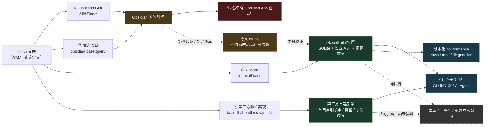
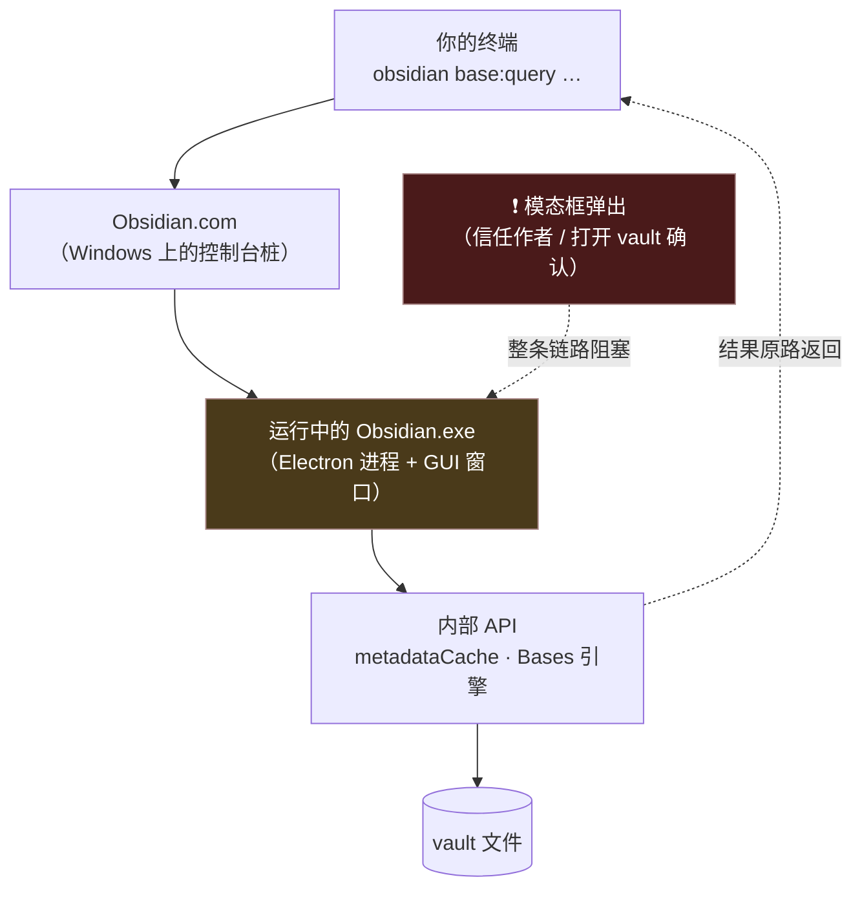
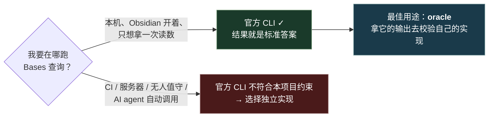
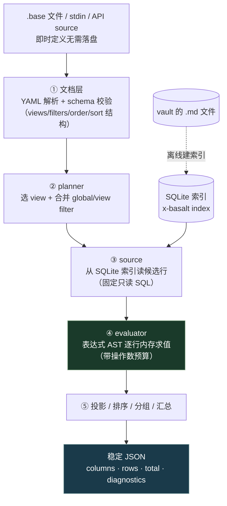
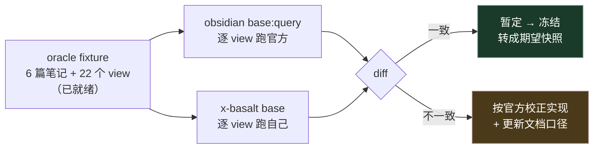

# Bases · 官方怎么做 / 我们怎么做

> **这份讲原理，不讲怎么用。** 想用 → [Bases 使用指南](../use/bases.md)。
>
> 回答三件事：官方 Obsidian 是怎么实现 Bases 查询的、x-basalt 为什么选另一条路、这条路能换来什么。

---

## 0. 一分钟版本

Obsidian **Bases** 是官方内建的「把笔记当数据库查」的功能。查询定义是 YAML——可以保存在 `.base`，也可内嵌 Markdown `base` 代码块；其中声明“筛哪些文件、显示哪些列、怎么排序分组”。官方专用 CLI 的文件/视图入口与本项目正文入口不是同一回事，见[局部调研](../research/2026-10-01-dql-bases-compatibility-local-audit.md)。

同一个 `.base`，下图比较官方 GUI、官方 CLI 与 x-basalt 三条执行路径；它不是独立实现的完整清单：


```mermaid
flowchart LR
    B[".base 文件<br/>（YAML 查询定义）"]

    B --> G["① Obsidian GUI<br/>人眼看表格"]
    B --> C["② 官方 CLI<br/>obsidian base:query"]
    B --> X["③ x-basalt<br/>x-basalt base"]
    B --> T["④ 第三方独立实现<br/>basecli / headless-vault-kit"]

    G --> GE["Obsidian 本体引擎"]
    C --> GE
    X --> XE["x-basalt 自建引擎<br/>SQLite + 独立 AST + 预算求值"]
    T --> TE["第三方自建引擎<br/>各自声明子集 / 类型 / 诊断边界"]

    GE --> NEED["⚠ 必须有 Obsidian App 在运行"]
    XE --> FREE["✓ 独立无头执行<br/>CI / 服务器 / AI Agent"]
    TE --> FREE
    XE --> CONTRACT["版本化 conformance<br/>rows / total / diagnostics"]
    GE -. 受控取证 / 指定版本 .-> ORACLE["语义 oracle<br/>不作为产品运行时依赖"]
    ORACLE -. 差分校正 .-> XE
    TE -. 共同子集，尚未实测 .-> COMPARE["兼容 / 完整性 / 部署成本对照"]
    XE -. 待执行 .-> COMPARE

    style TE fill:#1a3a2a,stroke:#8a8,color:#fff
    style CONTRACT fill:#1a3a4a,stroke:#8aa,color:#fff
    style ORACLE fill:#4a3a1a,stroke:#a88,color:#fff
    style COMPARE fill:#333,stroke:#aaa,color:#fff,stroke-dasharray:5 5
    style GE fill:#4a3a1a,stroke:#a88,color:#fff
    style XE fill:#1a3a2a,stroke:#8a8,color:#fff
    style NEED fill:#4a1a1a,stroke:#a88,color:#fff
    style FREE fill:#1a3a4a,stroke:#8aa,color:#fff
```

①②走的是**同一个引擎**——官方 CLI 控制桌面 App；③④各为独立实现。图中实线表示公开执行路径，虚线表示语义校正或待执行对照；第三方路径的来源与限制见 §0.1。官方 CLI 的 App 依赖见[固定版本官方帮助](https://github.com/obsidianmd/obsidian-help/blob/9cf8c2913e56830e75c13f33ba198d7e70b6d9ef/en/Extending%20Obsidian/Obsidian%20CLI.md)。

**一句话结论**：官方 App 引擎是受控语义对照来源，但官方 CLI 不符合本项目的无头运行时约束。x-basalt 提供独立的查询、诊断与版本化边界；是否更适合实际任务，应通过兼容性与运维对照验证，不能仅凭无 GUI 推导优势。

### 0.1 业界对照更新（2026-09-30）

- **官方 Headless 不等于官方 Bases 无头引擎**：公开 Services 列 Sync/Publish，并明确区别于控制桌面 App 的 CLI；目前没有据此证实其提供 Bases/DQL 执行。信源：[固定版本 Headless 官方帮助](https://github.com/obsidianmd/obsidian-help/blob/9cf8c2913e56830e75c13f33ba198d7e70b6d9ef/en/Extending%20Obsidian/Obsidian%20Headless.md)。
- **已有第三方独立实现**：`basecli` 提供只读 Bases、公式/分组/汇总，但声明不读属性类型配置、存在日期推断等偏差；见[README](https://github.com/hobbs/basecli/blob/ebf409d798c637c86430739f13e1e6b585c5e22c/README.md)与[LIMITATIONS](https://github.com/hobbs/basecli/blob/ebf409d798c637c86430739f13e1e6b585c5e22c/LIMITATIONS.md)。`headless-vault-kit` 提供 SQLite Vault 索引、Bases/DQL 子集与 MCP，成熟度限制由作者明确登记；见[README](https://github.com/angelsaez/headless-vault-kit/blob/f158bd8e8236efabb96505eea701cc204fe42b37/README.md)与[ROADMAP](https://github.com/angelsaez/headless-vault-kit/blob/f158bd8e8236efabb96505eea701cc204fe42b37/docs/ROADMAP.md)。
- **尚未实测等价性**：上述工具应加入共同支持子集的差分对照，不因此替换本项目 oracle 或声称已完整兼容。评估协议见[最新调研 §9](../research/2026-09-30-agent-knowledge-industry-landscape.md#9-下一步实验可复现能推翻建议)。

下文 2026-07/08 的本机读数保留为版本化观察，不视为对当前所有官方版本的保证。

---

## 1. 官方是怎么实现的

### 1.1 Bases 本体：笔记就是表

一句直觉：**每篇笔记是一行，frontmatter 的每个属性是一列。**

```markdown
---
status: 进行中          ← 这是一列
priority: 2             ← 这是一列
due: 2026-08-10
---
# 登录改版             ← 笔记本身是一行
```

`.base` 文件就是这张表的查询定义：

```yaml
views:
  - type: table
    name: 进行中的高优项
    filters: status == "进行中" and priority <= 2
    order:                       # order = 选哪几列显示
      - file.name
      - due
    sort:
      - property: due
        direction: ASC
```

官方定位是**内建核心插件**，用于数据库式文件/属性视图；本轮未取得“接替 Dataview”的明确官方宣言，不能据此决定削减 DQL。DQL 与 Bases 分别使用文本查询和 YAML 定义，但差异不止序列化：任务行、inline fields、行展开与类型化公式各有职责。信源：[官方介绍](https://github.com/obsidianmd/obsidian-help/blob/9cf8c2913e56830e75c13f33ba198d7e70b6d9ef/en/Bases/Introduction%20to%20Bases.md)、[局部能力矩阵](../research/2026-10-01-dql-bases-compatibility-local-audit.md#4-双路线各补什么不要把上游-dql-能力算到本项目头上)。

`.base` 既可以是独立文件，也可以嵌在 Markdown 的代码块里。

### 1.2 官方 CLI 的真实架构

Obsidian 1.12（2026-02）开始随桌面版附带官方 CLI，100+ 命令，在 `设置 → 通用 → 命令行界面` 里打开。

关键在于**它不是无头工具**。官方文档原话：*"Note that the Obsidian app must be running."*


```mermaid
flowchart TB
    T["你的终端<br/>obsidian base:query …"]
    S["Obsidian.com<br/>（Windows 上的控制台桩）"]
    A["运行中的 Obsidian.exe<br/>（Electron 进程 + GUI 窗口）"]
    API["内部 API<br/>metadataCache · Bases 引擎"]
    V[("vault 文件")]

    T --> S --> A --> API --> V
    API -.->|结果原路返回| T

    M["❗ 模态框弹出<br/>（信任作者 / 打开 vault 确认）"]
    M -.->|整条链路阻塞| A

    style A fill:#4a3a1a,stroke:#a88,color:#fff
    style M fill:#4a1a1a,stroke:#a88,color:#fff
```

也就是说：**CLI 是 GUI 的遥控器，不是 GUI 的替代品。** 它读到的数据 100% 是 Obsidian 自己的读数——这正是它的价值，也正是它的天花板。

### 1.3 base 相关的三条命令（本机实测 `obsidian help`）

| 命令 | 作用 | 参数 |
|---|---|---|
| `base:query` | **查一个 base 并返回结果** | `file=<名>` / `path=<路径>` / `view=<view 名>` / `format=json\|csv\|tsv\|md\|paths`（默认 json） |
| `base:views` | 列出某个 `.base` 里的所有 view | `file=` / `path=` |
| `base:create` | 在 base 里新建一条（=建一篇笔记） | `file=` / `path=` / `view=` / `name=` / `content=` / `open` / `newtab` |
| `bases` | 列出 vault 里所有 `.base` 文件 | — |

用法形如：

```bash
obsidian base:query vault=my-vault path=views/projects.base view=Active format=json
```

参数是 `key=value`，flag 是裸词。

### 1.4 官方输出长什么样（2026-07-28 实测）

在一个真实 vault 里放这个 `.base`：

```yaml
views:
  - type: table
    name: areas
    filters: type == "area"
    order: [file.name, type]
    sort:
      - property: file.name
        direction: ASC
```

跑 `obsidian base:query format=json`，官方吐出来的是：

```json
[
  { "path": "areas/工作领域.md", "名称": "工作领域", "type": "area" },
  { "path": "areas/学习领域.md", "名称": "学习领域", "type": "area" }
]
```

三个关键差异，都会咬人：

| 观察 | 说明 |
|---|---|
| **裸数组，没有信封** | 没有 `total`、没有诊断、没有 conformance/版本标记。查询出错和查询命中 0 行，从输出上分不出来 |
| **列名是本地化显示名** | `file.name` 出来是 `"名称"`——**跟着界面语言变**。英文界面下会变成 `"Name"`。拿它做快照比对，换个语言就全红 |
| **`path` 是恒附加的** | 没在 `order` 里写，它照样出现 |

这也解释了 x-basalt 为什么不复刻官方输出字节：**官方 JSON 不是稳定 schema**，它是 UI 表格的序列化。

### 1.5 五个必须知道的坑（全部实测撞到）

**坑一：vault 按「名字」定位，不是路径。**
所有场景库的文件夹都叫 `vault` 的话，命令会打到最近聚焦的那一个上。不带 `vault=` 就是"当前活跃 vault"。实测：注册了一个新 vault 后发 `vault=oracle-vault`，命令静默打到了另一个库上，返回 `No base files found` ——**不报错，只是答非所问**。这类静默串库是自动化里最阴的失败。

**坑二：App 一旦弹模态框，CLI 整个挂死。**
实测 `obsidian vault` 这条最简单的命令直接超时无返回，因为 Obsidian 那边有个"信任作者/打开 vault"的确认框在等人点。没有超时，没有错误码，就是挂着。**官方 CLI 无法无人值守**——任何流水线都可能被一个弹窗卡到天荒地老。

**坑三：必须先有 GUI 环境。**
Windows 上 `obsidian` 解析到安装目录的 `Obsidian.com`（控制台桩）。没装 Obsidian、没有显示器的服务器、CI runner、Docker 容器里——这条路根本不存在。

**坑四：`base:query` 查的是「当前打开的那个 base」，`path=` 不足以定位。**
只发 `obsidian base:query path=x.base` 会得到**空输出**——不报错、不提示。必须先 `obsidian open path=x.base` 把它在界面里打开，查询才有结果。help 里 `base:views` 的描述其实已经说了：*"List views in the **current** base file"*。

**坑五：不可重复。**
同一串命令（`open` → `base:views` → `base:query`），第一次拿到了完整结果；紧接着原样重放，`base:views` 照常返回 view 列表，`base:query` **却返回空**。加延时、重新 `open`、显式带 `view=` 都试过，都是空。

坑五最致命：**它意味着官方 CLI 的 base 查询不是一个函数，而是一次对 UI 状态的采样。** 同样的输入不保证同样的输出——这对"当自动化 oracle 用"是个硬伤，跑差分时必须逐条人工确认拿到了非空结果，不能信任批处理的退出码。

> **2026-07-28 补充：坑五的结论要收窄。** 上面五个坑说的都是 `base:query` **这个命令**，它们仍然成立（实测它连无 filter 的基线 view 都返回空、退出码 0）。但「官方 Bases 不可自动化取证」这个更强的推论**不成立**——绕开该命令，用 `obsidian eval` 直接读 Bases 内部对象（`controller.selectView` 切 view、`controller.view.rows` 取算好的行集），26 个 view 连跑两次**全部一致**，没有一条触发 `implementation-defined`。
>
> 所谓"不可重复"其实是**读得太早**：`selectView` 一调用 `viewName` 就变了，但 `view.rows` 要等异步重算——不等收敛就读，会拿到上一个 view 的行集，看起来就像"结果随机"。用「rows 连续两轮不变」当判据后，重复性问题消失。
>
> 修正后的表述：**绕不开 Obsidian App 进程（不是无头），但绕得开人。** 详见 [oracle runbook §0](bases-oracle-runbook.md)。下面 §1.6 的结论（官方 CLI 进 oracle、不进运行时依赖）不变——变的只是"进 oracle"这件事的成本，从"人工逐个点"降到"一条脚本"。

### 1.6 所以官方 CLI 该被用在哪


```mermaid
flowchart LR
    Q{"我要在哪跑<br/>Bases 查询？"}
    Q -->|"本机、Obsidian 开着、<br/>只想拿一次读数"| O["官方 CLI ✓<br/>结果就是标准答案"]
    Q -->|"CI / 服务器 / 无人值守 /<br/>AI agent 自动调用"| N["官方 CLI 不符合本项目约束<br/>→ 选择独立实现"]
    O --> ORA["最佳用途：<b>oracle</b><br/>拿它的输出去校验自己的实现"]

    style O fill:#1a3a2a,stroke:#8a8,color:#fff
    style N fill:#4a1a1a,stroke:#a88,color:#fff
    style ORA fill:#1a3a4a,stroke:#8aa,color:#fff
```

这条判断是 x-basalt 整个 Bases 模块的立项前提：**官方 CLI 进 oracle，不进运行时依赖。**

---

## 2. 我该怎么实现

### 2.1 全景流水线

自己实现意味着不碰 Obsidian 一行代码，从 `.base` 文本一路算到结果 JSON：


```mermaid
flowchart TB
    F[".base 文件 / stdin / API source<br/>即时定义无需落盘"] --> P1["① 文档层<br/>YAML 解析 + schema 校验<br/>（views/filters/order/sort 结构）"]
    P1 --> P2["② planner<br/>选 view + 合并 global/view filter"]
    P2 --> P3["③ source<br/>从 SQLite 索引读候选行<br/>（固定只读 SQL）"]
    P3 --> P4["④ evaluator<br/>表达式 AST 逐行内存求值<br/>（带操作数预算）"]
    P4 --> P5["⑤ 投影 / 排序 / 分组 / 汇总"]
    P5 --> OUT["稳定 JSON<br/>columns · rows · total · diagnostics"]

    IDX[("SQLite 索引<br/>x-basalt index")] --> P3
    MD[("vault 的 .md 文件")] -.->|离线建索引| IDX

    style P4 fill:#1a3a2a,stroke:#8a8,color:#fff
    style OUT fill:#1a3a4a,stroke:#8aa,color:#fff
```

输入事实：`src/cli.ts` 的 `-` / `--stdin` 与 `src/base/engine.ts` 的 `source` 已实现，同内容与文件模式等价；它们直接调用自建内核，不委托官方 App，见 `tests/base-cli.test.ts` 与[本轮 R01](../research/2026-10-01-dql-bases-compatibility-local-audit.md#5-本轮可复现对照)。

要点：**SQLite 只负责"取哪些候选行"，所有 Bases 语义都在内存求值层。** 因为 Bases 的类型系统（Date/Link/List/duration）和 truthiness 规则跟 SQL 的不一样，硬塞进 SQL 会在边界上失真。

### 2.2 六个关键决策，和为什么

| 决策 | 为什么 | 反面案例 |
|---|---|---|
| **独立的表达式 AST**，不复用 DQL 那套 | Bases 和 DQL 是两门语言：`status == "x"` 在两边的类型提升、null 语义都不同 | 复用 = 一边改语义另一边悄悄坏掉 |
| **不用 `eval`** | `.base` 是用户/第三方可写的输入，`eval` 等于把 vault 交出去 | 属性名走白名单，不进 SQL 字符串 |
| **只读，永不写回** | 不改用户 `.base`、不写 `.obsidian/types.json` | 「自动升级旧 base」听着贴心，实际是不可逆的数据损坏面 |
| **版本化 conformance**，不吹"完整兼容" | 官方语义会变，且大半没有公开规范 | 输出里恒带 `conformance: bases-markdown-2026-07`，别人一看就知道口径 |
| **诊断而不是静默** | 不支持的写法必须报出来 | `order` 里有非法项就报错，不能悄悄少一列 |
| **官方 CLI 只当 oracle** | 见 §1.6 | 用官方 CLI 兜底执行 = 把 GUI 依赖偷渡进产品 |

### 2.3 一个具体例子，走完全程

拿仓库里的 oracle fixture 实跑（`tests/fixtures/bases/oracle/`）。笔记 `CaseA.md`：

```markdown
---
explicit_null: null
empty_str: ""
zero: 0
false_prop: false
empty_list: []
sortable: null
---
```

查询 `truthiness.base` 的一个 view：

```yaml
- type: table
  name: truthy-zero
  filters: zero          # 裸属性作条件 —— 0 算真还是假？
  order: [file.name]
```

跑：

```bash
x-basalt index tests/fixtures/bases/oracle --db /tmp/oracle.db
x-basalt base tests/fixtures/bases/oracle/views/truthiness.base \
  --view truthy-zero --vault tests/fixtures/bases/oracle --db /tmp/oracle.db
```

输出（实测）：

```json
{
  "conformance": "bases-markdown-2026-07",
  "base": "views/truthiness.base",
  "view": "truthy-zero",
  "columns": ["file.name"],
  "total": 0,
  "rows": [],
  "diagnostics": [
    { "rule": "base/markdown-only-dataset", "severity": "warning",
      "message": "本次查询为 md-only conformance：仅 Markdown 笔记作为行…" },
    { "rule": "base/default-sort-tiebreak", "severity": "info",
      "message": "view 未显式 sort：按 file.path ASC 稳定排序（x-basalt 扩展，非官方 Bases 语义）" }
  ]
}
```

三个可以直接学走的设计点：

1. **`total` 与 `rows` 分离** —— `total` 是 limit 前的行数，翻页时不用重查。
2. **`diagnostics` 是一等公民** —— 「这次用的是 md-only 数据集」「这个排序是我自己加的、不是官方语义」都明说。**凡是自己的扩展，都要在输出里承认**，否则用户会把你的行为当成官方行为。
3. **退出码有语义** —— 有 `error` 级诊断则退 1（`rows` 仍为空数组输出完整 JSON），只有 warning/info 退 0。这让 `x-basalt base` 在 CI 里可以直接当 `.base` 语法检查器用。

### 2.4 现在做到哪了

| 阶段 | 内容 | 状态 |
|---|---|---|
| P0 | 文档层：YAML + schema + 诊断 + 源码位置 | ✅ |
| P1 | 查询主路径：filter / 属性引用 / file 字段 / order / sort / limit | ✅ |
| P1 收口 | `x-basalt base` CLI + guides | ✅ |
| P2a | formulas：类型化值 + 算术 + 依赖图 + 循环检测 + `today`/`now` | ✅ |
| P2b | `types.json` / 列表高阶函数 / groupBy / summaries | ✅ |
| P3a | 附件数据集（all-files 模式：图片/PDF/canvas 也作为行） | ✅ |
| **P1 oracle** | 与指定版本比对，冻结争议语义 | ✅ 2026-07/08 取证与校正记录见 §5；⑦ 分组内容/组序、⑧ 汇总已跟，顶层行序与部分超集保留 boundary；不是本轮重跑 |
| 显式 context | `contextFile` / `this.*` | ✅ 已实现；本轮 context 测试通过 |
| 定义输入 | 文件 / stdin / API source | ✅ 已实现；本轮入口等价验证通过 |
| 内嵌提取 | Markdown base 块 / embed 路径 | 不直接提取；正文可经 source/stdin 传入 |

上文阶段测试数是当时记录，不是本轮全量验证。2026-10-01 局部测试与新发现的公式/TASK 执行缺口见[局部调研 §5–7](../research/2026-10-01-dql-bases-compatibility-local-audit.md#5-本轮可复现对照)，不宣称全部语境完整兼容。

---

## 3. 能达到什么效果

### 3.1 官方桌面 CLI 与独立实现的部署差异（历史观察）

| 场景 | 官方 CLI | x-basalt |
|---|---|---|
| CI 里把 `.base` 当查询跑，结果不对就红 | ✗ 需要 GUI 进程 | ✓ `x-basalt base` 退出码即断言 |
| 服务器/容器里定时导出报表 | ✗ | ✓ 纯 Node，无 Electron |
| AI agent 直接调用拿结构化数据 | △ 能跑但会被弹窗挂死 | ✓ 稳定 JSON 契约，可编排 |
| 多 view 做差分 | `base:query` 路径有本机观察限制；受控 `eval` 路径已可脚本化（§1.5） | ✓ 脚本批量 |
| 同样输入拿到同样输出 | 原命令受 UI/异步状态影响；受控取证等待收敛后曾两次一致 | ✓ 字节稳定（同 DB + base + clock 重跑全等） |
| 对齐官方语义 | 官方 App 引擎是指定版本的语义对照，仍需控制取证状态 | 需 oracle 校正并声明差异 |

最后一行是诚实的短板，也正是 §3.3 要讲的。

输出契约的差距，同一个查询并排看：

| | 官方 `base:query` | `x-basalt base` |
|---|---|---|
| 形状 | 裸数组 | 带信封的对象 |
| 行数 | 只能 `length` | `total`（limit 前）+ `rows` |
| 列名 | 本地化显示名（`名称` / `Name`，跟界面语言变） | 表达式原文（`file.name`） |
| 版本标记 | 无 | `conformance: bases-markdown-2026-07` |
| 出错时 | 空数组，与"0 行命中"无法区分 | `diagnostics[]` + 退出码 1 |
| 自有扩展 | — | 在 `diagnostics` 里显式承认（如默认 tie-break） |

### 3.2 实测读数

```
# 8 个 truthiness view（CaseA 六种 falsy 形态）
truthy-missing        -> 0 行   []
truthy-explicit-null  -> 0 行   []
truthy-empty-string   -> 0 行   []
truthy-zero           -> 0 行   []
truthy-false          -> 0 行   []
truthy-empty-list     -> 0 行   []
eq-missing-null       -> 0 行   []           ← 校正前：missing == null 判否
eq-explicit-null-null -> 1 行   [CaseA.md]   ← 校正前：只有显式 null 的那行判真
```

六种 falsy 形态（missing / null / `""` / `0` / `false` / `[]`）都判假——这六条经 oracle 确认与官方一致，已冻结。

后两行是**校正前**的读数：那时 `missing`（属性根本不存在）和 `null`（写了 `x: null`）在相等语义上是两回事。
oracle 判官方相反（两个 view 都命中全部 12 行），2026-07-28 已跟官方合并，现在两个 view 都是全量命中（取舍见 §5.1）。

性能（1 / 100 / 10,000 篇笔记）：11ms / 4ms / 68ms。万篇级不需要把过滤下推到 SQL。

### 3.3 曾经的软肋：9 项「暂定」语义（2026-07-28 已全部取证，逐条状态见 §5）

这 9 项**曾经**只是「能跑、有测试锁着，但从没和官方比对过」。2026-07-28 的 oracle 把它们全部过了一遍——
下表保留原清单并就地标状态，取舍理由在 [§5 校正账本](#5-oracle-校正账本逐条跟官方--不跟官方及理由)：

| # | 争议点 | 状态（2026-07-28 后） |
|---|---|---|
| ① | missing / null / `""` / `0` / `false` / `[]` 的真假 | 全部为假（✅ 冻结）；~~missing ≠ null~~ → ✅ 2026-07-28 跟官方**合并** |
| ② | 多键 sort 里 null 排哪 | **见下方警告** |
| ③ | 空 filter 数组 `and: []` | ~~直接拒绝，报 unsupported~~ → ✅ 2026-07-28 跟官方：`and:[]`=真 / `or:[]`=假 / `not:[]`=真 |
| ④ | `if()` 是否惰性求值 | 惰性 —— ✅ 与官方一致，冻结 |
| ⑤ | date 与 datetime 跨精度比较 | 严格 ISO 推断，统一 epoch 比较 —— ✅ 行集与官方一致 |
| ⑥ | frontmatter 里的 `[[wikilink]]` | 转成 Link 值，路径感知相等 —— ✅ 行集与官方一致 |
| ⑦ | 声明类型与实际值冲突 | 行级 warning，按运行时类型参与 —— ⏸ 无 fixture view，本轮未取证 |
| ⑧ | groupBy 用 list/link 当键 | 2026-07-28 曾改扇出，2026-08-03 已跟官方改为**整列表键、不扇出**；顶层行序保留 boundary，见 §5.8；本轮 R04 复现 |
| ⑨ | `"2026-01-01" + " 备注"` 是拼接还是日期运算 | 原命题不成立——官方 `+` 根本不拼接字符串；**决定保留本仓的拼接超集**，见 §5.5 |

> ✅ **第 ② 项已于 2026-07-28 校正**（曾是文档与实现不一致的活样本）
>
> `docs/design/bases-status.md` §3 写的是「null/missing **恒排最后，与方向无关**」，而实跑 `sort-null.base`：
> ```
> sort-asc  -> [B:1, C:2, A:null, D:null, E:null, F:null]   null 在后 ✓
> sort-desc -> [A:null, D:null, E:null, F:null, C:2, B:1]   null 在前 ✗
> ```
> 根因：`sortKeyCompare` 是恒 ASC 语义（null 排名靠后），engine 用 `-c` 实现 DESC，**null 的排名差也一起被翻转**。
> oracle 给出的裁判是「官方 ASC/DESC 都排最后」——与本仓登记口径同侧，所以这条**当 bug 修**，
> 现由 `sortKeyCompareDirected(a, b, direction)` 施加方向，空值组不参与翻转。
> 这个例子本身是「为什么必须跑 oracle」的最好注脚：没有裁判，连"实现和文档谁对"都判不了。

### 3.4 怎么把软肋消掉


```mermaid
flowchart LR
    F["oracle fixture<br/>6 篇笔记 + 22 个 view<br/>（已就绪）"]
    F --> O["obsidian base:query<br/>逐 view 跑官方"]
    F --> M["x-basalt base<br/>逐 view 跑自己"]
    O --> D{"diff"}
    M --> D
    D -->|一致| K["暂定 → 冻结<br/>转成期望快照"]
    D -->|不一致| C["按官方校正实现<br/>+ 更新文档口径"]

    style K fill:#1a3a2a,stroke:#8a8,color:#fff
    style C fill:#4a3a1a,stroke:#a88,color:#fff
```

材料全部就位：fixture 在 `tests/fixtures/bases/oracle/`，操作手册在 [oracle runbook](bases-oracle-runbook.md)。

**一条需要修正的判断**：TODO 里曾写着 oracle「需要人工串行跑、**AI 侧做不了**」。这句话在官方 CLI 出现前成立，之后就不成立了。

**2026-07-28 实测结论**（26 个 view 全跑完，每个连跑两次全部一致）：

- ✅ **可以全自动**：但不是靠 `base:query`（它吐不出结果），而是靠 `obsidian eval` 直接读 Bases 内部对象——`controller.selectView()` 切 view、`controller.view.rows` 取算好的行集。坑四（要先 `open`）、坑五（重放返回空）都是 `base:query` 这条路的问题，走 `eval` 不受影响。
- ⚠️ **唯一的人工**：首次要在 Obsidian 里打开一次 fixture vault。用 URI 自动切库在 Windows 上不稳（会弹 "Vault not found"），换成一次点击反而让整体可重跑。
- ❌ **仍然做不到**：无头。Obsidian App 进程必须在跑，所以 CI / 服务器 / 容器里这条路依然不存在——这不影响 §1.6 的结论。

**准确的说法**：oracle **绕不开 Obsidian App 进程，但绕得开人**。26 个 view 从"攒一次人工"变成一条脚本几分钟，且可随 Obsidian 升级重跑做回归。详见 [oracle runbook](bases-oracle-runbook.md)。

---

## 4. 怎么拿官方读数做对照

x-basalt 侧的命令见[使用指南 §4](../use/bases.md#4-怎么跑)。要取官方读数（做 oracle 或排查差异）：

```bash
# 前置：Obsidian 1.12+ 且 设置 → 通用 → 打开命令行界面；App 必须在跑且已打开目标 vault
obsidian bases                                   # 列出所有 .base
obsidian open path=views/projects.base           # ★ 必须先 open，否则 base:query 返回空（§1.5 坑四）
obsidian base:views                              # 列出当前 base 的 view
obsidian base:query format=json                  # 查当前 base
```

⚠️ 拿不到结果时先按这个顺序排查：App 在跑吗 → 目标 vault 是活跃的吗（坑一）→ base 文件 `open` 了吗（坑四）→ 重放一次（坑五，同一命令可能时灵时不灵）。

---

## 5. oracle 校正账本：逐条「跟官方 / 不跟官方」及理由

> 取证结论在 [oracle runbook §4](bases-oracle-runbook.md)，这里只记**取舍**——每条为什么跟、
> 为什么不跟。**不接受「有意差异」这种无理由的记法**：不跟官方的，必须在这里写清代价与依据，
> 它就是 documented boundary 本身。

| # | 分歧 | 取舍 | 理由 |
| --- | --- | --- | --- |
| ① eq | 官方把 MISSING 与 null 合并（`missing == null` 为真），本仓原先区分 | **跟官方** ✅ 2026-07-28 | 见 §5.1 |
| ② | DESC 时空值排到了最前 | **当 bug 修** ✅ 2026-07-28 | 不是选择题：本仓登记口径与官方同为「恒排最后、与方向无关」，实现漂移。见 §3.3 的警告框 |
| ④ | 空 filter 数组当前报 unsupported | **跟官方** ✅ 2026-07-28 | 见 §5.2 |
| ⑦ | 分组时顶层 rows 顺序随分组键变动 | **不跟** · documented boundary（2026-07-28 决策） | 见 §5.3 |
| ⑧ | summary `values` 的空值与 limit 两个维度 | **跟官方**（2026-07-28 决策；(b) 可直接落，(a) 卡在一条未取证的前置） | 见 §5.4 |
| ⑨ | 官方 `+` 不做字符串拼接 | **不跟** · documented boundary（2026-07-28 决策） | 见 §5.5 |
| ㉗ | 默认数据集是否含 `.base` 自身 | **不跟默认值** · documented boundary + 文档讲清取舍（2026-07-28 决策） | 见 §5.6 |
| ㉓ | 分组 DESC 时空值组翻到最前 | **当 bug 修** ✅ 2026-08-02 | 与 ② 同源：官方实测组序 2→1→null，空值恒最后、与方向无关。见 §5.7 |
| ⑦ | 官方按**整组键列表**成组（不扇出）+ 顶层行序随分组 | **跟内容/组序** ✅ 2026-08-03；**行序不跟** · boundary | 首轮 groups 实读缺失，2026-08-02 已读全：`groupedDataCache` 键为整组键列表。见 §5.8 |
| ⑧(a) | summary values 空值计入分母的机制 | **跟官方** ✅ 2026-08-03 | `list()` 官方非字面量不可直测；汇总通道直接证实：values 含空值、计分母（0.25/12）。见 §5.9 |
| ⑮ | `date.time()` 返回形态 | **跟官方** ✅ 2026-08-03 | 官方 `"HH:mm:ss"` 字符串；本仓已改。见 §5.10 |
| ㉖ | duration 的 month 换算 | **跟官方** ✅ 2026-08-03 | 官方 31d（year=365d 与本仓一致）。见 §5.11 |
| ⑬⑯⑱⑳⑪⑰ | astral reverse / format 本地化 / number 构造器 / linksTo / list 字面量 / relative | **不跟** · documented boundary（round-2 决策） | 逐条理由见 §5.12 |

> 第二批四条 2026-07-28 已出决策，**实现只有 ⑧ 待落**（且卡在 §5.4 的前置取证上）；
> ⑦⑨㉗ 的决策就是「维持现状 + 在这里写清为什么」，本身不产生代码改动。
>
> **round-2（2026-08-02/03）追加**：㉓ 已按 bug 修；⑧(a) 前置取证完成、机制由汇总通道证实，
> ✅ 已落地；⑮㉖ 两条新分歧跟官方、✅ 已落地；⑦ 的 round-1 决策**被新实据挑战**（官方不扇出），
> 暂维持现状、待拍板；⑬⑯⑱⑳⑪⑰ 落 boundary。

### 5.1 ① equality：MISSING 与 null 合并（跟官方）

**官方读数**：`eq-missing-null`（`missing == null`）与 `eq-explicit-null-null` 两个 view 都命中**全部 12 行**——
即「属性根本不存在」的行，`X == null` 同样判真。本仓原先区分二者，`missing == null` 判假。

**为什么跟**：这是七条分歧里**唯一会静默改变行集且没有任何提示**的一类。写 `status != null`
想筛「填了 status 的笔记」，在旧行为下会把**没有 status 属性**的笔记也算进来——多出来的行不报错、
不发诊断，只是数字不对。既然官方是裁判、且这条读数稳定可重放（连跑两次一致），没有保留的理由。

**推论范围（本仓自己的决定，不是官方读数）**：官方观察覆盖的是 `==` 运算符，本仓把合并落在
`typedEqual`——值域**唯一**的相等语义，于是分组分桶、`unique()`、`contains()`、Unique 汇总一并生效。
理由：官方引擎只有一套相等语义，为「只让 `==` 合并、其余仍区分」再造第二套相等，是比合并更大的、
无证据的发明；且 MISSING 与 null 序列化后同为 `null`，分组时区分二者只会产出两个 key 都是 `null`
的组，读出方无从分辨——合并顺带消掉了这个歧义。

**有意不跟随的一处**：`isType("null")` 仍只对**显式 null** 为真，`missing.isType("null")` 为假。
`isType` 问的是「这个值是什么类型」而非「它是不是空」，官方观察没有覆盖它，不外推。判空用
`x == null` 或 `isEmpty()`。

**没被牺牲的能力**：区分 missing 与 null 的入口仍在——`file.hasProperty(name)` 只看 key 是否存在，
不受值是不是 null 影响。合并的是**相等语义**，不是**信息**。

**与 DQL 侧的关系**：无关，且有意不同。DQL 的 `WHERE field = null` 测的是**键是否存在**
（把 `0` / 空串视为「有」，见 `core.json5`），两边是两套语义、两套实现文件（`src/query/` vs `src/base/`），
本次改动不触及 DQL 一行。

### 5.2 ④ 空 filter 数组：按空集布尔代数默认值（跟官方）

**官方读数**：`and:[]` → 12 行（全部）、`or:[]` → 0 行、`not:[]` → 12 行（全部），连跑两次一致。
本仓原先对三者一律报 `base/unsupported-feature` error + 空结果。

**为什么跟**：原来的「P1 拒绝」不是一种语义主张，而是一句「**官方语义未确认，不猜**」的**占位**——
它存在的唯一前提是「没有裁判」。裁判来了，读数还稳定可重放（无 `implementation-defined` 余地），
占位就该撤掉。而且官方给的正是空集上的布尔代数默认值（空合取为真、空析取为假），是最不意外的一种。

**实现代价为零**：`evalFilter` 用的是 `children.every(...)` / `children.some(...)`，
空数组时 JS 天然给出 `true` / `false`；`not` 是 `!some(...)` → `true`。所以校正只是**删掉 planner 里
那段拒绝**，求值侧一行没改。

**一个必须记住的判读陷阱**：`or:[]` 校正前后都是 **0 行**，但成因完全不同——旧行为是
`base/unsupported-feature` **error + 空结果**，新行为是**恒假**的正常空集。行数相同 ≠ 口径一致，
回归用例因此额外断言「三个 view 都没有 error 诊断、也不再出现 unsupported-feature」。

### 5.3 ⑦ 分组时顶层 rows 顺序：不跟（documented boundary）

**官方读数**：同一份数据，`groupBy: file.tags` 时 CaseF 排在**最后**，`groupBy: scores` 时 CaseF 排在
**最前**——顶层 `rows` 的顺序随分组键变动。x-basalt 两种情况都保持 `file.path` 稳定序。

**决策：保留 `file.path` 稳定序，不跟官方。** 三条理由，按分量排：

1. **官方那个顺序的「因」根本没测到，只测到「果」。** 观察记录里的 `groups` 字段是坏的——
   `summary-custom` 这个**根本没有 `groupBy`** 的 view 也报了 1 个组，且所有组的 `key` 全是 `null`、
   `rows` 全空。也就是说本轮只拿到了顶层行序，**没有拿到官方的分组内容与组序**。
   跟一个连机制都没测准的顺序，等于照抄症状：下次官方组序一变（或我们对空 list 键 vs missing 键的
   位置猜错），行序就跟着错，而我们不会知道自己错在哪。要跟，前置是先把 `groups` 取证补对。
2. **它会拿掉字节稳定契约的一部分。** 「同 DB + 同 base + 同 clock 重跑逐字节一致」是本引擎最硬的
   保证（`random()` 都为它让路了）。顶层 `rows` 跟着分组键漂移，意味着改一次 `groupBy` 配置、
   或某篇笔记多一个 tag，整份 `rows` 的顺序都会重排——对拿 JSON 做 diff / 快照断言的用法是直接的伤害。
   官方那个顺序服务的是 GUI 表格的渲染次序，x-basalt 的 `rows` 服务的是机器读者。
3. **不跟并不丢信息。** 分组结果本身在独立的 `groups` 字段里（含组键与组内行），要按分组次序读就读它；
   顶层 `rows` 保持平铺 + 稳定序，两个字段各司其职。官方只有一个 `rows`，所以它必须把两件事挤在一起。

**代价（诚实记录）**：把官方 `.base` 原样搬过来、且**依赖顶层行序**的用法，在 groupBy 场景下会看到不同顺序。
判断是这个代价小于放弃字节稳定——而且真要官方那个次序，读 `groups` 再自己拍平即可。

### 5.4 ⑧ summary `values` 的两个维度：跟官方；(b) 已落地，(a) 卡在一条未取证的前置

**官方读数**（`meanOfValues: values.mean()` 作用于 `sortable`；样本 CaseA=null、CaseB=1、CaseC=2、其余 9 行缺失）：

| view | 官方 | x-basalt | 维度 |
| --- | --- | --- | --- |
| `summary-custom`（全量 12 行） | **0.25**（entries=12） | 1.5 | (a) 0.25 = (1+2)/**12** → 空值**计入分母** |
| `summary-custom-limited`（limit 1） | **null**（entries=1） | 1.5 | (b) 按 **limit 后**的行集汇总 |

**决策：两个维度都跟官方。** 口径反直觉（「求平均把没填的也算进分母」几乎肯定不是使用者想要的），
但汇总口径属于「官方说了算」的纯约定，没有安全或正确性上的理由去对抗它；而且 (b) 还顺带消掉了本仓
自己的一处不一致——改前顶层 summaries 按 **limit 前**全量算，组级 summaries 却按 **limit 后**算。

**落地拆成两步，因为 (a) 有一条硬前置**：

- **(b) 计算集改为 limit 后 —— ✅ 已落地（2026-07-29）**。`engine.ts` 顶层 summaries 的取值集
  由 `filtered` 换成 `limited`，锁定用例「汇总计算集为 limit 前全量」翻为「limit 后行集」
  （fixture view `limitBefore` → `limitAfter`，sort score ASC + limit 2 → Sum=30，
  与旧口径 60、与「只取首行」10 三者互不相等，判别力足）。
  **breaking**：带 `limit` 的 view，其内置汇总（Sum/Average/…）读数会变。
  顺带两项收益：① 顶层与组级口径统一，本仓自己的不一致消失；② 两处原本各自对同一行集求值一遍，
  现共用一份 `perRowValues`——省掉一轮求值预算，并消掉「同一行错误推两条重复诊断」
  （`pushRowDiagnostic` 不去重）。新增用例 `groupBy + limit + summaries → 顶层与组级同为
  limit 后行集` 锁定该收益（顶层 15 == 组级 active 15；旧口径顶层为 20）。
- **(a) 空值计入分母**：⚠️ **不能只改 `values` 的作用域**。当前 `values` 剔除 null/MISSING，
  若改成含空值，`values.mean()` 会立刻报行级类型错误——因为 `list.mean()` 要求元素全为 number。
  要复现 0.25，必须**同时把 `list.mean()` 改成「非 number 元素不计入分子、但计入分母」**，
  而 `list.mean()` 是通用列表函数，官方**从没给过**它在混合列表上的读数。
  两种机制在这一个观察点上不可区分：
  - **M1**：`values` 含空值 + `mean()` = 数值和 ÷ 全长；
  - **M2**：`values` 剔空值 + 汇总的分母另取行数（entries）。
    ——M2 在本仓的模型里**无法表达**：`values.<任意表达式>` 是不透明的用户表达式，引擎没有地方去
    「替换它的分母」。所以可落地的只有 M1，而 M1 会顺带改掉一个通用函数的语义。

  **前置**：补一个 fixture view 直接观察官方 `list.mean()` 在混合列表（含 null）上的行为
  （如 `list(1, 2, null).mean()`），确认是 M1 再动手。取证已脚本化，这一条的成本近零。
  在此之前 (a) 维持现状并保留本条记录——**不靠猜把一个通用函数的语义改掉**。

### 5.5 ⑨ `+` 的字符串拼接：历史差分决定（保留超集 + documented boundary）

> **2026-10-01 证据校准**：固定官方语法示例已使用 `price.toFixed(2) + " dollars"`，与下述 2026-07/08 的静默空读数存在版本/观察范围差异。旧读数保留，不能继续外推“官方根本不拼接”。尚未重跑当前 App；本仓继续保留字符串拼接，不因旧差分删除能力。信源：[固定官方语法](https://github.com/obsidianmd/obsidian-help/blob/9cf8c2913e56830e75c13f33ba198d7e70b6d9ef/en/Bases/Bases%20syntax.md)。

**官方读数**：`label + " 备注"`（string + string）→ **空**，无错误。即官方的 `+` **根本不做字符串拼接**。
x-basalt 正常拼接为 `"报告 备注"`。（原命题「拼接语境下是否做日期推断」因此不成立——见 [runbook §4.9](bases-oracle-runbook.md)。）

**决策：保留拼接能力。** 理由：

1. **砍掉是纯功能损失，换不到任何东西。** 官方在这里给出的是**静默的空**——不是一种语义，是一个没实现
   的洞。跟着把一个能用的能力删掉，只为了让输出同样为空，没有收益。
2. **和本仓「不静默」的一贯立场一致。** 同一批决策里，正则非法是报 `base/invalid-regex` 而不是当作不匹配、
   渲染类函数是显式拒绝而不是返回空——都是同一条原则：宁可给出可诊断的结果，也不静默产出空。
3. 相邻的 `date + string` 一并保留现状：官方静默空，x-basalt 报 `base/property-type-mismatch` 行级错误。
   两边都不产出拼接串，差的是**失败形态**——本仓这边写清了「为什么没有值」。

**代价（诚实记录）**：这是**超集**，不是等价——把官方那边渲染为空的 `.base` 搬过来，在这里会看到一个拼接出的
字符串。差异是**可见的**（有值 vs 空），不会静默给出错误的行集，所以判断代价可接受。
需要与官方逐字节对齐输出的场景，请不要用 `+` 拼字符串。

### 5.6 ㉗ 默认数据集是否含 `.base` 自身：不改默认值（documented boundary + 文档讲清取舍）

**官方读数**：无 filter 的基线 view 官方把 `.base` 文件**自身**也算作行。x-basalt 默认
`bases-markdown-2026-07` 只把 `.md` 当行。

**决策：默认值不动，用文档 + 现成的 conformance 开关覆盖这条差异。** 理由：

1. **这条差异不是静默的。** md-only 模式**每次查询恒发** `base/markdown-only-dataset` warning，
   读出方拿到的每一份结果里都写着「我的数据集口径是什么」。已声明的差异和悄悄少几行，是两回事。
2. **官方读数只证明了 `.base` 是行，没证明图片/PDF 也是行**——oracle fixture 里根本没有附件样本。
   而本仓能切过去的 `bases-all-files-2026-07` 是「一切非隐藏文件都是行」，把默认值换成它，
   等于顺带断言了一件**没取证过的事**。要对齐官方的默认数据集，正确顺序是先补附件样本取证。
3. **要对齐时一条 flag 即可**，且这正是 oracle 对照本身的跑法（`--conformance bases-all-files-2026-07`）。
   能力不缺，缺的只是默认值该指向哪。
4. 改默认是 breaking，且对 CLI/CI 的主流用法（查笔记）是负优化——多出来的 `.base` / 图片行，
   note 属性全 `null`，绝大多数查询都得再加一句 filter 把它们滤掉。

**代价（诚实记录）**：把官方 `.base` 原样搬过来直接跑，默认会比官方少几行（少的正是 `.base` 自身等非 md 文件）。
两个 conformance 的取舍见[使用指南 §6.2](../use/bases.md#62-all-files-模式附件并入数据集)。

---

### 5.7 ㉓ 分组组序的方向维度：当 bug 修（2026-08-02）

**官方读数**（round-2 · 1.13.4 · `group-desc-nullpos`）：DESC 组序 **2 → 1 → null**——空值组
恒排最后，与方向无关。这与顶层 sort 的 ② 完全同源：`groupBy` 的 DESC 此前是把
`groupKeyCompare` 结果整体取反，空值组的「最后」排名差被一起翻转。

**为什么当 bug 修**：本仓登记口径（runbook §1 ㉓）与官方同为「空值组最后」，实现没做到——和
② 的定性完全一致，不是选择题。新增 `groupKeyCompareDirected(a, b, direction)`：任一侧落在
null/MISSING 时直接给「空值在后」的定序，方向只作用于两侧都非空的情形。

**落点**：`src/base/engine.ts`；回归用例 `tests/base-group-summary.test.ts`
（`group-missing.base :: byAreaDesc`，断言组序 `front/back/null`），标注 oracle ㉓。

### 5.8 ⑦ 分组内容与行序：跟内容/组序，行序不跟（2026-08-03 定案）

**round-1 决策**（2026-07-28）是「不跟」：当时只测到顶层行序、官方的分组内容与组序根本没读到
（观察记录 `groups` 字段是坏的），跟等于照抄症状；且会牺牲字节稳定契约。

**round-2 实据**（2026-08-02 · 1.13.4）：`v.data.groupedDataCache` 读全后，官方是**按整组键列表
成组、不扇出**：

- `group-by-tags`：两组 = `[]`（11 个无标签文件）+ `["#project","#area"]`（CaseF）——CaseF 的
  两个标签**没有**扇成两个组，而是作为一个键列表进一组；
- `group-by-list-prop`：两组 = `[1,2,3]`（CaseF）+ `null`（11 行）；
- 顶层行序随分组键重排（3 个 DIFF 同源）；DESC 组序空值恒最后（㉓）。

本仓 GROUP-002 的原暂定口径曾是**扇出**（一行进其每个元素的组）——已于下述 2026-08-03 校正，不是当前行为。

**2026-08-03 决策：跟内容、不跟行序。**

- **跟**：分组键 = 整组键列表、一行恰好一组（不扇出）、空列表成 `[]` 键、缺失成 null 键、
  组序按方向 + 空值恒最后（㉓）——`groupBy` 分桶模型与 GROUP-002 一组测试已改，CLI 实测
  `group-by-tags`（`[]`/`[project,area]`）、`group-by-list-prop`（`[1,2,3]`/null）与官方一致。
- **不跟（boundary）**：顶层 rows **保留 `file.path` 字节稳定序**，不随分组重排。官方行序规则
  目前只有两条样本（分组序先于行序），机制未完全明瞭——照抄等于照抄症状（round-1 同款理由），
  且字节稳定是本仓登记过的硬契约。代价：`group-by-*` 顶层行序与官方不同（3 个 DIFF 留档）。
- 键值表现差异：官方 key 带 `#` 前缀与 icon/lowerTag 包装（UI 元数据），本仓 file.tags 值不带
  `#` 且 key 直接序列化列表——语义一致，表现层差异不入账。

### 5.9 ⑧(a) summary values 计分母机制：跟官方（round-2 定案，✅ 2026-08-03 落地）

**取证结果**：官方 filter 里 `list(...)` **不是字面量**（`list(1,2).isEmpty()==false` 0 行、
`list(1,2).mean()==1.5` 0 行、`list(1,2,null).mean()==1/1.5` 均 0 行、errors 恒空），所以
`list(1,2,null).mean()` 这条直测路径整体关闭。但**汇总通道直接给出了机制**：
`summary-custom` 的 `values.mean()` = **0.25、entries=12**——`values` 含 12 个条目
（含 null 与 9 个 MISSING），mean 把它们**计入分母**（(1+2)/12）。

**为什么跟**：M1 机制（values 含空值 + mean 计分母）被官方读数直接证实；本仓现在
`values` 剔除空值、`list.mean()` 要求全 number，两条都相反。

**实现（2026-08-03 落地，breaking）**：`list.mean()` 改为「非 number 不计分子、计分母」+
`values` 作用域含 null/MISSING。代价：`[1,2,null].mean()` 从报错变为 1——任何用户表达式里的
`.mean()` 都跟着变，影响面不小，故实现前需用户知情。

### 5.10 ⑮ `date.time()` 返回形态：跟官方（✅ 2026-08-03 落地）

**官方读数**：`date("2026-07-01T10:30:00").time() == "10:30:00"` 12 行，`=="10:30"` 0 行，
`==37800000` 0 行 → 官方返回 **`"HH:mm:ss"` 字符串**，不是 duration 也不是毫秒数。
本仓现返回「当日 UTC 零点起的 duration」。

**为什么跟**：返回形态是投影契约的一部分，官方有稳定读数；且 `"HH:mm:ss"` 对人类读、
对字符串拼接都更直接。实现 + 回归用例后，`created.time()` 的 CLI 输出从毫秒数变字符串
（`date-methods` 的 x-basalt 读数注释同步改）。

### 5.11 ㉖ duration 的 month 换算：跟官方（✅ 2026-08-03 落地）

**官方读数**：`duration("1 month") == duration("31 days")` 12 行、`=="30 days"` 0 行、
`=="28 days"` 0 行；`duration("1 year") == duration("365 days")` 12 行（与本仓一致）。
官方 month = **31 天**，本仓现值 = 30 天。

**为什么跟**：官方有稳定读数，month=31d 是简单常数修正；year=365d 已一致。改动在
`src/base/values.ts` 的 duration 换算 + 回归用例（`duration-units` 读数注释同步改）。

### 5.12 boundary 批：⑬⑯⑱⑳⑪⑰（round-2 决策）

以下各条官方**没有可跟的稳定语义**（或本仓保有一个明确更安全的超集），逐条记理由：

- **⑬ astral reverse**：官方 BMP `"abc".reverse()=="cba"` 一致，但代理对
  `"a💩b".reverse()=="b💩a"` 0 行——官方对 astral 的处理不是 code point 反转（可能按 code unit
  拆坏代理对或静默失败）。本仓按 code point 反转不产生孤立代理项，是安全差异，保留 + boundary。
- **⑯ format 本地化 token**：官方 `format("MMMM")=="七月"` 12 行——输出**随界面语言**（本机中文），
  不是稳定契约；本仓有意只支持数字 token（YYYY/MM/…）并报错拒绝本地化 token，保留 + boundary。
- **⑱ date(number)/duration(number)**：官方对照 `date("…")==date("…")` 12 行（通道可用），
  但 `date(1000)` 与 epoch-ms / epoch-sec 两个候选都 0 行、`duration(1000)` 也 0 行 → 官方
  **不支持 number 构造**。本仓支持是超集，保留 + boundary。
- **⑳ linksTo**：`file.linksTo(file(...))` 与 `file.linksTo("CaseB")` 均 0 行、errors 空——
  官方要么没有该函数要么不可观测。本仓的解析/文本双语义是超集，保留 + boundary。
- **⑪ list 字面量**：官方 filter 里 `list(1,2)` 非字面量（`list(1,2).isEmpty()==false` 0 行），
  本仓的字面量构造是超集，保留 + boundary（`list.slice` 等 list 方法随之不可与官方对拍）。
- **⑰ relative()**：输出随时钟与界面语言变化（官方未给稳定读数），不可稳定取证；本仓固定英文 +
  固定阶梯（month=30d/year=365d），保留 + boundary。

> 上述 boundary 的 fixture view 与原始读数都在 evals 私有仓观察记录
> `2026-08-02-bases-oracle2.json`，可随时重跑复核。

---

## 6. 外部信源

- [Obsidian Bases 官方文档](https://obsidian.md/help/bases) —— Bases 本体、views/filters/formulas/functions/语法
- [Obsidian CLI 官方页](https://obsidian.md/cli) —— 架构说明（"the Obsidian app must be running"）、命令总览
- 本机 `obsidian help` —— 命令与参数的实测真相源（本文 §1.3 表格即由此实测得到）
</content>
