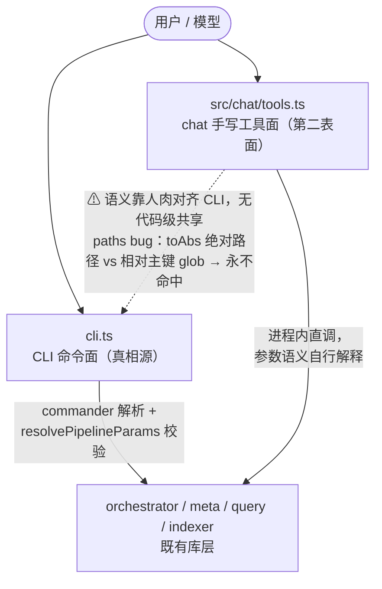
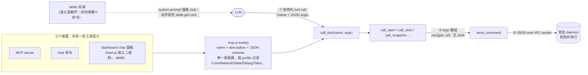
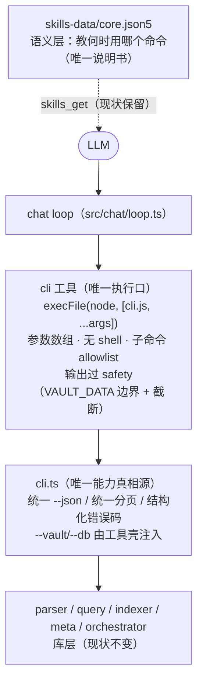

# chat 工具面架构：单一真相源评估（对标 agent-browser）

> 日期：2026-07-30 · 类型：**设计评估（提案·待拍板）**，不是开工契约。
> **实现状态：✅ 已落地（2026-08-03，计划 [2026-08-03-chat-cli-tool.md](../plans/2026-08-03-chat-cli-tool.md)）**——`src/chat/cli-tool.ts` 单工具 + `tools.ts` 收编为 { cli, skills_recall, skills_get } + `X_BASALT_CHAT_CHILD` 防递归。
> 触发：chat 审查实锤 `pipeline_run` 的 `paths` 参数静默失效（`src/chat/tools.ts:467` 把模型给的路径 `toAbs` 成绝对路径，喂给匹配**相对主键**的 glob 路由过滤 `src/orchestrator/route.ts:53`，永不命中）——根因不是某行代码写错，而是 chat 手工维护着第二张能力表面，语义靠人肉对齐 CLI，必漂移。
> 关联：[chat 读写机制](chat-readwrite.md)、[chat skill grounding](chat-skill-grounding.md)、对标调研 [`../research/2026-06-30-chat-gap-vs-agent-browser.md`](../research/2026-06-30-chat-gap-vs-agent-browser.md)。

## 0. 本文回答的问题

> 「为什么不只维护一份教 AI 用 CLI 的 skill，让 chat 直接执行这个 CLI（跨 win/unix）？」——这条路线对不对？对的话 x-basalt 该怎么落？

**结论先行**：方向对（agent-browser 就是这么做的），但落地的关键不在「执行 CLI」，而在两条纪律——**工具 schema 与 CLI 一处定义**、**模型永远不拼 shell 字符串（参数走数组）**。满足这两条，win/unix 差异结构性消失；不满足，skill 文档会退化成 shell 引用手册。

## 1. 现状：chat 是手工维护的第二张能力表面

- CLI 面的参数语义集中在 `src/orchestrator/params.ts`（`resolvePipelineParams`，声明期报错）；chat 面在 `tools.ts` 里**重新解释**同一批参数（`toAbs`、默认值、源选择）。
- CLI 加能力 → chat 要人工跟进；跟漏、跟错都无声无息。`paths` 在 CLI 里是 glob 路由过滤（文件列表源归 `--stdin`），chat 包装层把它理解成「文件列表」——双重错位，模型一传就静默零处理。
- skills 侧（`skills-data/core.json5`）教的是 CLI 用法，和 chat 工具面描述的又是第三份近似表述。

## 2. 对标：agent-browser 怎么做（chat 与 dashboard）

可迁移的四条纪律（deepwiki 两源核实，调用链以 `call_tool → handler → argv 数组 → send_command → daemon` 为准）：

1. **schema 单一真相源**：`tools()` 一处定义 name/description/JSON schema，MCP、chat、dashboard 三面共享；`McpConfig` 按 profile 过滤暴露子集。不存在第二张手写表面。
2. **模型不见 shell**：LLM 产出结构化 tool call，handler 拼 **argv 数组**直接分发——跨平台不是「教两套引用规则」，而是引用问题不存在。
3. **skills 管语义、schema 管参数**：skills（`skills get core`）教「什么时候用哪个命令」；参数校验是代码层的 JSON schema + 结构化 `ParseError`（UnknownCommand/MissingArguments/InvalidValue），不靠文档防漂移。
4. **容错在分发层**：瞬时错误重试 5 次（200ms 递增退避），daemon 不可达则 `ensure_daemon` 重生——模型侧只看到干净的结构化错误。

> x-basalt 无 daemon，等价物是：spawn `execFile(process.execPath, [cli.js, ...argv])`（参数数组、无 shell），或把 CLI 命令实现抽成库函数进程内分发。两者都满足纪律 2。
>
> **补充实证（2026-07-30 deepwiki）**：agent-browser 的 chat 会话甚至只暴露**一个**工具——`CHAT_TOOLS` 常量定义单个 `agent_browser` 工具（入参一条 `command` 字符串，由 CLI 解析执行）。「全部能力收一个执行口」不是 x-basalt 的激进发明，而是对标库的既验形态；这也顺带解释了它的防递归：模型词表里根本没有能起新 AI loop 的入口（详见 §5）。

## 3. 目标形态：彻底切到「chat = 薄执行壳 + CLI 唯一真相源」

**决策（2026-07-30 讨论拍板方向）**：不留混合过渡形态。曾被考虑的「高频读工具保留进程内 + 写侧走 cli 工具」混合案被否决——它只是把漂移面缩小、不消失，还长期背两份 schema 的维护债。「先补契约再切」是同一计划内的**步骤排序**，不构成一个并存的架构阶段。

**彻底切的第三个理由（用户拍板）：工具名额预算。** LLM 工具面每多一个工具都是 prompt 体积与选择错误率的双重成本。全部能力收进**一个** `cli` 工具后，chat 的工具面只占一个名额，腾出的预算留给将来真正的 AI-native 新能力（各种读取 / search 工具）。准入规则由此清晰：

- **能力属于 CLI**（vault 操作原语）→ 进 CLI 子命令，经 `cli` 工具到达，**不配独立工具**；
- **能力不属于 CLI**（如语义/embedding 检索、外部源——CLI 不该长的能力）→ 才配独立 AI 工具，注册在保留下来的 `tools.ts` 装配点（见 §4 第 3 步）。

目标形态下 AI 视野 ≡ CLI 视野（对齐 agent-browser 实证）：

- **同一词表**：模型可用能力 = CLI 子命令集（allowlist 过滤后），不多不少；
- **同一分发**：模型 args 数组与人敲的 argv 汇入同一个 `cli.ts` 入口，校验、执行、错误格式一致；
- **同一输出契约**：模型观察到的 stdout 就是 `--json` 结构化输出，分页口径全命令统一。

## 4. 执行序列（一次到位，四步有先后、无并存）

1. **前置 · CLI 输出契约统一**：全命令 `--json`；统一分页（`offset/size/total/hasMore`）；错误结构化（错误码 + 消息，非零 exit code 分类）。这是唯一起点，契约不齐时切换 = 模型观察面退化。
2. **chat 侧新增 `cli` 工具**：input `{ args: string[] }` → `execFile(process.execPath, [cliEntry, ...args])`；`--vault/--db` 由工具壳注入；超时 + 子命令 allowlist；stdout/stderr 过 `observe(safety, …)`（边界包裹 + 8000 字符截断留在薄壳，**不需要 CLI 本体感知 AI**）。
3. **删除手写工具面、保留 `tools.ts` 框架**（2026-07-30 用户拍板 + 评估确认）：删的是 `buildTools` 里那 ~14 个手写工具定义（schema + execute 全套，约 360 行）；**留的是框架**——`buildTools(ctx, safety)` 装配点（`loop.ts` 的消费签名不变，loop/repl 零改动）、`observe` safety 输出处理、`wrapToolErrors` 错误分类外壳、RECALL 追踪机制（改为解析 `args` 子命令）。「腾出空间」指的是 **ToolSet 条目从 ~14 个收编为个位数**，不是删文件——框架正是未来 AI-native 工具的注册缝。`cli` 工具实现放独立模块（如 `src/chat/cli-tool.ts`），`tools.ts` 只剩装配；`skills_get`/`skills_recall` 保留为独立工具（grounding 是最高风险的第一步，且它们是「模型说明书」元工具、非 vault 能力面——agent-browser 的 `TOOL_SKILLS_GET` 同样单列）。`tool-errors.ts` 分类改为「exit code + stderr 结构化错误」驱动。
4. **回归验证**：用 `../x-basalt-evals` 场景库在切换前后各跑一遍，对比操作失败率 / 撞顶率——大爆炸切换的质量回归由此兜底（这是「敢直接切」的前提，不是可选项）。

顺手项：`paths` bug 随工具面删除自然消亡——文件列表语义归 CLI 的 `--stdin` 源（或给 `run` 补显式 `--paths` 源），不再有 chat 层 `toAbs`。

后续扩展口（非本轮）：AI-native 新工具（语义检索等，§3 准入规则第二条）以独立工具加入，与 `cli` 工具并存——工具面只有「1 个 CLI 执行口 + N 个 AI-native 能力」，N 的每个都要过「CLI 不该长这个」的审查。

## 5. 未决 / 风险

- **未决**：方向已拍板（彻底切），实现契约（allowlist 清单、写命令自动补 `--apply`、契约统一的分项验收）待立计划时细化。
- **风险·能力暴露面扩大（含递归调用 chat）**：`cli` 工具让模型触达全部子命令，allowlist 必须排除两类：① 常驻/交互类（`watch` 永不返回、挂死对话——系统提示现行禁令要变成壳层硬约束）；② **`chat` 自身**（否则模型可 `chat` 套 `chat` 起嵌套 AI loop）。防递归对照 agent-browser：它**没有**深度计数器，靠的是结构性排除——chat 会话的 LLM 只拿到一个 `agent_browser` 工具（`CHAT_TOOLS` 单工具、typed、无 shell），而 `chat` 命令在 `main.rs` 顶层分发、不走普通命令路径，`batch` 也不能嵌 `chat`。即「能起新 AI loop 的入口根本不进模型词表」。x-basalt 同理用 allowlist 结构性排除 `chat`，另加一道便宜加固：工具壳 spawn 时注入 `X_BASALT_CHAT_CHILD=1` 环境变量，chat 启动检测到即拒——兜住 allowlist 误配/被绕。
- **风险·写无确认闸叠加 CLI 默认 dry-run**：CLI 的 `run` 默认 dry-run、`--apply` 才落盘，与 chat「写直接落盘」纪律相反——`cli` 工具壳对写命令自动补 `--apply`（与 chat 现行安全模型一致），此点需在实现契约里写死。
- **风险·性能**：每步一次 spawn 冷启动（node + SQLite 打开），20 步 loop 多出数秒——可接受，但场景库回归时顺带记录耗时变化。
- **已核实 / 未核实**：agent-browser 机制经 deepwiki 两源交叉确认（dashboard 面板、tools() 三面共享、argv 分发），未直读其源码；其迭代快，落地前按版本号再核一次。
