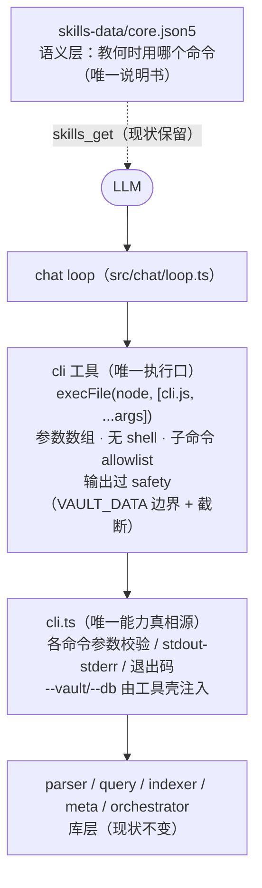
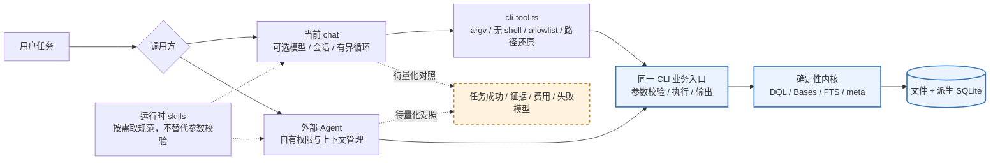

# chat 工具面架构：单一真相源评估（对标 agent-browser）

> 初始讨论：2026-07-30；当前单 CLI 工具面已实现，2026-09-30 补充职责与投入边界。
> **实现状态：✅ 已落地（2026-08-03，计划 [2026-08-03-chat-cli-tool.md](../archive/plans/2026-08-03-chat-cli-tool.md)）**——`src/chat/cli-tool.ts` 单工具 + `tools.ts` 收编为 { cli, skills_recall, skills_get } + `X_BASALT_CHAT_CHILD` 防递归。
> 迁移前 paths 漂移及对标依据已归档；不把旧工具名或旧源码行号当当前实现。
> 关联：[chat 读写机制](chat-readwrite.md)、[chat skill grounding](chat-skill-grounding.md)、对标调研 [`../research/2026-06-30-chat-gap-vs-agent-browser.md`](../archive/research/2026-06-30-chat-gap-vs-agent-browser.md)。

## 0. 本文回答的问题

> 「为什么不只维护一份教 AI 用 CLI 的 skill，让 chat 直接执行这个 CLI（跨 win/unix）？」——这条路线对不对？对的话 x-basalt 该怎么落？

**结论先行**：方向对（agent-browser 就是这么做的），但落地的关键不在「执行 CLI」，而在两条纪律——**工具 schema 与 CLI 一处定义**、**模型永远不拼 shell 字符串（参数走数组）**。这能消除模型拼 shell 的引用层差异，不代表全部 win/unix 路径、编码或 shell 场景已实测；仍以具体平台回归为准。

## 1. 迁移前的问题：chat 曾手工维护第二张能力表面

本节历史内容已归档，见[原章节](../archive/decisions/2026-07-30-chat-tool-surface-record.md#1-迁移前的问题chat-曾手工维护第二张能力表面)。当前规则与剩余边界见本文有效章节。

## 3. 目标形态：彻底切到「chat = 薄执行壳 + CLI 唯一真相源」

```mermaid
flowchart TD
    llm([LLM]) --> loop["chat loop（src/chat/loop.ts）"]

    loop --> cliT["cli 工具（唯一执行口）<br/>execFile(node, [cli.js, ...args])<br/>参数数组 · 无 shell · 子命令 allowlist<br/>输出过 safety（VAULT_DATA 边界 + 截断）"]

    cliT --> cli["cli.ts（唯一能力真相源）<br/>各命令参数校验 / stdout-stderr / 退出码<br/>--vault/--db 由工具壳注入"]
    cli --> libs["parser / query / indexer / meta / orchestrator<br/>库层（现状不变）"]

    skills["skills-data/core.json5<br/>语义层：教何时用哪个命令<br/>（唯一说明书）"] -.->|"skills_get（现状保留）"| llm
```

**决策（2026-07-30 讨论拍板方向）**：不留混合过渡形态。曾被考虑的「高频读工具保留进程内 + 写侧走 cli 工具」混合案被否决——它只是把漂移面缩小、不消失，还长期背两份 schema 的维护债。「先补契约再切」是同一计划内的**步骤排序**，不构成一个并存的架构阶段。

**彻底切的第三个理由（用户拍板）：工具名额预算。** LLM 工具面每多一个工具都是 prompt 体积与选择错误率的双重成本。全部能力收进**一个** `cli` 工具后，chat 的工具面只占一个名额，腾出的预算留给将来真正的 AI-native 新能力（各种读取 / search 工具）。准入规则由此清晰：

- **能力属于 CLI**（vault 操作原语）→ 进 CLI 子命令，经 `cli` 工具到达，**不配独立工具**；
- **能力不属于 CLI**（如语义/embedding 检索、外部源——CLI 不该长的能力）→ 才配独立 AI 工具，注册在保留下来的 `tools.ts` 装配点（见 §4 第 3 步）。

目标形态下 AI 视野 ≡ CLI 视野（对齐 agent-browser 实证）：

- **同一词表**：模型可用能力 = CLI 子命令集（allowlist 过滤后），不多不少；
- **同一分发**：模型 args 数组与人敲的 argv 汇入同一个 `cli.ts` 入口，校验、执行、错误格式一致；
- **同一业务输出**：工具观察现有 CLI 的 stdout/stderr/退出码，再经工具壳截断与安全包装；各命令的 JSON/分页契约不同，不宣称全命令统一。

## 4. 执行序列（一次到位，四步有先后、无并存）

本节历史内容已归档，见[原章节](../archive/decisions/2026-07-30-chat-tool-surface-record.md#4-执行序列一次到位四步有先后无并存)。当前规则与剩余边界见本文有效章节。

### 4.1 文件路径不是普通 argv：索引主键必须在壳层还原

切 C 后仍有一条不能“逐项原样透传”的跨层不变量：`query` / `search` 给模型的 `file.path` 是 **vault 布局主键**，而 `parse` / `meta` 的公开 CLI 接收的是物理文件路径、按 cwd 解析。两者只在“vault 根恰好等于 cwd”时偶然相同：

- 单根位于嵌套目录时，主键 `a.md` 实际应读 `<vault>/a.md`；
- 多根时，主键 `plans/a.md` 的 `plans` 是根命名空间，物理根可能是 `.tmp/plans`，不能当 cwd 下的目录；
- 读侧解析错会触发模型反复猜前缀并撞 error-storm，写侧解析错则可能静默修改 cwd 下的同名文件。

因此 `src/chat/cli-tool.ts` 在 spawn 前仅对 `parse` / `meta` 的文件位置参数调用既有 `resolveVaultLayout(...).toAbs(...)`，再把绝对路径交给原 CLI。转换放在 chat 壳而非 `cli.ts`：壳持有本轮确定的 `ToolContext.vaultPath`，能无歧义解释索引主键；公开 `parse` / `meta` 仍可独立操作任意显式文件路径，不新增 `--vault`，也不复制第二套路由算法。

后续扩展口（非本轮）：AI-native 新工具（语义检索等，§3 准入规则第二条）以独立工具加入，与 `cli` 工具并存——工具面只有「1 个 CLI 执行口 + N 个 AI-native 能力」，N 的每个都要过「CLI 不该长这个」的审查。

## 5. 当前边界与风险（2026-09-30 复核）

- **已实现，不再待立项**：`buildTools` 装配 `cli`、`skills_recall`、`skills_get`，CLI 壳以 argv 数组分发、排除 watch/chat；路径还原与参数注入以 [`src/chat/tools.ts`](../../src/chat/tools.ts) / [`src/chat/cli-tool.ts`](../../src/chat/cli-tool.ts) 为准。§1 与 §4 指向已归档的迁移问题及执行记录，不代表仍有两套工具面。
- **风险·能力暴露面扩大（含递归调用 chat）**：`cli` 工具让模型触达全部子命令，allowlist 必须排除两类：① 常驻/交互类（`watch` 永不返回、挂死对话——系统提示现行禁令要变成壳层硬约束）；② **`chat` 自身**（否则模型可 `chat` 套 `chat` 起嵌套 AI loop）。防递归对照 agent-browser：它**没有**深度计数器，靠的是结构性排除——chat 会话的 LLM 只拿到一个 `agent_browser` 工具（`CHAT_TOOLS` 单工具、typed、无 shell），而 `chat` 命令在 `main.rs` 顶层分发、不走普通命令路径，`batch` 也不能嵌 `chat`。即「能起新 AI loop 的入口根本不进模型词表」。x-basalt 同理用 allowlist 结构性排除 `chat`，另加一道便宜加固：工具壳 spawn 时注入 `X_BASALT_CHAT_CHILD=1` 环境变量，chat 启动检测到即拒——兜住 allowlist 误配/被绕。
- **写入开关遵循 CLI**：`meta` 写动作默认落盘，`run` 的批量写需显式 `--apply`；当前 `execCli()` 不自动补该开关。模型调用与人调用走同一命令语义，不能因没有确认弹窗就假设所有批量调用都已写入。信源：[`src/cli.ts`](../../src/cli.ts)、[`src/chat/cli-tool.ts`](../../src/chat/cli-tool.ts)。
- **写后节流不是验收禁令（2026-10-02 修正）**：默认依据成功写入回执回答，不追加交叉验证；用户明确要求复核时实际读取，明确要求再次运行／幂等验证时真实执行第二次同范围、同动作、同落盘开关的 run，并读取独立回执，不能拿 query=0 代替。先检查 dryRun、failed、changed、reindexed，失败或未执行不宣称完成。此为 SYSTEM_PROMPT 与运行时 chat 说明书的提示纪律，不新增壳层验收器，不改变 CLI 开关；小样本取证与风险见[执行记录](../archive/plans/2026-10-02-chat-write-verification.md)。
- **风险·性能**：每次 CLI 工具调用会 spawn 冷启动；当前未量化净开销、成功率或费用优势。旧场景库的选址/格式不因归档变成实施授权，未来比较按 §6 的协议记录失败模型、过程证据、耗时和费用。
- **已核实 / 未核实**：原 agent-browser 对照经 deepwiki 两源交叉确认，未直读对应版本源码；只作为当时设计背景，不据此证明当前实现优劣。当前项目机制以本仓源码为准。

## 6. 宿主投入与接口纪律（2026-09-30）

**保持已实现的薄壳，不把调查中的宿主能力当成新增实现要求。** Anthropic 的 [Context engineering](https://www.anthropic.com/engineering/effective-context-engineering-for-ai-agents) 与 [Advanced tool use](https://www.anthropic.com/engineering/advanced-tool-use)说明按需上下文/工具发现已有现成路线；[Is Grep All You Need? v1](https://arxiv.org/html/2605.15184v1)提示效果仍取决于模型、宿主和交付方式。它们支持先比较外部宿主的建议，不支持“通用宿主必然更省或更准”。

```mermaid
flowchart LR
    U["用户任务"] --> H{"调用方"}
    H --> LOCAL["当前 chat<br/>可选模型 / 会话 / 有界循环"]
    H --> EXT["外部 Agent<br/>自有权限与上下文管理"]
    LOCAL --> WRAP["cli-tool.ts<br/>argv / 无 shell / allowlist / 路径还原"]
    WRAP --> CLI["同一 CLI 业务入口<br/>参数校验 / 执行 / 输出"]
    EXT --> CLI
    SK["运行时 skills<br/>按需取规范，不替代参数校验"] -.-> LOCAL
    SK -.-> EXT
    CLI --> CORE["确定性内核<br/>DQL / Bases / FTS / meta"]
    CORE --> DATA[("文件 + 派生 SQLite")]
    LOCAL -. 待量化对照 .-> EVAL["任务成功 / 证据 / 费用 / 失败模型"]
    EXT -. 待量化对照 .-> EVAL
    classDef core fill:#eaf3ff,stroke:#3274b7,stroke-width:2px;
    classDef compare fill:#fff3df,stroke:#bc7c22,stroke-width:2px,stroke-dasharray:5 5;
    class CLI,CORE,DATA core;
    class EVAL compare;
```

消费入口策略：外部 AI 先经 `skills get summary` 按需发现能力，默认直接编排 CLI；用户用自然语言提任务不等于再次委托。用户明确委托时保留 chat 路线，调用契约与工具面取 `skills get chat`，不在入口复制。合成只读任务中的默认直调与显式委托均已取证，但未复现默认委托，也不据此承诺所有宿主行为、答案范围或费用优势。

图中 chat 路径依据上述本仓源码，外部路径表示 CLI 可供调用，不代表所有宿主已集成或通过验收。比较协议见[最新调研 §9](../research/2026-09-30-agent-knowledge-industry-landscape.md#9-下一步实验可复现能推翻建议)。新增 MCP/工具 schema 应共享业务语义；[MCP Tools 规范](https://modelcontextprotocol.io/specification/2025-11-25/server/tools)的发现/annotations 不替代权限执行。保留封闭工具面、明确部署体验的理由可以成立，但须实测而非由工具数量推出质量。
