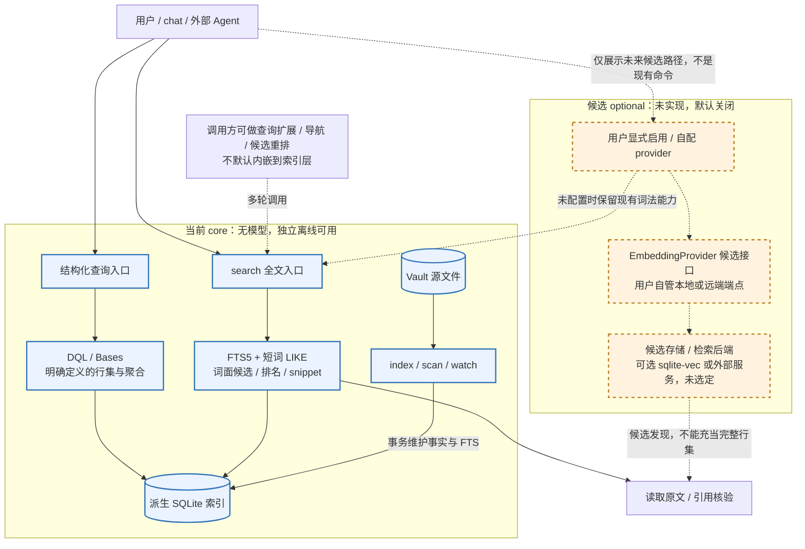

# 全文与语义检索：当前实现、组合评估与能力边界

> 初始评估：2026-06-28；证据更新：2026-09-30。
> 当前 FTS5 已落地；embedding/混合检索仍是待评估方案，不是开工或兼容承诺。
> 当前实现以 [`src/indexer/index.ts`](../../src/indexer/index.ts)、[`src/query/index.ts`](../../src/query/index.ts) 和 [`tests/fts.test.ts`](../../tests/fts.test.ts) 为准；行业证据与待执行实验见[最新调研](../research/2026-09-30-agent-knowledge-industry-landscape.md)。
> 原分层、候选接口/存储、QMD 取舍与工作量评估完整保留在[2026-06-28 历史快照](../archive/decisions/2026-06-28-semantic-retrieval-integration.md)；本文更新当前事实与明确边界，不以删去旧方案代替决策。

## 1. 结论与定位

1. **保留无模型全文检索作为内核能力。** 当前 `search` 是 SQLite FTS5/trigram 与短词 LIKE 兜底，不需要 AI provider。[P1]
2. **语义发现不只等于向量。** 查询扩展、同义词、目录/链接导航、摘要与向量/混合检索是不同的补召回路径；效果要比较宿主、检索和结果交付的完整系统。[S1][S2]
3. **先验证现成检索组合，再决定是否自建 embedding。** QMD 已提供词法/向量/重排及 metadata filtering，可作为对照对象；尚未实测其中文 Vault 效果与接入成本。[S3]
4. **候选发现与精确查询分开。** 检索用于找证据；“全部”“计数”及批量写入选择仍须遵守明确定义的查询范围、完整性、索引时效与写侧边界。向量/重排不保证穷尽概念相关。[S3][P1]

以上延续离线内核、可选 AI 隔离的边界；不新增默认模型、服务或依赖。

### 1.1 分层与依赖：当前内核 / 候选增强

实线是当前执行/索引依赖；虚线是调用方可采用的方式或未来候选路径。FTS5 可独立长期交付，embedding 不是它的前置条件；默认无配置不加载模型或向量扩展。当前代码依据 [P1]–[P3]，旧分层与候选依据 [H1]；虚线不表示已实现自动路由或降级。

### 1.2 明确保留的非目标

- 不内嵌本地模型推理运行时，不随产品下载/加载 GGUF 或引入 `node-llama-cpp`；用户自行运行 Ollama 等端点与产品内嵌运行时是两回事。
- 不整套搬入 QMD 的模型、chunking、HyDE/rerank 流水线；需要切块时另评估，不因比较现成工具就增加默认运行管线。
- 不默认开启向量，不使离线命令依赖 provider；模型调用与存储扩展必须隔离在显式启用的可选层。
- 不为向量缓存改变核心索引的删除语义，不自动引入软删除、内容哈希 docid 或另一套 Vault 文件身份。

这些是原评估的边界，不因本轮事实更新而撤销。新需求若要求改变，先更新设计/计划再实施；旧取舍与理由见 [H1] §7、§9。

## 2. 当前实现：FTS5 已落地

| 项 | 当前行为 | 信源 |
| --- | --- | --- |
| 索引 | 常规 `files_fts(path,name,content)` 表，自存副本；不是早期设想的 external-content 表 | `ensureFts()` [P1] |
| 版本迁移 | `store_config.fts_version` 与 `FTS_VERSION` 比对；缺表/版本不符时重建并从 files 回填 | `ensureFts()` [P1] |
| 写侧同步 | 在 indexer 的文件插入/删除边界维护 FTS，与对应索引事务配合 | `insertPayload()` / `deleteByPath()` [P1] |
| 查询入口 | `x-basalt search`，经 `DataviewEngine.search()` 只读索引 | [P1][P2] |
| 短词优先 | 查询整体至少 2 字符；按空白切词后，只要任一词不足 3 字符，整条查询就走已转义 LIKE 子串匹配、逐词 AND，按 path 排序、score 为 0 | `MIN_FTS_QUERY_LEN` / `TRIGRAM_LEN` / `searchLike()` [P1] |
| 非 CJK | 所有词均至少 3 字符且不含 CJK 汉字时，各词字面短语 AND；用户输入不作为 FTS 操作符执行 | `escapeFtsPhrase()` / `search()` [P1] |
| CJK 汉字 | 所有词均至少 3 字符且含 CJK 汉字时，重叠 trigram 并集 OR 宽松召回；部分片段命中也可入结果 | `hasCjk()` / `overlappingTrigrams()` [P1] |
| 结果 | 排名、snippet、分页；`total` 是当前匹配规则下的行数，不是整句精确出现次数 | `search()` / `paginate()` [P1] |
| 时效 | 只看索引快照；文件修改后需更新索引才能反映 | [P1][P2] |

因此，早期“查不了正文”“FTS 待建”“现在都不做”的表述不再代表当前实现。DQL 与正文检索仍是不同入口，具体命令与匹配口径见[命令参考](../use/commands.md#search--全文检索正文)，本文不另造参数契约。[P2]

### 中文与排序边界

SQLite 的 trigram 按连续三字符建词，不是中文词级分词；不足三字符的查询不能直接依赖 trigram MATCH。当前实现用 LIKE 补短词、用 trigram OR 扩 CJK 候选，不等于解决了所有中文相关性问题。[S4][P1]

FTS5 仍可按 bm25 排名，但其统计单元是 tokenizer 产生的 token，不应将 trigram 排名说成中文词级 BM25，也不应断言中文词级分词一定更好。短词扫描成本、索引体积、宽松匹配的误召回与排序质量须按真实语料验证。[S4][P1]

## 3. Agent 参与召回：能做什么，不能承诺什么

调用方可以扩展查询词、生成假想答案后抽词、按目录/链接继续探索、读取候选重排。这些路径能弥补**初始查询**缺少词面重叠的情况，不需要内核默认加载模型；它们也可能选错词、停得过早或带来额外费用。[S1][S2]

必须区分：

- **固定候选集上的重排**不能找回未进入候选集的文档。
- **改变查询或导航路径**可能找到原先漏掉的文档；所以不能推导“零初始词面重叠只有向量能补”。
- **向量检索**提供另一种候选发现方式，但受 embedding、切块、范围过滤和候选窗口影响，也不保证全部相关文档都被发现。[S3]

《Is Grep All You Need?》在 116 个对话记忆问题上观察到检索、宿主、交付路径的交互；不是个人 Vault 的效果 oracle。不能据此宣称日常任务词法必然足够，或向量一定更好。[S2]

## 4. QMD 的当前可借鉴点与组合风险

核查版本：`04e4dbd8245c527a88f1a8f0bda547aef9ca81fb`。[S3]

| 能力 | 评估方向 | 必须保留的边界 |
| --- | --- | --- |
| 词法/向量/查询扩展/重排 | 作为完整端到端对照，不默认整套内嵌 | 模型运行、下载、增量更新与总成本另测 |
| metadata filtering | 可作为候选约束，不再描述为“只有语义搜索” | `qmd.metadata` 命名空间及校验不等同普通 frontmatter schema |
| FTS 过滤 | 比较匹配效果与候选完整性 | `searchFTS()` 先取 `limit * 10` 再筛，源码注明 best-effort completeness |
| 向量过滤 | 按集合规模分别评估 | 小集合可精确扫描；超过 20,000 候选转受限 ANN over-fetch |
| 内容哈希/版本号 | 借鉴失效与重建机制 | 哈希不替代模型/切块版本，不能只按正文相同跳过所有重算 |
| 外部 CLI/SDK/MCP | 按实际宿主能力选择组合方式 | 不为接口名新增一份业务语义或不可丢弃的第二真相源 |

组合前要回答：哪个系统负责扫描/更新、两套索引如何失效、检索结果路径如何映射 Vault 布局、过滤类型如何转换、未配置/失败怎样明确报告。外部检索不得被当成 DQL/Bases 全量枚举或安全写侧。[S3][P1]

## 5. 可选 embedding 的候选方案（未实现）

**准入条件：** 在同一任务、模型与预算下，词法 + 查询扩展/导航仍有可重复漏召回；外部混合检索确有收益，但组合负担或边界不能满足需求。先做[调研 §9 的实验](../research/2026-09-30-agent-knowledge-industry-landscape.md#9-下一步实验可复现能推翻建议)，再立设计/计划。

若进入实现，可评估：

- provider 隔离、用户显式启用；不使离线命令依赖模型。
- 外部检索服务与本地 `sqlite-vec` 两种路径，不先冻结后者。
- 失效键包含实际索引内容哈希、模型/维度、切块及归一化版本；不能把未经刷新且只覆盖正文的 frontmatter `sha256` 当全输入版本。
- 配置缺失时保持现有词法能力；调用失败必须显式返回错误/降级信息，不能无提示切换后仍声称语义检索成功。
- 输出区分候选相关性与完整查询口径，不把 metadata filter 或 top-k 当全量统计。

以上是待评估约束，不是当前 API。模型漂移、更新/删除、许可、数据出域和费用都需验收。

### 5.1 原接口 / 存储候选的保留与校准

| 候选 | 原评估保留内容 | 当前边界 |
| --- | --- | --- |
| provider | `EmbeddingProvider.embed(texts) -> vectors`；OpenAI 兼容 embeddings 端点，包括用户自管 Ollama；env / 配置文件风格 | 仅候选接口，不是已导出的 API；具体配置键、批量与错误契约未冻结 |
| 本地存储 | `sqlite-vec` 作为可选 SQLite 扩展，显式启用且配置就绪后才加载 | 保留本地候选，不自动选型或新增依赖；外部检索服务另作对照 |
| 重算门控 | 内容寻址用于避免重复 embedding | 保留优化动机，但不能只复用 frontmatter 正文 hash；按实际输入及模型/维度/切块/归一化版本失效 |
| 词法兜底 | 未配置保留 FTS5；原评估提出 provider 失败时自动回 FTS5 | 保留降级候选，不默默废弃；是否自动降级由实施契约确定，失败/降级必须可观察，不能称为语义成功 |

来源为 [H1] §5；完整旧表、工作量及未采纳方案均在历史快照，不在此重抄。旧文“唯一不可外包 = embedding”“只有向量能救”“穷尽概念相关”等断言仍只作历史，当前边界以 §3–5 为准。

## 6. 与 chat / 外部宿主的关系

chat 与外部 Agent 都是调用方；不将 query expansion、重排或一般会话管理默认塞入 query/indexer。当前 chat 经 `cli` 工具调用既有 `search`，不是另一套搜索引擎。[P3]

优先保留 CLI 的参数、分页与错误语义，让宿主按需取 skills。是否加独立检索工具或 MCP 出口由具体接入需求决定；工具数量本身不是效果证明。[S1][P3]

## 7. 验证与停点

- **已有实现证据：** FTS 建表/同步、中文/短词分支与搜索入口见源码；边界测试见 `tests/fts.test.ts`。文档更新不是本轮已跑全量测试的声明。[P1]
- **待验证：** 真实中文语料的证据召回、查询扩展的调用成本、QMD 组合效果、索引更新与删除失效、过滤候选窗口、多宿主结果交付差异。
- **进入实现前：** 报告证据 Recall@k、任务成功、引用真实性、初始化/更新成本与 p50/p95；完整查询和安全写另测，不混成一个平均准确率。
- **停点：** 无端到端收益，不扩大默认依赖；外部组合已满足需求，不仅为保持全自建而复制管线。

## 8. 信源

- **[H1] 原评估历史快照**：[2026-06-28 语义/全文检索融入设计评估](../archive/decisions/2026-06-28-semantic-retrieval-integration.md)：完整保留原分层图、接口/存储、QMD 取舍、风险/非目标与工作量；不作为当前功能或效果证明。
- **[P1] 当前源码与边界测试**：[`src/indexer/index.ts`](../../src/indexer/index.ts)、[`src/query/index.ts`](../../src/query/index.ts)、[`tests/fts.test.ts`](../../tests/fts.test.ts)。
- **[P2] 当前调用契约**：[命令参考 search](../use/commands.md#search--全文检索正文)。
- **[P3] 当前 chat 工具面**：[`src/chat/tools.ts`](../../src/chat/tools.ts)、[`src/chat/cli-tool.ts`](../../src/chat/cli-tool.ts)、[工具面设计](chat-tool-surface.md)。
- **[S1] 官方上下文工程**：[Anthropic Context engineering](https://www.anthropic.com/engineering/effective-context-engineering-for-ai-agents)、[Advanced tool use](https://www.anthropic.com/engineering/advanced-tool-use)。用于能力/职责趋势，不代表本项目实测增益。
- **[S2] 条件化检索实验**：[Is Grep All You Need? v1](https://arxiv.org/html/2605.15184v1)，§3–5；作者实验，未独立复现。
- **[S3] QMD 固定版本**：[README](https://github.com/tobi/qmd/blob/04e4dbd8245c527a88f1a8f0bda547aef9ca81fb/README.md)、[store.ts](https://github.com/tobi/qmd/blob/04e4dbd8245c527a88f1a8f0bda547aef9ca81fb/src/store.ts)、[metadata.ts](https://github.com/tobi/qmd/blob/04e4dbd8245c527a88f1a8f0bda547aef9ca81fb/src/metadata.ts)、[metadata-filter.ts](https://github.com/tobi/qmd/blob/04e4dbd8245c527a88f1a8f0bda547aef9ca81fb/src/metadata-filter.ts)。过滤机制为源码事实，效果仍待 A/B。
- **[S4] SQLite 官方 FTS5 文档**：[Trigram tokenizer](https://sqlite.org/fts5.html#the_trigram_tokenizer)、[bm25](https://sqlite.org/fts5.html#the_bm25_function)。用于 tokenizer/排序机制，不代替真实中文评测。
