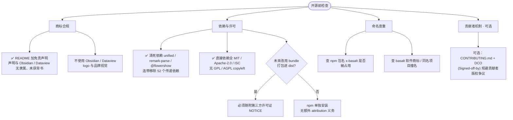

# 指南：第三方库许可证与选型避坑

> 日期：2026-06-26 · 类型：操作指南（选库时召回）
> 用途：每次引入第三方库前的**许可证避坑依据**。先过这份清单，再决定能不能 `import`。
> 关联：依赖决策 [`../specs/2026-06-26-deps-build-vs-buy.md`](../specs/2026-06-26-deps-build-vs-buy.md)、库普查 [`../research/2026-06-26-libraries-survey.md`](../research/2026-06-26-libraries-survey.md)
> 免责：以下为工程惯例理解，非正式法律意见；关键依赖如需商用分发，以正式法律意见为准。

## 0. 一句话结论

x-basalt 是 **MIT** 项目、希望可被他人当库/CLI 使用。因此：**只 `import` 宽松许可证（MIT / Apache-2.0 / ISC / BSD）的库；坚决不 `import` 传染式 copyleft（GPL / AGPL，必要时含 LGPL）的库。** 许可证缺失 = 风险，按"未授权"处理直到查实。

## 1. 为什么在意：copyleft 的"传染"

GPL-3.0 这类 copyleft 的核心机制一句话：**义务由「分发」触发；一旦触发，你分发的整个作品都得用 GPL 开源，并递归传染给再用你代码的下游。**

- **触发条件 = 分发（convey）**：把软件给别人（发 npm 包、给二进制、交付客户、公开到 GitHub）才触发。**纯自己用、不分发，不触发**（GPL 不限制"使用/运行"，只限制"分发"）。
- **传染范围 = 整个衍生作品**：不是只开源那个 GPL 库，而是**你分发的整个作品**都要按 GPL 授权，并提供完整对应源码 + 构建方式。你**失去用 MIT 等宽松证的自由**（被迫"升级"成 GPL）。
- **递归污染下游**：`GPL 库 → 你的库（被迫 GPL）→ 别人 import 你的库的应用（分发时也被迫 GPL）→ …`。对想被广泛依赖的项目是致命的——没人敢依赖会"毒化"自己代码库的包。

## 2. 许可证分级（选型速查）

| 类型                      | 代表                          | 能否 `import` 进 MIT 项目 | 说明                                                                                      |
| ------------------------- | ----------------------------- | ------------------------- | ----------------------------------------------------------------------------------------- |
| 宽松（permissive）        | MIT、Apache-2.0、ISC、BSD-2/3 | ✅ 可用                   | 随便用/改/闭源，只需保留版权声明（Apache-2.0 另有专利授权条款，更友好）                   |
| 弱传染（weak copyleft）   | LGPL、MPL-2.0                 | ⚠️ 谨慎                   | 允许"动态链接/文件级"使用而不传染整体；但 JS 同进程 `import` 边界模糊，**保守按传染对待** |
| 强传染（strong copyleft） | **GPL-2.0 / GPL-3.0**         | ❌ 禁止                   | `import` 即让本项目被迫 GPL，递归污染下游                                                 |
| 网络传染                  | **AGPL-3.0**                  | ❌ 禁止                   | 比 GPL 更狠：**连"提供网络服务"都算触发**，即使不分发二进制                               |
| 无 license 字段 / 未声明  | ——                            | ❌ 默认禁止               | 法律默认"保留所有权利"，比 GPL 更不可用；**查实前不得依赖**                               |

## 3. 两个关键边界（别吓过头，也别钻空子）

| 情形                                                                | 是否传染                                                                                                 |
| ------------------------------------------------------------------- | -------------------------------------------------------------------------------------------------------- |
| 代码里 `import`/`require` 一个 GPL 库（同进程链接）                 | ✅ **会传染**（JS 基本按衍生作品对待）                                                                   |
| 只 `spawn` 子进程调用一个 GPL 的**独立 CLI 程序**（不 link 其代码） | ⚠️ **通常不传染你的代码**（属"独立程序"，像用 git/gcc）；但若**打包分发那个 GPL 程序本身**，要附带其源码 |
| 用户只是**运行/使用**你的软件（end use）                            | ❌ **不触发**——GPL 不限制使用，用户无需开源任何东西                                                      |
| 纯后端 SaaS，只提供网络服务、不分发二进制                           | GPL-3.0 一般不触发；**AGPL-3.0 会**                                                                      |

> 注：动态链接是否传染在法律上有争议（FSF 认为传染）。对 JS `import` 一律按"会传染"处理最安全。

## 4. 选库前的检查清单（每次必过）

1. **查许可证两处一致**：包的 `package.json` 的 `license` 字段 **且** repo 根目录 `LICENSE` 文件——两者都看，须一致且为宽松证。
2. **license 字段缺失 / "UNLICENSED" / 自定义**：一律 ❌，除非 repo LICENSE 明确是宽松证且有把握。
3. **看传递依赖**：该库自己的依赖里有没有 GPL/AGPL（传染会穿透依赖链）。可用 `npm ls` / `pnpm licenses list` 或 `license-checker` 类工具扫。
4. **拿不准就不 `import`**：可改为子进程 CLI 调用（独立程序边界），或自建，或换宽松证替代。
5. **记录**：选用/否决的许可证理由写进 [`../specs/2026-06-26-deps-build-vs-buy.md`](../specs/2026-06-26-deps-build-vs-buy.md) 的依赖矩阵。

## 5. 本项目已命中的具体案例

| 库                                                          | 许可证                           | 裁决              | 依据                                                 |
| ----------------------------------------------------------- | -------------------------------- | ----------------- | ---------------------------------------------------- |
| `remark-obsidian`                                           | **GPL-3.0**                      | ❌ 禁止 import    | 功能最全，但会让 x-basalt 被迫 GPL 并污染下游        |
| `remark-obsidian-md`                                        | ⚠️ **manifest license 字段缺失** | 🔒 查实前不得依赖 | 不能假设是 MIT；落地前必须看其 repo LICENSE 文件确认 |
| `gray-matter` / `better-sqlite3` / `commander` / `chokidar` | MIT                              | ✅ 可用           | 已在用，宽松证                                       |
| `fuse.js`（拟引入）                                         | Apache-2.0                       | ✅ 可用           | 选型时确认                                           |
| `yaml`（拟引入）                                            | ISC                              | ✅ 可用           | 选型时确认                                           |
| `kysely` / `peggy`（拟引入）                                | MIT                              | ✅ 可用           | 选型时确认（peggy 以实际 manifest 为准复核）         |

> 上表"拟引入"项的许可证以最终 `pnpm install` 时的实际 manifest 为准复核，勿凭本表当定论。

## 6. 开源/发布前总检查（流程图）

> 本节是开源前的**全局检查总览**，范围不止许可证，含商标与命名。基于 2026-06-28 的开源风险评估沉淀。✅ = 已完成；其余为发布前待办。

> 整体结论：无致命法律障碍，主要为商标措辞与命名查重；删死依赖与法律无关（都是 MIT），属发布前工程整洁，已提前随本次完成。**非正式法律意见；如需商用维权层面确定性，就商标项另寻专业意见。**
