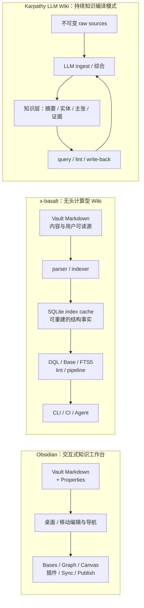
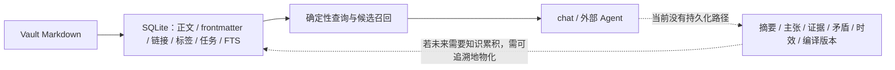

# x-basalt、Obsidian 与 LLM Wiki：能力差距与边界 rebase

> 调研快照：2026-08-07。
>
> 文档边界：本文是外部能力对照与仓库现状核查，**不是**实现设计、路线图或兼容承诺；当前实现仍以 `src/`、`docs/design/` 与测试为准。
>
> rebase 基线：[`2026-06-30-feature-gap-vs-dataview-obsidian.md`](../history/research/2026-06-30-feature-gap-vs-dataview-obsidian.md)。旧文保留当时证据与判断；本文按当前代码、当前设计状态和官方一手资料重新排布结论，并把 LLM Wiki 纳入同一比较框架。

## 0. 一句话结论

x-basalt 不是 Obsidian 的无头复刻，也不以生成另一套 `wiki/` Markdown 为目标。它当前的架构是：

```text
Vault Markdown（内容与用户可读源）
  → parser / indexer
  → SQLite index cache（结构化、可查询的物化事实层）
  → DQL / Base / search / lint / pipeline / 可选 chat
```

因此，**没有单独的 LLM 生成 Markdown Wiki 目录不是差距**；SQLite 索引层就是本项目选择的 Wiki 载体。当前真正的差距有三类：

1. **与 Obsidian 的有意分工**：UI、编辑体验、Canvas/图谱、同步/发布、插件生态、自动随重命名改链等，属于桌面应用能力，并非本项目缺一块实现。
2. **与 Obsidian / Dataview 内容兼容的真实边界**：解析器、DQL 和 `.base` 都是明确子集；超出边界时应诊断或报错，而非声称完整兼容。
3. **与 Karpathy LLM Wiki 的核心闭环差距**：现有 SQLite 保存的是可由 Vault 重建的内容与结构事实；尚未保存跨来源综合后的主张、证据、矛盾、时效和 Agent 维护记录。因此它避免了“重新找原文”，但还不能普遍避免“重新综合知识”。

## 1. 比较对象与口径

| 对象 | 本文采用的口径 | 不把什么混进来 |
| --- | --- | --- |
| **x-basalt** | 当前仓库中已实现的纯 Node.js CLI：解析、SQLite 索引、DQL 子集、FTS5、无头 Bases、frontmatter 写侧、管道、诊断与可选 chat。 | 未落地的 TODO、设计提案和外部 Agent 的自定义提示词。 |
| **Obsidian** | 官方桌面应用及其 core/community plugin 平台：Markdown 编辑、Properties、Bases 视图、Canvas、图谱、同步、发布和插件扩展。 | 不将 Dataview 当作 Obsidian core；Dataview 子集另行比较。 |
| **LLM Wiki** | Karpathy 提出的模式：不可变原始资料、由 LLM 维护的持续知识层、约束 Agent 的 schema，以及 ingest/query/lint 操作。 | 不假定某个同名社区仓库的额外功能；原始文章本身不是固定产品规格。 |

## 2. 三方架构图



上图的关键不是让 x-basalt 复制 Obsidian 的 UI，也不是再新建一份 Markdown Wiki；而是区分两种“知识层”：当前 SQLite 已物化**结构事实**，LLM Wiki 所强调的则是可追溯的**跨来源综合结果**。



## 3. 当前能力地图

| 层 | x-basalt 当前能力 | Obsidian / LLM Wiki 对照 | 结论 |
| --- | --- | --- | --- |
| 内容源与存储 | `.md` 为内容源；SQLite 存文件正文、frontmatter、链接、标签、任务、块、inline fields、附件条目及 FTS 索引。 | Obsidian 同样以本地 Markdown / Properties 为内容基础；LLM Wiki 的 source 层强调原始资料不可变。 | 本项目的 SQLite 索引可以充当计算型 Wiki 层；但当前没有独立的 raw-source 生命周期。 |
| 结构化读取 | 解析 wikilink/embed、Markdown inline link、tag、callout、task、highlight、block reference、三形态 inline field；索引与路径感知链接 JOIN。 | Obsidian 支持更广泛的编辑语法与交互；LLM Wiki 不限定具体解析器。 | 对无头批处理足够强；不是完整 Markdown / Obsidian 渲染器。 |
| 查询与检索 | DQL `LIST` / `TABLE` / `TASK` 固定子集；FTS5 trigram 正文子串检索；`.base` 无头求值，输出稳定 JSON。 | Obsidian Bases 有 UI 视图、嵌入、上下文和插件扩展；LLM Wiki 在中等规模可用目录/搜索给 Agent 定位资料。 | x-basalt 的确定性查询是优势；渲染与完整语言兼容不是目标。 |
| 写入与维护 | `meta` 仅改 frontmatter；`run` 可批量执行内建动作；`links` / `lint` 诊断问题。 | Obsidian 可交互编辑、重命名时更新链接，并由插件扩展工作流；LLM Wiki 要求 Agent 将结论回写并维护全局一致性。 | 有安全、可脚本化的原语；尚无语义级知识编译与审阅闭环。 |
| AI / 知识层 | `chat` 可经单一 CLI 工具读写 Vault，模型与 key 可选；`skills` 可召回操作规范。 | LLM Wiki 的 LLM 是持续维护者：摄取资料、整合多页、标冲突、将问答回写。 | 当前是 Agent 可调用的工具底座，不是自主知识维护系统。 |

## 4. 当前能力边界（以已实现行为为准）

### 3.1 解析与索引

**已支持**

- frontmatter、标签、wikilink / embed、Markdown inline link / image、callout、task、highlight、block reference，以及 `key:: value` / `[key:: value]` / `(key:: value)` 三种 inline field。
- 代码区对多数行内语法做等长掩码；链接节点保留完整文件行列，供 `links` / `lint` 定位。
- SQLite 以 `files`、`links`、`tags`、`tasks`、`blocks`、`inline_fields`、`vault_entries` 和 FTS 维护可重建的结构事实；反向链接等隐式字段在查询期 JOIN，不依赖 Obsidian 运行时缓存。

**已知近似或收窄**

- 不解析 Markdown reference link 和复杂 inline link；代码块内的 task 仍可能被提取；同名 bare wikilink 存在解析歧义。
- inline field v1 仅接受 ASCII 字母数字下划线键、按文件级 last-wins 保存、值不类型化，也不提供 `file.inlineFields` 聚合对象。
- 附件可作为 Bases 的行和链接目标，但不会提取 PDF、图片、Canvas 等附件的内容作为正文知识。

### 3.2 DQL、全文检索与 Bases

**已支持**

- DQL：`LIST` / `TABLE` / `TASK`、单一 `FROM`、布尔 / 比较 / 真值判断、部分字符串谓词、固定标量函数、`GROUP BY`、`FLATTEN`、多键 `SORT`、`WITHOUT ID`、`LIMIT`，以及 frontmatter 与 inline field 合并读取。
- 全文：`search` 使用 FTS5 + trigram 做中英文子串检索；这是字面召回，不是语义向量检索。
- Bases：读取 `.base`、解析 filters / formulas / summaries / groupBy，支持 all-files 数据集和显式 `contextFile`，以稳定 JSON 返回结果。

**明确不做或暂缓**

- DQL 不支持多源 `FROM and/or`、`CALENDAR`、DataviewJS、任意算术 / 聚合表达式、lambda、动态字段访问和完整 Dataview 函数集。
- Bases 不渲染 table/cards/list/map，不执行插件 view/function，不读隐式 sidebar / active-file 上下文，不支持 Markdown code block Base 或 `![[View.base#Name]]` embed，也不自动改写 `.base` 或 `.obsidian/types.json`。
- embedding 语义检索尚在 backlog；不能把 FTS5 的命中数解释为概念相关度或完整短语匹配数。

### 3.3 frontmatter、链接与批量维护

**已支持**

- `meta` 以原子写方式读改 frontmatter：get/set/unset/rename/normalize/profile/apply；正文逐字节不动，非法 YAML 拒写。
- `run` / `scan` / `watch` 可把索引、解析、规范化和有限的 frontmatter 动作编排为批处理；`links check/suggest` 与 `lint` 提供断链、required/enum 等诊断。

**边界**

- `meta` 不改正文，不做嵌套键路径、全文重写、文件重命名/移动或“改名后全 Vault 更新链接”。
- lint 当前覆盖链接与元数据规则，不等于来源真实性、陈旧主张、跨页矛盾、知识孤儿或缺少研究问题的语义审计。
- chat 的写动作无逐项确认闸；chat 只做一次性操作，不可在对话内启动常驻 watch；真实 Agent 成功率尚未有场景库量化回归。

## 5. 与 Obsidian 的差距：分工与兼容性分开看

### 4.1 有意分工，不计为“待补齐”

Obsidian 官方将 Bases、Canvas、Graph view、编辑器、文件浏览、Sync、Publish、模板和众多 core plugin 放在桌面 / 移动应用内，并允许社区插件继续扩展。x-basalt 的硬边界是无 GUI、无 Obsidian API、无任意插件执行；它服务的是 CI、脚本、Agent 和无头批处理。

因此，下列能力是**产品分工**而非 x-basalt 的落后项：交互式编辑与 Live Preview、Canvas / Graph 可视化、移动端、Sync / Publish、工作区、命令面板、插件生态、交互式 Base 视图布局。

### 4.2 真实的内容 / 查询兼容差距

| 维度 | 当前差距 | 影响 |
| --- | --- | --- |
| Properties | Obsidian 有全 vault 的属性类型 / UI 管理；x-basalt 可读写 YAML frontmatter，但不复刻 Properties view、类型登记或完整 `.obsidian/types.json` 写侧语义。 | 头部元数据可自动化，编辑器级类型体验不等价。 |
| 链接生命周期 | Obsidian 可在文件重命名时更新内部链接；x-basalt 当前做诊断与建议，不做文件重命名及全库 rewrite。 | 批量整理文件名仍需额外工具或人工流程。 |
| Markdown 解析 | x-basalt 是正则提取器，不是渲染 / 编辑 AST；存在 reference link、复杂链接、task 代码区等明确近似。 | 对这些语法不能承诺完全一致的索引、诊断与查询结果。 |
| Dataview DQL | x-basalt 有经过测试的固定子集，但不是 Dataview 执行器。 | 高阶函数、完整类型、动态访问、多源 FROM、DataviewJS 等查询须改写、拆分或不能执行。 |
| Bases | x-basalt 已覆盖无头查询主路径和部分官方差分，但不提供界面、嵌入形态、环境隐式上下文或第三方扩展。 | 适合自动化 / JSON 消费，不替代 Obsidian 中的交互式数据库界面。 |

## 6. 与 LLM Wiki 的差距：SQLite 不是问题，语义物化才是

Karpathy 的原始模式要求 LLM 把新资料整合进一个持续更新的知识层：更新实体页、主题综合、交叉引用、矛盾与日志；查询所得的新结论也应回到该知识层。它明确是可按领域裁剪的模式，而不是规定必须使用某个 Markdown 目录。

| LLM Wiki 操作 | x-basalt 当前等价物 | 当前差距或边界 |
| --- | --- | --- |
| 保存知识层 | SQLite index cache 保存 Vault 内容与结构事实。 | 不缺独立 `wiki/` 目录；但当前 schema 没有主张、摘要、证据、置信度、冲突或编译版本等语义表。 |
| ingest 原始资料 | `index` / `scan` / `watch` 增量更新 Vault 的解析事实。 | 没有原始资料清单、不可变 raw 层、网页/PDF/OCR 摄取、去重或“来源变更影响哪些综合结论”的生命周期。 |
| 将资料编译成知识 | chat / 外部 Agent 可调用 parse、query、search、meta、run。 | 不会原生生成并持久化跨来源摘要、实体关系或结论；重新建索引不会产出新的综合知识。 |
| query 与回答 | DQL / Base / FTS5 提供确定性候选集；chat 可基于工具结果回答。 | 当前没有主张级证据链、引用覆盖检查或答案自动归档为可复用知识。 |
| lint 与维护 | 链接与元数据诊断已存在。 | 未识别矛盾、过时信息、孤儿知识、缺失关键页或数据缺口；也没有 Agent 变更日志与审阅状态模型。 |

这意味着当前架构可以被称作**计算型 / 索引优先的 Wiki**：它已经解决“让 Agent 可定位、可查询、可批处理地操作知识”的底座问题。若未来希望满足 LLM Wiki 的“知识持续累积”定义，判断标准不应是“是否又生成 Markdown”，而是 SQLite（或另一个受控层）是否持久化且可追溯地保存那些不可从单篇原文直接重建的综合结果。

## 7. 旧调研 rebase 对照

| 2026-06-30 的结论 | 2026-08-07 状态 | 本次处理 |
| --- | --- | --- |
| inline fields 完全缺失 | 已落地三形态解析、索引和 DQL 合并读取；仍保留 v1 键、类型和多值限制。 | 从“核心缺口”降为“部分兼容边界”。 |
| 全文检索缺失 | 已落地 FTS5 + trigram `search`。 | 从缺口移除；补充“非语义检索”的当前限制。 |
| `!field` / 裸字段真值缺失 | 已落地并对齐既定真值口径。 | 从缺口移除。 |
| Bases 不在当时对照中 | 无头查询引擎、公式、分组、汇总、all-files 和显式 context 已落地。 | 新增为当前能力与 UI 边界。 |
| DQL 函数、高阶表达式、多源 FROM、DataviewJS | 仍为固定子集外。 | 保留为真实兼容差距。 |
| task emoji 多字段与完成语义 | 仍只提取单字符 status 与第一个 ISO 日期。 | 保留为真实数据语义差距。 |
| Obsidian GUI / 生态 | 当前项目始终明确排除。 | 重分类为有意分工，不计实现债。 |

## 8. 证据、可信度与使用方式

### 一手外部资料

- [Obsidian Properties](https://obsidian.md/help/properties)：属性类型、frontmatter 格式、Properties view 的能力边界。
- [Obsidian Bases introduction](https://obsidian.md/help/bases) 与 [Bases syntax](https://obsidian.md/help/bases/syntax)：官方 `.base`、视图、嵌入、公式、`this` 上下文和插件扩展口径。
- [Obsidian Core plugins](https://obsidian.md/help/plugins)：Canvas、Graph、Sync、Publish、插件等应用层能力清单。
- [Obsidian Internal links](https://obsidian.md/help/links)：重命名时更新内部链接与链接 / 嵌入语法口径。
- [Karpathy — LLM Wiki](https://gist.github.com/karpathy/442a6bf555914893e9891c11519de94f)：raw sources / wiki / schema 三层与 ingest/query/lint 操作模型。

### 仓库内依据

- `src/indexer/schema.ts`：当前 SQLite 保存的表与“结构事实、非语义综合”的界线。
- `docs/use/obsidian-syntax.md`、`docs/design/dql-subset.md`、`docs/design/bases-status.md`、`docs/design/meta-subset.md`、`docs/use/chat.md`：当前已支持能力、已知近似与明确不做。
- 旧基线：[`2026-06-30-feature-gap-vs-dataview-obsidian.md`](../history/research/2026-06-30-feature-gap-vs-dataview-obsidian.md)。

### 限制

- 本文核查的是官方文档和当前仓库实现，不等价于在所有 Obsidian 版本、主题、社区插件和真实大 vault 上的差分测试。
- LLM Wiki 的原始文章刻意抽象；本文只对比其模式，不把任一社区实现的附加功能归入“官方 LLM Wiki”。
- 本文不创建路线图。是否把某个差距转为实现任务，应另行进入 design / plan 文档并冻结验收口径。
