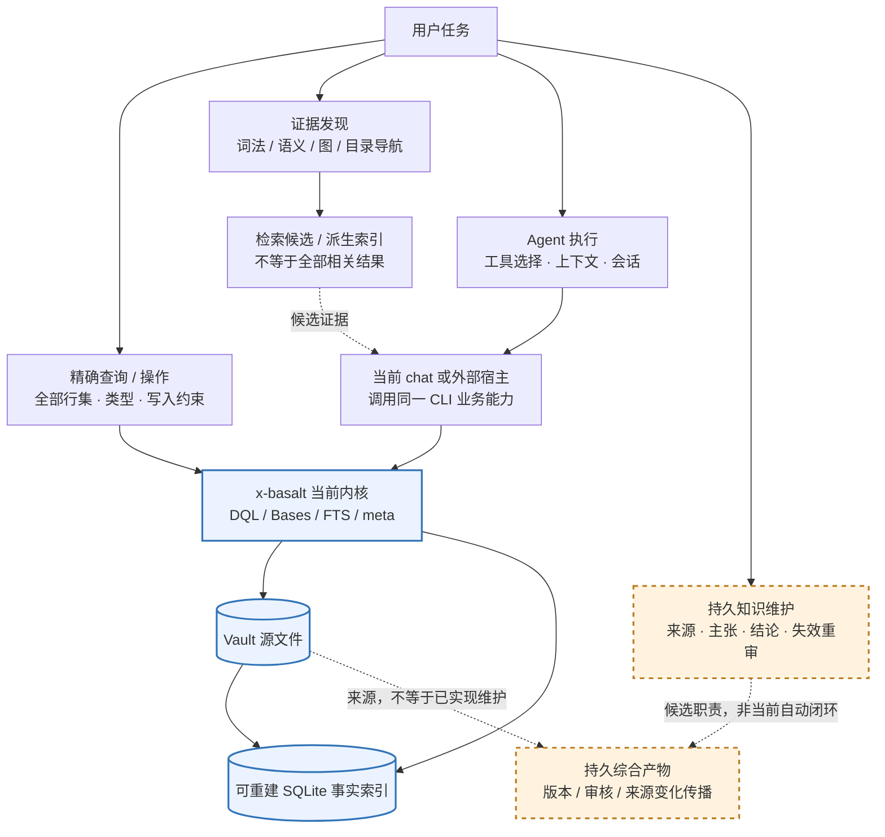

# Agent 知识工具深度业界调研：x-basalt 的定位与架构取舍

> 调研基准：2026-09-30 UTC；项目基线：x-basalt 0.10.0，commit `0a508dd6883d3ea61d90efa9af359bd5daedc8f2`。
> 性质：一手证据驱动的研究快照，不是产品路线图、设计契约或迁移授权。没有运行竞品或真实 Vault A/B；能力证据与效果证据分开。

## 1. 结论先行

**SQLite、Markdown 与自建查询引擎仍适配 x-basalt 的确定性任务；随着同类工具增加，“无头操作 Obsidian + 和笔记聊天”的差异化需要重新验证。更值得优先评估的路线，是强化外部 Agent 可组合的、语义边界清楚的 Vault 数据与操作内核。**

这是条件化建议，不是市场成功证明：

1. **保留确定性内核。** 对“全部”“计数”“哪些没有反链”“批量修改这些文件”，完整行集、类型语义、错误定位和写侧约束不可被 top-k 检索替代。DQL/Bases 的价值来自真实工作流兼容，不来自语言本身。[S05][S07][S09][P01]
2. **优先验证组合，而非再造全套宿主。** 通用 Agent 的工具发现、上下文管理、持久会话和执行环境投入持续增加；x-basalt 的 CLI 与运行时 skills 已具备组合基础。保留薄 chat 是合理选项，但继续扩建通用 harness 应以可量化的领域优势为条件。[S01][S02][S04][P02]
3. **检索能力正在商品化，不等于检索已被淘汰。** QMD 已有词法/向量/重排和结构化 metadata filter；托管 File Search 提供另一种低运维选择。是否自建应看中文、更新一致性、部署负担和端到端增益，而不是“向量是下一代”。[S05][S06]
4. **知识维护是另一类产品，不是索引的升级名称。** Basic Memory、OpenViking、Graphiti、Letta Code 分别覆盖可写笔记、上下文层级、时态事实和持续 Agent 记忆；这些不是同一种存储。若目标是 LLM Wiki，真正缺口是来源—主张—综合结论—失效重审闭环，而非只多建一张向量表。[S10]–[S14][S18][P03]
5. **必须正视直接竞争。** `headless-vault-kit` 已公开提供 SQLite 索引、反链、DQL/Bases、原子写与 MCP；`basecli` 专做无头 Bases。它们说明该方向成立，也说明“别人必须启动 Obsidian”已不是对所有替代品成立的判断。尚不能据此证明它们与 x-basalt 等价或足以替换。[S07]–[S09]

**建议的优先顺序：先做确定性内核和外部宿主的公平对照，再评估检索组合；只有反复发生的知识维护需求得到证明，才进入编译型 Wiki 或长期记忆系统。** 不建议凭本报告立即删 chat、删 DQL、迁移 OKF profile 或换图数据库。

## 2. 调研方法与边界

图示信源：当前内核/工具路径 [P01]–[P03]，检索完整性边界 [S05]，持久知识对照 [S10]–[S12][S18][S24]。虚线明确区分候选职责，未表示本项目已有自动知识维护。

### 2.1 问题不是“哪个框架更新”

| 层 | 核心问题 | 正确验收方式 | 容易混淆的替代品 |
| --- | --- | --- | --- |
| 数据事实 | 文件有哪些属性、任务、链接；结果是否完整且当前 | 行集一致性、增量失效、类型与链接歧义 | top-k 文本搜索 |
| 精确操作 | 能否只改指定字段、拒绝不合法写入、不丢更新 | 字节级 diff、并发/失败注入、恢复 | Agent 会调用 write 工具 |
| 证据发现/执行 | 能否找到证据并完成任务 | 证据召回、任务成功、调用/费用/延迟 | 单次 embedding 分数 |
| 持久综合知识 | 结论能否积累、溯源、撤回和重审 | 冲突保留、来源变化传播、长期回归 | 可重建索引或会话 JSONL |

证据分为：**A** 固定版本源码/规范；**B** 官方文档中的能力声明；**C** 作者论文/自测；**D** 本报告推断。A/B 可支持“存在某路径”，不能直接支持“更准确、更安全、更省钱”。未查到能力写“未证实”，不写“不支持”。

### 2.2 取证做了什么

- 搜索用于发现直接竞品、近期规范与反证，结论回到官方资料、论文及源码；没有用搜索摘要证明实现细节。
- 对核心仓库固定 commit，核查 README 与相应实现/限制，而非只看功能表：重点是 QMD 搜索过滤、Basic Memory 写侧、OpenViking 层级检索/记忆更新、Graphiti 时态字段、PageIndex Markdown 索引，以及两个无头 Bases 竞品。
- 对动态官网保留本次观察日期；Obsidian Help 的部分页面只有 SPA 壳，改读官方仓库的固定 Markdown。404 源码及客户端验证页面不作为能力证据。
- 没有统计市场份额、付费转化、社区真实部署数量；没有运行竞品 benchmark。覆盖的是与本项目决策相关的代表路线，不声称穷尽业界。
- 深度源码核查的产品与只做外围筛查的产品在下文分开。没有采用跨数据集排行榜给产品排名。

## 3. 行业演进：不是 RAG → Agent 的单线替代

### 3.1 从“塞入上下文”转向“控制如何取得和使用上下文”

Anthropic 的 context engineering 强调最小高信号上下文、just-in-time 获取、压缩和结构化笔记；advanced tool use 增加按需工具发现与程序化编排；Managed Agents 把 session、harness、sandbox 分离。OpenAI Shell 也将程序执行作为原生工具能力。这些说明通用执行与上下文编排已有强供应，不证明任何外部宿主在本项目任务上一定更好。[S01][S02]

对 x-basalt 的含义：领域语义应尽量在可独立验收的 CLI/API 中，而不是只存在于 system prompt。外部宿主可复用“如何调用”，不应重新猜“null 如何比较、链接如何解析、哪些写入被拒绝”。当前单 `cli` 工具使用 argv、不是 shell，这个约束也不能在外部集成时丢掉。[P01][P02]

**反证：** 文件探索会多轮读错目录、停得太早，Shell 扩大权限，宿主更新可能改变行为；自建 harness 可以提供封闭工具面、稳定输出、特定部署体验。这里应减少没有证据支持的通用建设，不是宣布自建 chat 错误。

### 3.2 长上下文、文件探索与检索并存

Lost in the Middle 说明长上下文中的位置会影响效果，但旧模型实验不能直接代表当前模型。RLM 把长输入置于可编程外部环境中，让模型按需检查和递归处理；它证明了不同上下文访问策略的可能性，不证明普通 Agent 已能低成本穷尽任意 Vault。[S03]

2026 年《Is Grep All You Need?》用 **116 个 LongMemEval 问题**对比 Chronos、Claude Code、Codex、Gemini CLI，改变 grep/vector 与 inline/file-based 交付方式。论文中排序随宿主、模型、噪声及交付方式变化；其 grep 是处理对话和已提取时态事件的 regex 检索，不能直接等同于任意 Markdown Vault 上的原始 `rg`。部分扩展实验行尚不完整。[S19]

CORE-Bench v2 研究仓库状态下的需求驱动代码检索：代码理解、改动定位和支持上下文的难度不同，embedding 的传统 code-search 分数并不能稳定预测 Agent 所需上下文覆盖。它不是 Obsidian benchmark，也不是 grep 与向量的完整端到端判决。[S20]

**可采纳结论：比较“宿主 × 检索 × 结果交付”的完整系统；不可采纳结论：grep 已淘汰向量，或长上下文已淘汰索引。**

### 3.3 混合检索成为现成能力，但完整查询仍是不同契约

QMD 组合词法、向量、query expansion、重排与上下文说明；OpenAI/Gemini File Search 将索引检索作为托管服务。它们压低的是“给 Agent 找候选段落”的实现门槛，而不是保证全库关系查询和批量写入正确性。[S05][S06]

QMD 是特别重要的反证：不能再把它简单描述为“只有语义搜索”。固定版本支持跨 CLI/SDK/MCP/HTTP 的 metadata filtering。但是 `searchFTS()` 对过滤查询先取 `limit * 10` 候选再筛，源码明确是 best-effort completeness；向量过滤在候选集合不超过 **20,000** 时可精确扫描，更大集合走受限 ANN over-fetch。过滤是实能力，不能因此推出完整枚举/统计保证。[S05]

### 3.4 从“记住对话”扩展到“维护可变知识”

不同路线在解决不同状态问题：

- Basic Memory：Markdown 笔记及 observation/relation，让 Agent 读写同一知识工作空间。[S10]
- OpenViking：资源、记忆和 skills 的虚拟文件系统与 L0/L1/L2 分层内容，目录范围检索和会话记忆更新。[S11]
- Graphiti：episode 提取与带 `valid_at`、`invalid_at`、`expired_at` 的事实边，支持历史与当前事实的区别。[S12]
- Mem0：可嵌入应用的记忆层；其作者精度/费用宣传是特定条件下的自测，不是 Vault 效果保证。[S13]
- Letta Code：持续身份、可重写 memory/skills、MemFS/git 与 reflection；当前源代码已迁到 `letta-ai/letta-code`，旧 V1 API server 不能当成当前架构。[S14]

**“记忆”不是单个 feature。** 用户偏好、历史事实、综合文档、执行经验和搜索缓存具有不同真相源与失效规则。x-basalt 的源文件索引能保存前两者的文本，却不会因此自动拥有跨来源主张的维护逻辑。[P03]

## 4. 竞争与组合矩阵

### 4.1 深度核查对象

“完整查询”指明确全库范围内的行集/聚合契约，不指输出一定很长；“写安全”列存在的机制，不代表并发与崩溃安全已实测。

| 路线/产品 | 强项及状态真相源 | 完整/结构化能力 | 写入与知识更新 | 代价与替代边界 |
| --- | --- | --- | --- | --- |
| x-basalt 基线 | 文件源 + 可重建 SQLite；Obsidian 解析、DQL/Bases、meta | 支持其文档化子集；隐式字段查询期 JOIN | YAML Document 往返、dry-run、同目录 rename；没有自动知识维护闭环 | 应按覆盖矩阵验收，不能称完整 Obsidian；meta 原子替换不等于并发防覆盖 [P01][P03] |
| QMD | 本地 Markdown 检索；SQLite/模型索引 | 有 metadata filter；搜索路径有候选完整性边界 | 索引维护，不是 Vault 精确写侧替代品 | 模型下载/推理与更新索引；适合证据发现，值得组合 A/B [S05] |
| headless-vault-kit | 文件派生 SQLite、反链/任务、无头服务器自动化 | DQL LIST/TABLE + FROM/WHERE/SORT/LIMIT；拒绝 TASK/GROUP/FLATTEN；有 Bases | 原子替换、digest 检查、只读默认 MCP、显式写开关、审计 | 与本项目直接重叠；0.1.0 成熟度有限，作者路线文档承认实用写侧/MCP 验证不足 [S07] |
| basecli | Python、从 Vault 构造行集，专做 Bases | 公式/类型/分组/汇总；不等价完整应用行为 | 只读，不写 notes/.base | 默认按值推断类型，types.json/日期语义有偏差；适合窄需求替代 [S08] |
| 独立 obsidian-cli | Go + rg；笔记生命周期、图上下文、批量命令/schema | 属性/tag 搜索与链接图；DQL/Bases 等价未证实 | 声明 dry-run、if-hash、链接/大小约束 | README 自称 POC；有可选 URI open 路径，不能直接纳入本项目硬约束 [S09] |
| Basic Memory | 可读写 Markdown、observation/relation、context traversal | 搜索/图上下文，非 DQL/Bases 的替代证明 | 防覆盖策略；accepted-note 服务有可选 base_checksum/409；MCP 普通 edit 不传该前置条件 | 当前写侧存在 DB 接受内容与文件物化阶段，不能简单称“任何时刻只以磁盘 Markdown 为唯一真相” [S10] |
| OpenViking | viking:// 层级上下文；资源/记忆/skills | 目录范围语义检索与分层读取；非 Vault SQL 行集 | LLM 产生 MemoryOperations 后执行，另有会话 checkpoint | 不是普通目录结构换名；要接纳服务、模型与生命周期；AGPLv3 需评估 [S11] |
| Graphiti | episode → 时态实体/事实图 | 混合检索、图遍历与时态字段；非 wikilink 精确 JOIN | 自动事实失效机制含模型判断 | 图后端及模型依赖；不应把抽取图与源文件链接图混为一谈 [S12] |
| GraphRAG | 提取实体关系 + community reports | local/global 搜索；global 面向跨全库主题综合 | 索引管线，不提供已证实的 Vault 写侧 | 索引昂贵；当前 README 明示 maintenance mode、无新增功能/PR [S15] |
| LightRAG | 图 + 向量；局部/全局/混合检索 | 关系发现和生成；不是 DQL/Bases 兼容引擎 | 官方声明增量与选择性删除、缓存辅助重建 | 改 embedding 模型仍有重建成本；“轻量”是相对 GraphRAG，不等于零模型 [S16] |
| PageIndex | 文档树索引 + reasoning-based retrieval | 擅长有层级长文档导航，非完整元数据聚合证明 | 建树/摘要，不是精确写侧 | vectorless 仍需要模型/索引；主要公开评测是 PDF，不能直接外推到 Vault [S17] |
| Letta Code | stateful harness、memory/skills、MemFS/git | 对话/记忆搜索与工具执行 | reflection、上下文重写；不是来源主张正确性的保证 | 可组合宿主候选；默认 Cloud 可切 local，需单独审数据边界 [S14] |

### 4.2 外围产品与托管路线

- **Khoj**：官方 README 提供私有资料问答、Obsidian 客户端、自定义 Agent、定时研究和自托管。**AnythingLLM**：聊天、文档管线、向量后端、Agent、多用户与 memory；本次许可证核查为 MIT，Khoj 为 AGPLv3。它们是“个人/团队知识助手”的横向产品，不是已经证明的 DQL/Bases/精确 YAML 往返替代品。本轮停留在功能/部署层，没有审其核心写侧。[S22]
- **Obsidian Smart Connections**：官方仓库描述本地 embedding 和相关笔记/摘录发现；这是桌面内体验的替代路线，不符合本项目零 Obsidian 运行时定位。外围 MCP 项目是否依赖既有插件索引须逐项检查，不能因名字有 MCP 就当成无头内核。[S23]
- **托管 File Search**：OpenAI 支持语义/关键词检索及 metadata filter；Gemini 支持 metadata filtering 与 grounding。适用于愿意接受云端资料存储/费用/服务契约的问答任务；没有证据证明它们能实时复刻文件系统修改后的 Vault 关系与写入契约。[S06]
- **完全由通用 Agent + fs/rg 操作**：最低额外系统负担；无需自建索引即可工作，但全量统计、Obsidian 特殊语法、重复文件名、YAML 保真、并发与恢复成本转移给每次任务。应作为实验基线而非稻草人。

没有进一步展开企业搜索平台、NotebookLM、完整协同知识库与纯向量数据库：它们可能更适合别的产品目标，但不直接回答“保留一个无头 Vault 内核是否有价值”。若目标变为多人协作/多源企业问答，应重开范围而非套用本报告。

## 5. 决定路线的技术分水岭

### 5.1 搜索候选不等于全部结果

“找三篇相关记录”可容忍近似；“找出所有到期且无反链的记录，逐项更新”需要：完整范围、稳定类型、索引时效、可重跑结果、写前重核和逐项结果。QMD 的源码边界提供了具体反例，而不是说搜索工具无价值。[S05]

同样，GraphRAG 的 global search 表示跨 community report 综合，不等于关系代数意义的全量 COUNT；Graphiti 的实体事实边来自抽取，不等于作者写下的全部 wikilink。将这两类图分开，才不会用模型推断覆盖原始事实。[S12][S15]

**x-basalt 的可验证优势应是确定性契约，而非“用了 SQL 所以永远正确”。** 源文件改变而索引未刷新、歧义链接、跨根命名空间、日期/缺失值差异仍会造成错误。[P01]

### 5.2 安全写已不是独家能力，也不能只看 atomic 字样

| 安全层 | 能防什么 | 不能自动推出什么 |
| --- | --- | --- |
| 不变不写、dry-run | 减少误操作和无意义 churn | 运行时一定不会越界 |
| 同目录临时文件 + rename | 避免读到半写内容 | 不覆盖别人刚完成的更新、断电持久性 |
| 读取后 digest/version 前置条件 | 拒绝已观察到的旧版本 | 未加锁时检查与替换之间无竞态 |
| YAML Document 往返/字段更新 | 避免大范围格式与正文破坏 | 语义改动正确、所有 YAML 形态无损 |
| 权限边界/审计/备份 | 限制影响、追溯和恢复 | 模型不会错改合法范围内的文件 |

本项目 `src/meta/index.ts` 的 `editMeta()`/`applyProfile()` 读取后直接进入同目录临时写和 rename，当前 options 没有版本前置条件；不能把它包装成完整 optimistic concurrency control。`headless-vault-kit` 的 `Vault.write()` 有 digest 比较、fsync 和 replace，但从读校验到 replace 之间仍有窗口，本报告不宣称其提供无锁 CAS。[P01][S07]

Basic Memory 的 `note_content_writes.py` 在 accepted-note transaction 中校验可选 `base_checksum`，可返回 409；普通 MCP `edit_note.py` 构造 PATCH 时不传该参数，服务也明确说明普通 append 调用未必携带已同步 revision。它证明安全机制存在，也证明不能把服务能力无条件归于所有入口。[S10]

**投入应比较完整失败模型：** 人工/Sync/Agent 同时写、断电、权限变化、链接改名、重试、部分批量失败、审计与恢复。哈希是漂移检测依据，不是事实真实性或跨文件事务证明。

### 5.3 本地文件、虚拟文件系统和 DB 接受态是不同选择

QMD 的检索索引可重建，不意味着向量与普通 Markdown 属性天然同构；其结构化 metadata 使用 `qmd.metadata` 命名空间，不是自动把普通 frontmatter 当同一查询 schema。null、嵌套对象、空/混合数组有校验限制；无效 metadata 的文档仍可入索引，但不参与相应 filtered search。[S05]

OpenViking 的 `viking://` 是带上下文管理、分层内容与服务语义的虚拟空间，不是“给本地文件夹套路径”。Basic Memory 当前接受写入的 DB revision 与 deferred file materialization 又是另一种一致性模型。组合时必须先问：当前内容谁说了算，什么时候对查询可见，失败后以什么重建。[S10][S11]

x-basalt 若保持文件为真相源、SQLite 为派生缓存，应避免为接一套上下文服务悄悄引入第二份不可丢弃的权威状态。组合外部工具不等于统一索引，也不等于默认同步保证。[P03]

### 5.4 Wiki/长期知识的关键是失效，而不是生成

Karpathy 的 LLM Wiki idea file 将原始来源与持续维护的 Wiki 分开，强调摄入、查询与 lint；这是有启发性的模式，不是成熟标准或经独立评测的产品。[S24]

最小维护闭环应回答：这段结论来自哪个来源/版本；多个来源冲突是否被保留；来源更新/删除影响哪些主张；什么必须重新验证；生成者与审核者是谁；重跑是否产生重复知识。仅记录 mtime、sha256 或会话摘要不能回答这些问题。[S12][S18][S24]

OKF v0.2 用 `sources`、`generated`、`verified`、`status`、`stale_after` 和 Attested Computation 表达部分上述信息；**字段表达能力不是自动维护引擎**。规范还明确延后 runtime receipt/verdict、attester ABI/沙箱、attestation caching 等问题。[S18]

**[冲突提示]** x-basalt 的 `llm-wiki` profile 仍明确以 OKF v0.1 为来源。v0.2 §13 列出两项 deliberate breaking changes：`timestamp` 被 `generated.at` 取代，正文 Citations 被 `sources` 取代，消费者有旧文档 fallback。其余多数增量可选，但不能将整体升级描述为完全无破坏。影响范围为 profile、自我说明、文档自举和潜在消费者；建议停在研究登记，先决定版本与迁移口径再修改，不在本轮迁移。[P03][S18]

### 5.5 接口标准不保证业务兼容

MCP Tools 提供工具发现/调用与 schema；Agent Skills 规范支持按需加载指令。它们减少宿主适配成本，不验证 DQL/Bases 语义，也不替代权限隔离或安全写测试。MCP 的只读/破坏性 annotations 是提示，不是安全执行器。[S04]

当前 CLI + skills 路线与渐进披露相容；是否需要 MCP，应由无法使用 CLI 的具体客户端决定，而不是为了赶生态名词。应保持业务内核独立，多个入口共享同一契约，避免 CLI/MCP/chat 各定义一套行为。[P02]

## 6. 评测证据能证明什么

| 资料 | 实际研究对象 | 可以支持 | 不可以支持 |
| --- | --- | --- | --- |
| Anthropic Contextual Retrieval | 上下文增强 BM25/embedding/重排，作者实验 | 给候选补上下文可能改善召回 | 所有 Vault 都应启用同一昂贵管线 [S21] |
| Is Grep All You Need? | 116 个对话记忆问题；多宿主/交付路径 | 需要端到端、分条件比较 | 全行业 grep 胜出，或本项目无需搜索索引 [S19] |
| CORE-Bench v2 | 超 180K 查询、106K broader-context relevance labels；代码仓库任务 | 单一 embedding 排名不能代替任务上下文覆盖 | 直接估计个人知识库效果；自动标注等于人工金标准 [S20] |
| GraphRAG 论文 | 跨全库主题问答，图摘要方法 | global synthesis 有别于局部段落检索 | SQL COUNT/全部文件操作也应 LLM 图化 [S15] |
| PageIndex OSS benchmark | **62 问/34 PDFs**；正文事实，排除图表、计数算术及不能成功索引的文档 | 所选文档上的树检索有可复核实验脚本 | 其高分等于任意 Vault 或完整统计能力 [S17] |
| LongMemEval / V2 | 前者多会话记忆；V2 **451 问**、Agent 轨迹 | 长期更新/跨会话问题需要单独评测 | V2、PDF 问答、作者私有数据集分数可直接横比 [S25] |
| OpenViking / Mem0 作者自测 | 各自设置下的记忆/检索与费用 | 值得设计复现实验的假设 | 未重跑就宣布绝对费用/准确率优势 [S11][S13] |

许可证另核：QMD、basecli、headless-vault-kit、PageIndex、GraphRAG、AnythingLLM 的本次文件/声明为 MIT；Basic Memory、OpenViking、Khoj 为 AGPLv3；Graphiti 为 Apache-2.0。[S05][S07][S08][S10]–[S12][S15][S17][S22]

这是技术选型线索，不是法律意见。独立 CLI 组合、部署网络服务、复制源码、分发依赖的影响不同；组件、模型权重与商用云条款另查。不要将“开源”自动理解为可直接拼入 MIT 产品。

还要区分方法与具体实现的存续：GraphRAG 官方实现进入 maintenance mode 不证明图检索失效；Letta 换当前源码不证明记忆路线失效；Graphiti README 将 Kuzu 标为 deprecated，提醒图后端也有生命周期成本。[S12][S14][S15]

## 7. 回到 x-basalt：哪些判断应修正

| 之前/常见判断 | 调研后修正 | 置信度与未决条件 |
| --- | --- | --- |
| 无头 Obsidian 是稀缺能力 | 官方 CLI 仍依赖 App；官方 Headless 目前列 Sync/Publish。但独立无头数据/查询竞品已经存在 | 高：公开接口事实；低：竞争产品的实用等价性 [S07]–[S09][S26] |
| QMD 只能做语义检索，不能结构化过滤 | 当前已有完整接口面的 metadata filter；搜索行集完整性仍有明确边界 | 高：固定源码；效果需 A/B [S05] |
| 专用 CLI 的安全修改是独家优势 | 至少多个竞品有防覆盖/原子写/权限机制；x-basalt 仍要证明保真与失败模型 | 高：机制存在；当前安全优越性未证明 [S07][S09][S10][P01] |
| 通用 Agent 必然更好/更省 | 通用宿主值得优先借用，但模型、提示、工具面和交付方式共同决定效果 | 中：结构性建议；低：本项目成本优势 [S01][S19] |
| 零词面重叠只有向量能救 | 单次固定 FTS 的确可能漏召回；Agent 查询扩展、同义词、目录/链接导航、生成摘要、稀疏扩展也可找到原文 | 高：原断言过强；每条路线的实际增益未验证 [S01][S19][S20] |
| 向量可以穷尽概念相关 | 近似/排序检索不保证穷尽；概念相关也缺少天然完整 oracle | 高：不能作完整性承诺 [S05] |
| 可重建索引可以替代 Wiki 的全部价值 | 可替代一部分事实投影，不能自动替代持续综合与来源变化传播 | 高：状态职责不同 [S10]–[S12][S24][P03] |
| OKF 升级就是补几个 optional keys | v0.2 包含显式破坏性字段替换与消费 fallback，且运行协议尚未定义完 | 高：规范 §12–13 [S18] |

**本轮文档校正**：检索设计原有“只有向量能救”“穷尽概念相关”等强断言，现已改为条件化补召回，并更新 FTS5 已落地状态、QMD metadata/filter 边界与组合评估条件。同步补充无头竞品、chat 当前工具面与写侧风险；没有修改代码、接口或迁移 profile。[P01][P02][P04]

当前可保留的价值资产：Obsidian 特殊语法边界、查询期 JOIN、明确子集与诊断、YAML Document 写侧、Bases 场景矩阵与既有官方差分记录、领域 CLI/skills。**不是由本报告重新证明其全部正确，也不是因代码多就必须保留。**[P01][P02]

DQL 与 Bases 两套执行路径的长期维护成本确实存在，但是否删除 DQL 应由存量任务/文件决定；Bases 的内容兼容价值也必须超出“能读取 .base”。`basecli` 和 headless-vault-kit 是必须加入兼容/性能对照的对象。[S07][S08]

## 8. 可选路线与停点

| 路线 | 适用目标 | 建议 | 进入/退出条件 |
| --- | --- | --- | --- |
| A. 确定性 Vault 内核 + 外部宿主 | 自动化、结构化查询、安全字段操作、CI/server | **最优先验证**，不改硬约束 | 外部宿主 + x-basalt 能显著减少漏行/误改且接入负担可接受；否则缩小产品范围 |
| B. 现成知识助手/窄工具替代 | 主要是问答，或只需跑几份 .base | 优先试 QMD/Khoj/AnythingLLM/basecli；不先造大全套 | 实测满足用户任务且部署/许可可接受；不满足才保留相应自建层 |
| C. 可插拔证据发现 | 现有查询找不到间接相关正文 | 先对比 rg/FTS/外部混合检索 | 同模型和预算下，证据/任务收益覆盖运维与失效成本，才进入集成设计 |
| D. 可溯源知识编译/维护 | 经常跨来源综合，结论要长期更新 | 有潜力，但属于新职责，先小样本原型 | 真实反复使用且来源变化传播可靠；否则不要因 LLM Wiki 热度扩大范围 |
| E. 完整自建长期 Agent/上下文数据库 | 严格宿主控制、持续身份或专用服务 | 暂不作为默认方向 | 外部宿主无法满足明确需求且差异收益覆盖长期维护，才投资 |

不建议把模型相关摘要、事实抽取、长期记忆默认混进 parser/indexer。若未来决定 D，应先明确源文件、派生索引、持久生成物及其写权限四者边界；更新设计和计划再实现，不通过调研文档暗改架构。[P01][P03]

## 9. 下一步实验：可复现、能推翻建议

以下是**待执行协议**，不是已跑结果；样本数是建议起点，不是统计充分性声明。

### 9.1 公平对照组

固定相同只读/可写 Vault 副本、模型/推理档、任务、权限、token/时间预算与时钟：

- H0：通用宿主 + fs/rg，不提供 x-basalt。
- H1：同一宿主 + x-basalt CLI/skills；不能比 H0 少权限却将权限效应算成检索效应。
- H2：x-basalt 当前 chat + 相同模型；记录宿主/提示 differences，不能把它当纯 harness 因果实验。
- R0/R1/R2：同一宿主分别使用词法、QMD 混合、树/目录导航；必要时增加融合组，不预设 embedding 胜出。
- B0/B1：x-basalt 与 basecli/headless-vault-kit 在共同明确支持的 Bases 子集上比较；不支持项单列，不计为错误匹配。
- K0/K1：每次重新检索 vs 持久综合文档；给两组相同来源更新/删除与冲突输入，测复用与维护总成本。

采用随机任务顺序、重复运行、记录失败轨迹；为每个新检索库计入初始化/增量成本。对真实个人资料先做权限与脱敏审查，不上传真实 Vault 作为默认实验动作。

### 9.2 四类任务，不能合成一个平均准确率

| 任务类 | 起步样本 | Oracle 与检查 | 关键指标 |
| --- | --- | --- | --- |
| 精确查询 | 20 个：全部/计数/缺失/反链/任务/附件/日期/同名链接 | 人工核定完整行集；需要官方语义的项用既有已记录 oracle/人工导出；不引入 GUI 自动化 | 行集 precision/recall、聚合完全一致、确定性、索引时效 |
| 证据发现 | 20 个：中文短词、同义改写、无初始词面重叠、跨文档、无答案、反证 | 专家标注证据文件/段落与支持关系 | 证据 Recall@k、引用真实性、回答正确/拒答、费用与 p50/p95 |
| 安全修改 | 20 个：非法 YAML、注释/日期/BOM/换行、越界/软链、并发编辑、失败重试 | 文件字节 diff、越界文件不变、并发版本与恢复记录 | 误写/丢更新/半写、非目标字段变化、失败可解释性；严重数据损坏为硬淘汰项 |
| 知识维护 | 10 个序列：摄入→矛盾→更新→删源→重跑 | 来源—主张依赖人工表；检查旧结论是否被标 stale/撤回、冲突是否保留 | 失效漏传播、错误合并、重复产物、人工复审量、全生命周期费用 |

针对候选窗口缺陷增加“匹配项排在大量不满足 filter 的高分候选之后”用例；针对最终摘要增加“前面都是支持、后面才是反证”用例；针对 schema 增加 null/嵌套 metadata；针对写侧增加检查与替换之间的竞争写入。[S05][S07][S10]

### 9.3 预先声明停点

- H0 和 H1 若在真实核心任务上没有可重复差异，不继续靠加命令解释价值；调查任务是否太简单或产品需要收缩。
- 外部宿主若达到领域成功/安全要求，停止为相同需求扩建通用 chat；若封闭工具面显著降低事故或符合部署要求，保留薄宿主。
- 检索是否增加模型组件，以证据/任务收益和总拥有成本判断，不能只看 cosine 分数或单次成功案例。
- 窄 Bases 替代品若覆盖全部实际 .base 且维护成本更低，可以选择直接使用；若只有边缘不兼容但用户从不用，不据此保留重实现。
- 知识维护若不能可靠暴露来源变化与矛盾，不扩张为长期自主记忆；先维持原文 + 人审。

### 9.4 后续讨论与待办背景（2026-09-30—2026-10-01）

本节从根 TODO 迁入讨论背景与历史记录。用户观察、已对齐方向、研究建议和已验证事实分开处理；本节不构成功能实施授权，具体行动只列在根 TODO。

**已对齐方向：**继续沿现有主线逐步打磨，按真实缺口借用外部工具或成熟库，不要求全部自建；本轮没有足够证据支持整体改道。当前不把 chat 当第一优先级或万能入口，保留内置 chat / 外部 Agent 的双入口基础，不等于两路成熟度相同。

**用户观察与复现理由：**用户说的是复杂任务组织处理不过来，不是单纯运行时间长。要求理解、拆解、步骤依赖、执行、验收和异常恢复应分别检查，不能预设加预算或改检索就能解决。外部 AI 优先委托 chat 的现象也需保存能力发现与调用轨迹；是否隐藏入口、降低推荐或改为显式委托，尚未决定。下一轮切口须由复现决定，再比较外部复用与最小自建方案的适配、成本、许可和失败边界。

**双路线的局部结论与原因：**官方正文入口限制、本项目 stdin/source 无落盘路径、DQL/Bases 的模型互补，以及 R08/R09 两项已复现执行缺口，统一见[局部调研](2026-10-01-dql-bases-compatibility-local-audit.md)。保留双路线是有证据的建议，具体兼容范围、投入顺序与修复方式仍待确定；不自动删除模块或合并 AST。

**尚未定案：**chat 最终职责与复杂任务范围、外部 AI 的入口分流；检索组合/embedding、持久知识维护与 OKF v0.2 profile 迁移仍属候选或 backlog，不自动立项。

**旧 TODO 的 A/B 与 dogfood 记录：**Bases 语法接地后，base 从 7/12 到 12/12；后续四场景能力评估及 skill-before-base/source 均记为 39/39，零 base error、零撞顶、零 error-storm，记录指向外部 `x-basalt-evals`。原 TODO 据此称“已收口，进入真实 Vault dogfood，遇可复现阻断再立项”。[原计划 Evidence/Verify](../plans/2026-08-08-bases-chat-grounding.md)已有 A/B 记录，但计划 frontmatter 仍为 `active`，与旧 TODO 的收口表述不一致。本次仅保存历史记录，未重跑评测或核实外部轨迹，计划状态另列待办核对；不能把这些小样本读数当作当前复杂任务能力保证。

**长期待办的设计依据：**任务字段、DQL 函数与 FROM 多源差距的旧调查见[历史特性差距](../history/research/2026-06-30-feature-gap-vs-dataview-obsidian.md)；原“函数约 15%”为旧口径，不作当前跨引擎能力结论。变更编排器的 `restart/ignore` 依赖 `runPipeline` 的协作取消，背压、缓存跳过、分支、续跑、告警等余项见[编排设计](../design/change-orchestration.md)。跨平台 stdin/stdout 契约见[管道设计](../design/shell-pipe-portability.md)。FTS5 已落地，embedding 的候选准入见[语义检索 §5](../design/semantic-retrieval.md#5-可选-embedding-的候选方案未实现)。更多 profile 与 Kysely 收编 DQL→SQL 按需求评估，尚未选定集成方案。

## 10. 本次验证记录与未决风险

**已验证：** 已读取项目基线及重点一手资料；对核心项目固定 commit；交叉核对上述 metadata/filter、DQL 子集、写侧前置条件、OKF 差异和评测范围。已运行本项目 `meta profile show llm-wiki`，确认实际 profile 来源仍为 v0.1。

**文档与说明数据验证（实际执行）：** `tests/skill.test.ts` 36 项通过，typecheck/build 通过，`skills get core meta profile` 与 `skills get chat config` 条级召回冒烟通过；新增本地链接/锚点、77 个外部信源 URL 可达性、10 份 docs 的 frontmatter/正文哈希及 diff 空白检查通过。图示仅检查代码围栏与 flowchart 定界符，未实际渲染；以上不代表检索/写入效果 benchmark。

**未验证：** 未运行竞品、真实 Vault A/B、厂商成本复现或长期部署；未重新执行本项目全量生产测试/lint（未改生产代码、配置或测试基础设施）；未证明市场需求、保留率、兼容优越性与法律可集成性。外围产品未做深度源码审计。

**剩余风险：** 动态文档会变；源码机制不等于部署保证；模型/宿主版本影响结果；匿名化资料可能改变任务难度；许可、权限、同步与第二真相源风险需在实际组合前另审。本报告及直接受影响设计/教学文档按用户授权更新；元数据、信源链接和说明数据验证结果由本次执行记录补充，不把实验协议当结果。

## 11. 一手来源与复核索引

固定链接中的 commit 即本次快照；官网与论文使用下列指定 URL/版本。来源说明标明能力/实现/作者评测，避免同一引用承担不相干主张。

- **[S01] 上下文与通用 harness（官方工程材料）**：[Context engineering](https://www.anthropic.com/engineering/effective-context-engineering-for-ai-agents)、[Advanced tool use](https://www.anthropic.com/engineering/advanced-tool-use)、[Managed Agents](https://www.anthropic.com/engineering/managed-agents)。用于接口与职责趋势，不作为独立效果评测。
- **[S02] Shell（官方 API 文档）**：[OpenAI Shell](https://developers.openai.com/api/docs/guides/tools-shell)。用于程序执行能力与环境边界，不代表安全沙箱已在本项目启用。
- **[S03] 长上下文（论文）**：[Lost in the Middle v2](https://arxiv.org/html/2307.03172v2)、[RLM v1](https://arxiv.org/html/2512.24601v1)。各自任务/模型与本文不同。
- **[S04] 跨宿主接口规范**：[MCP Tools 2025-11-25](https://modelcontextprotocol.io/specification/2025-11-25/server/tools)、[Agent Skills specification](https://agentskills.io/specification)。业务与安全契约仍需实现者负责。
- **[S05] QMD，`04e4dbd8245c527a88f1a8f0bda547aef9ca81fb`**：[README](https://github.com/tobi/qmd/blob/04e4dbd8245c527a88f1a8f0bda547aef9ca81fb/README.md)、[store.ts](https://github.com/tobi/qmd/blob/04e4dbd8245c527a88f1a8f0bda547aef9ca81fb/src/store.ts)（`searchFTS`、`FILTERED_VEC_EXACT_SCAN_MAX`）、[metadata.ts](https://github.com/tobi/qmd/blob/04e4dbd8245c527a88f1a8f0bda547aef9ca81fb/src/metadata.ts)、[metadata-filter.ts](https://github.com/tobi/qmd/blob/04e4dbd8245c527a88f1a8f0bda547aef9ca81fb/src/metadata-filter.ts)、[MCP](https://github.com/tobi/qmd/blob/04e4dbd8245c527a88f1a8f0bda547aef9ca81fb/src/mcp/server.ts)、[LICENSE](https://github.com/tobi/qmd/blob/04e4dbd8245c527a88f1a8f0bda547aef9ca81fb/LICENSE)。搜索完整性边界为源码事实。
- **[S06] 托管检索（官方文档）**：[OpenAI File Search](https://developers.openai.com/api/docs/guides/tools-file-search)、[Gemini File Search](https://ai.google.dev/gemini-api/docs/file-search)。没有据此推导 Vault 全量/写侧兼容。
- **[S07] headless-vault-kit，`f158bd8e8236efabb96505eea701cc204fe42b37`**：[README](https://github.com/angelsaez/headless-vault-kit/blob/f158bd8e8236efabb96505eea701cc204fe42b37/README.md)、[ROADMAP](https://github.com/angelsaez/headless-vault-kit/blob/f158bd8e8236efabb96505eea701cc204fe42b37/docs/ROADMAP.md)、[dql.py](https://github.com/angelsaez/headless-vault-kit/blob/f158bd8e8236efabb96505eea701cc204fe42b37/src/hvk/dql.py)、[Bases run](https://github.com/angelsaez/headless-vault-kit/blob/f158bd8e8236efabb96505eea701cc204fe42b37/src/hvk/bases/run.py)、[write.py](https://github.com/angelsaez/headless-vault-kit/blob/f158bd8e8236efabb96505eea701cc204fe42b37/src/hvk/write.py)、[MCP tools](https://github.com/angelsaez/headless-vault-kit/blob/f158bd8e8236efabb96505eea701cc204fe42b37/src/hvk/mcp/tools.py)、[LICENSE](https://github.com/angelsaez/headless-vault-kit/blob/f158bd8e8236efabb96505eea701cc204fe42b37/LICENSE)。PyPI 0.1.0 已发布，但 README 仍留“尚未发布”措辞，以 PyPI/ROADMAP 核实发布状态；作者性能数据未复现。
- **[S08] basecli，`ebf409d798c637c86430739f13e1e6b585c5e22c`**：[README](https://github.com/hobbs/basecli/blob/ebf409d798c637c86430739f13e1e6b585c5e22c/README.md)、[LIMITATIONS](https://github.com/hobbs/basecli/blob/ebf409d798c637c86430739f13e1e6b585c5e22c/LIMITATIONS.md)、[engine](https://github.com/hobbs/basecli/blob/ebf409d798c637c86430739f13e1e6b585c5e22c/src/basecli/engine.py)、[evaluator](https://github.com/hobbs/basecli/blob/ebf409d798c637c86430739f13e1e6b585c5e22c/src/basecli/evaluator.py)、[setup.cfg](https://github.com/hobbs/basecli/blob/ebf409d798c637c86430739f13e1e6b585c5e22c/setup.cfg)（MIT 声明；本轮未取得独立 LICENSE 文本）。兼容与局限取声明/实现，不视为已通过本项目 oracle。
- **[S09] 独立 obsidian-cli，`e9d292acfa627e7e60753abbdd8e29d7d1a203f8`**：[README](https://github.com/nightisyang/obsidian-cli/blob/e9d292acfa627e7e60753abbdd8e29d7d1a203f8/README.md)。POC 和 if-hash 等为作者声明，本轮未审全部命令实现。
- **[S10] Basic Memory，`08b49bca209ddd859cae8db75084950a6998c2db`**：[README](https://github.com/basicmachines-co/basic-memory/blob/08b49bca209ddd859cae8db75084950a6998c2db/README.md)、[write_note](https://github.com/basicmachines-co/basic-memory/blob/08b49bca209ddd859cae8db75084950a6998c2db/src/basic_memory/mcp/tools/write_note.py)、[edit_note](https://github.com/basicmachines-co/basic-memory/blob/08b49bca209ddd859cae8db75084950a6998c2db/src/basic_memory/mcp/tools/edit_note.py)、[build_context](https://github.com/basicmachines-co/basic-memory/blob/08b49bca209ddd859cae8db75084950a6998c2db/src/basic_memory/mcp/tools/build_context.py)、[note_content_writes](https://github.com/basicmachines-co/basic-memory/blob/08b49bca209ddd859cae8db75084950a6998c2db/src/basic_memory/services/note_content_writes.py)、[LICENSE](https://github.com/basicmachines-co/basic-memory/blob/08b49bca209ddd859cae8db75084950a6998c2db/LICENSE)。重点复核 `patch_note` 的事务/可选前置条件与 MCP 的参数传递。
- **[S11] OpenViking，`1394d4769a34058dcd64bd9afcf917d3cae7ab54`**：[README](https://github.com/volcengine/OpenViking/blob/1394d4769a34058dcd64bd9afcf917d3cae7ab54/README.md)、[hierarchical_retriever](https://github.com/volcengine/OpenViking/blob/1394d4769a34058dcd64bd9afcf917d3cae7ab54/openviking/retrieve/hierarchical_retriever.py)、[memory_updater](https://github.com/volcengine/OpenViking/blob/1394d4769a34058dcd64bd9afcf917d3cae7ab54/openviking/session/memory/memory_updater.py)、[checkpoints](https://github.com/volcengine/OpenViking/blob/1394d4769a34058dcd64bd9afcf917d3cae7ab54/openviking/session/checkpoints.py)、[LICENSE](https://github.com/volcengine/OpenViking/blob/1394d4769a34058dcd64bd9afcf917d3cae7ab54/LICENSE)、[作者 benchmark](https://blog.openviking.ai/post/openviking-benchmark-results/)、[VikingRAG v1](https://arxiv.org/html/2609.11390v1)。部署收益未独立复现。
- **[S12] Graphiti，`3c427640abf909f12f71f963fce15eb514a3c493`**：[README](https://github.com/getzep/graphiti/blob/3c427640abf909f12f71f963fce15eb514a3c493/README.md)、[edges.py](https://github.com/getzep/graphiti/blob/3c427640abf909f12f71f963fce15eb514a3c493/graphiti_core/edges.py)、[LICENSE](https://github.com/getzep/graphiti/blob/3c427640abf909f12f71f963fce15eb514a3c493/LICENSE)。事实失效的正确性未实测。
- **[S13] Mem0，`94c3fe9f238f3dbf29c9ce98643bd71eb13077cd`**：[README 与作者评测入口](https://github.com/mem0ai/mem0/blob/94c3fe9f238f3dbf29c9ce98643bd71eb13077cd/README.md)。本轮以应用记忆路线筛查为主，不据自报增益排名。
- **[S14] Letta 当前源码迁移**：[旧仓 README，`5bcdd177d70fa2b31a754cfcd801e77b2e1ab16a`](https://github.com/letta-ai/letta/blob/5bcdd177d70fa2b31a754cfcd801e77b2e1ab16a/README.md)、[Letta Code README，`3687ea51f6d11eabc4ad7a7b163c649d023801ba`](https://github.com/letta-ai/letta-code/blob/3687ea51f6d11eabc4ad7a7b163c649d023801ba/README.md)。memory/Cloud/local 为当前官方声明，没有复核全部持久化实现。
- **[S15] GraphRAG，`769542fbf1d8e5b4c6a8677fefc34621c87894c5`**：[README/维护状态](https://github.com/microsoft/graphrag/blob/769542fbf1d8e5b4c6a8677fefc34621c87894c5/README.md)、[LICENSE](https://github.com/microsoft/graphrag/blob/769542fbf1d8e5b4c6a8677fefc34621c87894c5/LICENSE)、[query overview](https://microsoft.github.io/graphrag/query/overview/)、[index overview](https://microsoft.github.io/graphrag/index/overview/)、[论文 v2](https://arxiv.org/html/2404.16130v2)。全局问答方法与确定性聚合分开。
- **[S16] LightRAG，`453dce83d6d0354a06e46c8d4029a0895c4e054b`**：[README](https://github.com/HKUDS/LightRAG/blob/453dce83d6d0354a06e46c8d4029a0895c4e054b/README.md)。增量/选择性删除为官方能力声明，模型替换限制在同文档；未运行删除恢复测试。
- **[S17] PageIndex**：[README，`f279431eb4e47884862961b9718df180552f417a`](https://github.com/VectifyAI/PageIndex/blob/f279431eb4e47884862961b9718df180552f417a/README.md)、[Markdown 实现](https://github.com/VectifyAI/PageIndex/blob/f279431eb4e47884862961b9718df180552f417a/pageindex/page_index_md.py)、[LICENSE](https://github.com/VectifyAI/PageIndex/blob/f279431eb4e47884862961b9718df180552f417a/LICENSE)、[OSS benchmark，`ad4c0b92970a6f4801f09ff2e647389e8f5874fa`](https://github.com/VectifyAI/PageIndex-OSS-Benchmark/blob/ad4c0b92970a6f4801f09ff2e647389e8f5874fa/README.md)。评测范围以这个公开集为准，不泛化其他金融数据宣传。
- **[S18] OKF v0.2**：[当前独立规范，`ad30107c31c06aec8a7d5636e0d1058118604e6f`](https://github.com/GoogleCloudPlatform/open-knowledge-format/blob/ad30107c31c06aec8a7d5636e0d1058118604e6f/SPEC.md)、[knowledge-catalog 内副本，`22efaa5402775a7c4d4c37f89e41258daaf3cb65`](https://github.com/GoogleCloudPlatform/knowledge-catalog/blob/22efaa5402775a7c4d4c37f89e41258daaf3cb65/okf/SPEC.md)、[Google Cloud 发布说明](https://cloud.google.com/blog/products/data-analytics/okf-v0-2-adds-trust-signals/)。以 SPEC §12–13 为兼容事实；不将项目规范宣称为行业统一标准。
- **[S19] grep/vector/宿主实验**：[Is Grep All You Need? v1](https://arxiv.org/html/2605.15184v1)，重点 §3 实现、§4 条件、§5 讨论与不完整实验。作者研究，非独立复现。
- **[S20] 需求驱动代码检索**：[CORE-Bench v2](https://arxiv.org/html/2606.11864v2)，重点 §3 自动标注、§4 排名指标、limitations；不要与科学论文复现同名 CORE-Bench 混淆。
- **[S21] 上下文增强检索**：[Anthropic Contextual Retrieval](https://www.anthropic.com/engineering/contextual-retrieval)。作者实验，不作为强制管线依据。
- **[S22] 知识助手外围对照**：[Khoj README，`ae229ca894c0b80ad84664afcfdde523b5e87057`](https://github.com/khoj-ai/khoj/blob/ae229ca894c0b80ad84664afcfdde523b5e87057/README.md)、[LICENSE](https://github.com/khoj-ai/khoj/blob/ae229ca894c0b80ad84664afcfdde523b5e87057/LICENSE)、[AnythingLLM README，`ed752067ab7e38b754480aeea2a2dd6038b96b9a`](https://github.com/Mintplex-Labs/anything-llm/blob/ed752067ab7e38b754480aeea2a2dd6038b96b9a/README.md)、[LICENSE](https://github.com/Mintplex-Labs/anything-llm/blob/ed752067ab7e38b754480aeea2a2dd6038b96b9a/LICENSE)。未深审其检索/写侧。
- **[S23] 桌面相关笔记路线**：[Smart Connections README，`0a182cffa67a52fc203f1e9ad9cc555bd4e1c8a0`](https://github.com/brianpetro/obsidian-smart-connections/blob/0a182cffa67a52fc203f1e9ad9cc555bd4e1c8a0/README.md)。已读官方原文，仅用于外围能力声明，不纳入核心源码比较。
- **[S24] LLM Wiki 模式原始材料**：[Karpathy idea file](https://gist.github.com/karpathy/442a6bf555914893e9891c11519de94f)。不是正式产品规范或效果证明。
- **[S25] 长期记忆评测**：[LongMemEval，`9e0b455f4ef0e2ab8f2e582289761153549043fc`](https://github.com/xiaowu0162/LongMemEval/blob/9e0b455f4ef0e2ab8f2e582289761153549043fc/README.md)、[LongMemEval-V2，`2cc8c540bdb87fe6761629b585e727e1c4704520`](https://github.com/xiaowu0162/LongMemEval-V2/blob/2cc8c540bdb87fe6761629b585e727e1c4704520/README.md)。任务定义与题数来源。
- **[S26] Obsidian 官方文档，`9cf8c2913e56830e75c13f33ba198d7e70b6d9ef`**：[CLI](https://github.com/obsidianmd/obsidian-help/blob/9cf8c2913e56830e75c13f33ba198d7e70b6d9ef/en/Extending%20Obsidian/Obsidian%20CLI.md)、[Headless](https://github.com/obsidianmd/obsidian-help/blob/9cf8c2913e56830e75c13f33ba198d7e70b6d9ef/en/Extending%20Obsidian/Obsidian%20Headless.md)、[Headless Sync](https://github.com/obsidianmd/obsidian-help/blob/9cf8c2913e56830e75c13f33ba198d7e70b6d9ef/en/Obsidian%20Sync/Headless%20Sync.md)、[Headless Publish](https://github.com/obsidianmd/obsidian-help/blob/9cf8c2913e56830e75c13f33ba198d7e70b6d9ef/en/Obsidian%20Publish/Headless%20Publish.md)。官方 Headless 的公开 Services 未列 Bases/DQL 引擎；这是当前范围，不是对未来的断言。

### 项目内基线证据

- **[P01] 确定性内核与写侧**：[架构](../design/architecture.md)、[Bases 状态/既有 oracle](../design/bases-status.md)、[官方差异](../design/bases-vs-official.md)、[`src/indexer/schema.ts`](../../src/indexer/schema.ts)、[`src/query/sql-generator.ts`](../../src/query/sql-generator.ts)、[`src/meta/index.ts`](../../src/meta/index.ts)。旧验收记录不是本轮重新执行结果。
- **[P02] 宿主与工具面**：[chat 工具设计](../design/chat-tool-surface.md)、[`src/chat/index.ts`](../../src/chat/index.ts)、[`src/chat/cli-tool.ts`](../../src/chat/cli-tool.ts)、[`src/chat/tools.ts`](../../src/chat/tools.ts)、[`src/chat/loop.ts`](../../src/chat/loop.ts)、[`src/chat/session.ts`](../../src/chat/session.ts)。以源码已实现路径为准，不将提案状态文字当成尚未实现。
- **[P03] 知识与 profile 边界**：[先前 rebase](2026-08-07-x-basalt-obsidian-llm-wiki-rebase.md)、[`src/meta/profiles.ts`](../../src/meta/profiles.ts)、[`src/indexer/schema.ts`](../../src/indexer/schema.ts)。文件派生事实与持久综合知识分开。
- **[P04] 本轮修正的检索设计**：[semantic-retrieval](../design/semantic-retrieval.md)。更新当前实现、补召回路径、QMD 过滤边界与待评估准入，不引入 embedding 实现或默认依赖。
