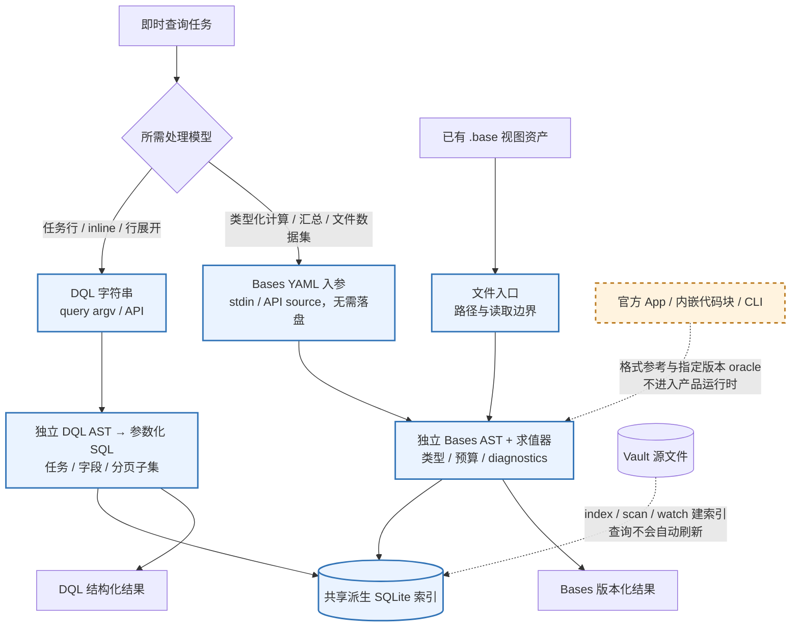

# DQL / Bases 局部深度调研：双路线的必要性与兼容边界

> 核查日期：2026-10-01 UTC；项目基线：x-basalt 0.10.0 / `0a508dd6883d3ea61d90efa9af359bd5daedc8f2`。
> 这是调研与建议，不是删改模块、升级兼容快照或功能实施授权。
> 后续实施状态（2026-10-01）：R08 已由[顺序清理计划](../plans/2026-10-01-todo-sequential-cleanup.md#5-bases-公式-file--asfile)修复，公式关联读取新增 16 项回归；R09 已执行 TASK 文件级排序，分组/展开明确拒绝，新增 18 项回归（[冻结表](../design/dql-subset.md#r09-task-子句回归矩阵)）。下文保留原取证基线的表格、代码定位与失败读数，不用后续结果改写历史探针。
> 上游：[业界调研](2026-09-30-agent-knowledge-industry-landscape.md)、[本轮已归档计划](../archive/plans/2026-10-01-dql-bases-compatibility-audit.md)。

## 1. 结论先行

**建议保留 DQL / Bases 双路线，先补各自的执行与说明缺口，不因为“官方也能查询”就把其中一条当作冗余。** 支持这个建议的不是单纯“官方入口必须写文件”，而是已验证的数据模型、行粒度与表达能力差异。

1. **用户记忆的入口问题基本成立，但需限定到公开入口。** 官方 `base:query` 文档是已有 base/视图的执行入口，未公开 raw query/source/stdin 正文参数；这与一次传入查询定义的接口不同。官方语言同时支持 Markdown `base` 代码块，因此不能说所有 Bases 都必须先落独立 `.base`。[O1][O2]
2. **本项目已经解除“查询定义必须落盘”。** `base -`、`base --stdin` 与 `BaseEngine.query({source, ...})` 直接接收定义并走自建引擎，不是临时写文件后委托官方 App，也不依赖 chat。[P1][P2][R01]
3. **解除入口限制，不会抹平两种语言的职责。** 本项目 DQL 有任务行、inline fields、特定数组行展开和外层分页；Bases 有类型化计算列、列表值处理、汇总及可选附件数据集。已在同一小库验证多个非等价结果。[P3][P4][R02]–[R07]
4. **“兼容范围待讨论”应改成具体能力账本，而不是先讨论缩减。** 当前存在自家实现缺口：Bases 公式体的文件解析器未接入；DQL TASK 分支未消费已解析的 SORT/GROUP BY/FLATTEN。它们应先登记独立修复切口，不解释成官方能力缺口、检索不足或模型处理能力不足。[R08][R09]

## 2. 取证范围与版本

| 来源 | 固定版本 / 性质 | 核查方式 |
| --- | --- | --- |
| Obsidian Help | `9cf8c2913e56830e75c13f33ba198d7e70b6d9ef` | 官方 CLI/Headless、Bases syntax/Create/Views/Functions/Table、Properties 原文 |
| Obsidian 公开 API | `cc1744324150c632416857c98964f87b1574a5fc`，package 1.13.2 | 只读声明与完整文件相关符号扫描；未安装/导入任何 Obsidian 包或类型 |
| Dataview | `5ad0994ff384cbb797de382e7edff2388141b73a`，package 0.5.70 | 官方插件文档、JS API 与 metadata 原文；未使用其执行层 |
| 本项目 | 上述 HEAD；本轮只改说明 | 源码、历史决策、定向测试及 CLI 小库对照 |

原文缓存落盘时间为 2026-10-01 UTC，固定 URL、HTTP 状态及正文 hash 记录于临时取证 manifest；不是发布日期，也不是 App 版本实测。38 项原文/元数据抓取均 HTTP 200；八份核心原文经复核重算 hash 一致。

公开声明的许可不能推导闭源 Bases 引擎可独立打包；本项目“不依赖 Obsidian 运行时/Dataview 执行层”的约束不因上游仓库许可而改变。[O4][O10]

**历史与当前分开：**既有官方 oracle 覆盖 Obsidian 1.12.7 与 1.13.4 的限定样本；本轮没有运行官方 App。Help 已列包括 early access 的后续布局，不能把最新文档当成所有已部署稳定版的共同能力。[P5][O3]

还发现两处历史说法必须收窄：官方当前语法示例已有字符串 `+` 拼接，不能把旧 oracle 的静默空读数外推为“官方根本不拼接”；官方还声明 `file.backlinks` / `file.properties` 不随 Vault 变化自动刷新结果，不能把 App 常驻缓存说成每次读取都必然最新。本轮校正说明，未通过猜测替代新版 oracle。[O5][P5]

## 3. “必须先写查询文件”到底是哪一层的限制

| 路径 | 查询定义从哪里来 | 是否依赖 Obsidian App | 本轮能证明什么 |
| --- | --- | --- | --- |
| 官方 `base:query` | `file/path/view` 定位 base；不指定文件时有通用 active-file 规则 | 是 | 专用命令段没有正文入参契约；未测 active embedded base 或隐藏参数 [O1] |
| 官方内嵌 `base` 代码块 | Markdown 内的 YAML 定义 | 是 | 不需独立 `.base`，但仍不是已公开的 CLI 零持久化正文接口 [O2] |
| 官方公开插件 API | 注册 Bases view，消费引擎提供的结果 | 是 | `registerBasesView` / `BasesView.data` 已公开；未暴露等价的任意 YAML→查询结果方法 [O4] |
| 官方 `eval` / 内部对象 | JS 与 App 可达对象 | 是 | JS 通用入口存在；既有内部 oracle 可脚本化，不代表稳定公开 Bases 文本接口 [O1][P5] |
| Dataview `dv.query(source)` | DQL 字符串 | 是，插件运行时 | 公开支持字符串→结构化结果；不能据此把插件执行层引入本项目 [O8] |
| x-basalt `query` | argv 中的 DQL 字符串 | 否 | 直接调用自建 DQL→参数化 SQL [P1][P3] |
| x-basalt `base -` / `--stdin` / API `source` | YAML 文本入参 | 否 | 直接解析、求值，不写查询定义文件；文件模式仍可用 [P1][P2][R01] |

“像 SQL 查询必须先写成 SQL 文件”的比喻，**在入口摩擦这一层有帮助**；但不能因此把 Bases 当 SQL，也不能把独立文件解释成其语言不可绕开的前提。持久视图适合 GUI 编辑、复用与版本管理；即时 Agent 调用则更需要本项目已有的正文入口。这是不同使用方式，不是仅凭文件格式就判断语言强弱。

公开 API 的关键证据：[O4] 中 `registerBasesView` 的说明是 “render data from property queries”；`BasesQueryResult` 面向 view 显示 `data/groupedData`。`QueryController` 虽有执行查询的职责注释，公开类体为空。**“未公开等价入口”不等于“内部任何方式都做不到”。**

## 4. 双路线各补什么：不要把上游 DQL 能力算到本项目头上

| 能力 | 官方 Bases / Dataview 对照 | x-basalt DQL 当前范围 | x-basalt Bases 当前范围 |
| --- | --- | --- | --- |
| 行粒度 | Bases 是文件行；Dataview TASK 是任务行 [O5][O6] | TASK 返回任务行；完成状态特判有限，更多任务字段不是完整 Dataview 兼容 [R03] | 文件行；没有原生任务结果行模式 |
| 元数据 | Bases note 属性来自 frontmatter；Dataview 有 inline fields [O5][O7] | frontmatter + `key:: value`，inline 值为 TEXT，缺键/显式 null 可兜底 | note 属性只来自 frontmatter；不自动合并 inline [R02] |
| 列表处理 | Bases `flat/map/filter/reduce` 处理值；DQL FLATTEN 产生新行 [O5][O6] | `file.tags` 等被标为 JSON 聚合数组的展开；不等于任意 frontmatter 数组或任意顺序命令链 | 列表方法与整列表键分组；一行不按每个标签扇出 [R04] |
| 计算列与类型 | Bases 有公式及 Date/Duration/Link/File/List/Object；完整 Dataview 也有表达式 [O5][O6] | 有限标量函数，非任意算术投影；不是通用 SQL | 类型化公式、依赖图、列表方法和汇总；不能用 DQL 的函数数量推断其能力 [R05] |
| 分组 | Bases 公开文档目前只允许一个属性；Dataview 允许重复命令 [O3][O6] | 单个 GROUP BY / FLATTEN 的固定 AST 子集，`rows`/组内计数等；不代表完整 Dataview 命令链 | 单键 groupBy、内置/自定义汇总；列表键按整体成组 [R04][R07] |
| 数据集 | Bases 默认覆盖 Vault 文件；Dataview 以页/任务模型查询索引 [O5][O6] | Markdown 数据集 | 默认 Markdown；显式 all-files 合并附件 [R06] |
| 关联读取 | Bases 有 `file()` / `asFile()` / `file.properties`；双方不是通用 SQL JOIN [O5][O6] | inlinks/outlinks 等查询期 SQL 关联，FROM 链接来源；不等于任意 JOIN 语言 | 筛选可读取相关文件属性；公式语境有本轮新发现缺口 [R08] |
| 分页 | 所查官方语法没有 offset/cursor 查询契约；LIMIT 不是分页 [O3][O6] | CLI/API 外层 `offset/size`，不是 DQL 文法 OFFSET | view limit + limit 前 total；当前无 offset/size 入口 [P1][P3] |
| 运行依赖 | 官方 CLI 控制 App；Headless 公开服务为 Sync/Publish [O1][O9] | 自建执行层 | 自建执行层；官方只作受控 oracle |

这张表不是功能数量排名。任务行、行展开、文件行及类型化值是**不同的数据处理模型**；统一成一种语言会改变既有数据解释，不是语法换个壳。[R02][R04][R06]

### 4.1 查询定义与执行内核分开



图中模型选择是建议，不是新增自动路由或成功保证。输入/执行路径见 [P1]–[P4]；具体子集及本轮发现的失败语境仍须遵守下节边界。

## 5. 本轮可复现对照

使用同一临时库：3 篇 Markdown + 1 个 PDF；Alpha/Beta/Gamma 的 estimate 为 8/21/5，status 为 active/inactive/active；标签为 `[red,blue]` / `[blue]` / `[blue]`。Alpha/Beta 正文另有 `rating:: 5/2`；3 条任务状态分别为空格、x、-。索引文件放在库外，没有创建任何 `.base`。

| 编号 | 输入 / 检查 | 实际结果 | 含义 |
| --- | --- | --- | --- |
| R01 | DQL `TABLE file.path, status WHERE status = "active"`；Bases 同条件经 `-` 与 `--stdin` | 均命中 2 篇；两个 stdin 入口结果等价，`base="<stdin>"`；库中无 `.base` | 查询定义可即席执行，不需要先写文件 |
| R02 | DQL `TABLE rating WHERE rating`；Bases `filters: rating` | DQL 2 行、值为字符串 `5/2`；Bases 0 行 | inline 不是两个引擎共享的 note 属性模型 |
| R03 | `TASK` / `TASK WHERE !completed` / `TASK WHERE completed = true` | 3 / 2 / 1 条；`TASK WHERE status = "x"` 为 0 | completed 有任务特判；status 仍是笔记字段，不是任务状态 |
| R04 | DQL `TABLE file.path, tag FLATTEN file.tags`；Bases groupBy file.tags | DQL 4 行；Bases 3 行、2 组，各组行数合计 3 | 行展开不等于整列表键分组 |
| R05 | Bases `double: estimate * 2`；DQL `TABLE estimate * 2` | Bases 16/42/10；本项目 DQL 退出 1 | Bases 的计算列不是本项目 DQL 算术子集的重复 |
| R06 | DQL LIST；Bases 默认 / all-files | 3 / 3 / 4 行 | 附件数据集是显式能力与口径，不能偷改 DQL |
| R07 | DQL `TABLE count() GROUP BY status` | 两组文件数 2/1，合计 3 | 当前有限分组计数可用，不代表完整聚合表达式 |
| R08 | 同一 `file("Beta").properties["estimate"]` 查找用于 filter / formula | filter 命中 3 行；formula 的 3 个 cell 为 null，逐行 unsupported warning | 本项目公式上下文未接文件解析器，尚未修复 |
| R09 | 对 `TASK SORT file.path DESC` / `TASK GROUP BY status` / `TASK FLATTEN file.tags` 做 AST→SQL 对照 | 解析接受；生成 SQL/参数与裸 TASK 相同 | 当前 TASK 分支未消费这些子句，不能宣传为已执行 |

### 5.1 入口复现模板

```bash
# 先对自己的样例库建索引；以下查询定义不写 .base 文件
x-basalt index ./sample-vault --db ./sample-index.db
x-basalt query 'TABLE file.path, status WHERE status = "active"' --db ./sample-index.db
printf '%s\n' 'filters: status == "active"' 'views:' '  - type: table' '    name: Active' '    order: [file.path, status]' | x-basalt base - --vault ./sample-vault --db ./sample-index.db
```

此处命令形态已在同构临时库实际执行；输出行数由样例内容决定。API 路径见 `BaseQueryOptions.source`，没有临时文件 fallback。[P1][P2]

### 5.2 两个应独立修复的执行缺口

**R08：公式文件解析器缺失。** `src/base/engine.ts` 的 `formulaAccessorFor()` 调用 `evaluateExpression()` 时未传 `resolveFile`，而 `rowEvalContext()` 为 filter/sort/投影等传入了解析器。因此不能把全局 `file()` / `link.asFile()` 的行级支持外推到所有公式；warning 的“自定义汇总”提示也不适用于这个公式场景。最初探针假设公式应返回 21，被实际结果推翻；本轮修正能力判断，**没有修复代码**。[P2][R08]

**R09：TASK 接受但忽略子句。** `parseDql()` 会记录 sort/groupBy/flatten，但 `generateSql()` 的 TASK 提前返回分支只装配任务列、WHERE 和 LIMIT。应另立切口决定明确拒绝还是补执行，并覆盖实际行序/行数，不能只测试能解析。[P3][R09]

既有定向测试全绿不代表这些组合已覆盖；“函数表已登记”与“语法已接受”都不是端到端能力证明。这两个缺口也说明复杂任务失败有时是工具执行上下文问题，不应全部归为检索或模型规划。

此外，指南原有“万篇毫秒内”与“同索引必然逐字节一致”不由本轮证明：性能未做大型库 benchmark；可复现性还需固定 query、types/context、conformance 和 clock，`now()` / `today()` 默认会随时间改变。本轮收窄说明，不改时钟实现。[P2]

## 6. 历史理由与当前建议

### 6.1 可核实的历史

- DQL 子集先于 Bases 存在；2026-06 的子集扩展纳入 TASK/GROUP BY/FLATTEN，2026-07 的 Bases 立项再补官方格式与类型化执行。[P6][P7]
- 动态 Bases 的 2026-08-03 计划明确目标：`.base` 可以是入参，不必磁盘文件，不绑 chat；当时还把结构化生成可靠性列为待验证动机。[P8]
- 后续小样本 grounding A/B 记录 Bases 从 7/12 到 12/12，证明语法接地能修正特定失败；只覆盖一个模型、固定小库与四类读取任务，不能外推“动态 Bases 永远比 DQL 更可靠”或复杂任务都能承接。[P9]
- 本轮没有取得官方“Bases 将接替 Dataview”的明确宣言。所查官方介绍只确认核心插件定位，不能据此推导 DQL 应淘汰或停止维护。[O5]

**因此：可以说双路线有实际互补性，不能重写历史为“所有 DQL 都只是因为 Bases 要写文件而存在”。** 用户对官方入口摩擦的记忆有依据；本项目通过 source/stdin 已把它解决，两路留下来的理由应转向具体能力与既有用户资产。

### 6.2 条件化投入建议，尚待用户决定

1. **保留并讲清分工。** DQL 服务任务/inline/行变换与已有 DQL 用法；Bases 服务已有 `.base` 资产、类型化公式/汇总及动态定义。对共同支持的问题可选任一，不作“一律优先”的语言排名。
2. **先修已复现的执行/说明缺口。** R08/R09 的定位已明确；功能修复另立最小计划。当前说明先停止宣称尚未真实执行的语境和子句。
3. **兼容按任务与语义切口升级。** 明确列“对齐官方”“有依据的不跟随”“暂未实现”“本项目扩展”，每项附版本、诊断和用例。不能把 layout 渲染、UI 状态、随机结果或局部静默空返回也当必须复刻的目标。
4. **外部复用不改变执行约束。** YAML、文法、值工具和测试方法可按需评估成熟库；第三方整包不能只因功能表相似就替换内核。上轮发现的 basecli/headless-vault-kit 可进入共同子集对照，但本轮没有实跑它们，也没有引入依赖。
5. **保持共享底座、独立语义。** 共享索引、路径、诊断等合理；不要以统一 AST、自动 `.base`→DQL 翻译或把 inline 合入 Bases 来偷偷改变已有口径。[P4][P7]

## 7. 已验证、未验证与剩余风险

**已验证：**首次 321 项定向测试全部通过（stdin/document/engine/CLI/context/group-summary/date/link/list、附件与 DQL 不变、query/parser/SQL generator）；最终同一集合加 skills 36 项，**357/357**，typecheck/build 均通过；SQLite 原生绑定恢复并验证版本 3.53.2；R01–R08 的 CLI 小库对照及 R09 的 AST→SQL 检查；官方固定原文与核心缓存 hash 复核。文档/数据验收记录见本轮计划 Verify。

**未验证：**当前官方 App/CLI 的实际行为、active embedded base、内部任意文本执行、真实大型 Vault 与复杂任务成功率、第三方引擎兼容；没有重跑全仓生产测试/lint（未改生产代码、依赖版本、配置或测试基础设施）。

**剩余风险：**公开资料不是内部能力穷举；历史 oracle 与最新版有版本差；本项目 R08/R09 尚未修复，更多组合可能存在同类缺口。本轮结果支持有条件保留双路线，不构成完整兼容或性能优越性证明。

## 8. 信源

### 官方与插件原文

- **[O1]** [Obsidian CLI，固定帮助](https://github.com/obsidianmd/obsidian-help/blob/9cf8c2913e56830e75c13f33ba198d7e70b6d9ef/en/Extending%20Obsidian/Obsidian%20CLI.md)：`base:query` 与 `eval`、App 依赖、active-file 通用规则。
- **[O2]** [Create a base](https://github.com/obsidianmd/obsidian-help/blob/9cf8c2913e56830e75c13f33ba198d7e70b6d9ef/en/Bases/Create%20a%20base.md)：独立文件与 Markdown 代码块。
- **[O3]** [Views](https://github.com/obsidianmd/obsidian-help/blob/9cf8c2913e56830e75c13f33ba198d7e70b6d9ef/en/Bases/Views.md)、[Table view](https://github.com/obsidianmd/obsidian-help/blob/9cf8c2913e56830e75c13f33ba198d7e70b6d9ef/en/Bases/Layouts/Table%20view.md)：单属性分组、多属性排序、汇总与布局版本。
- **[O4]** [公开 API 声明](https://github.com/obsidianmd/obsidian-api/blob/cc1744324150c632416857c98964f87b1574a5fc/obsidian.d.ts)、[package](https://github.com/obsidianmd/obsidian-api/blob/cc1744324150c632416857c98964f87b1574a5fc/package.json)、[LICENSE](https://github.com/obsidianmd/obsidian-api/blob/cc1744324150c632416857c98964f87b1574a5fc/LICENSE.md)：仅检查公开声明/元数据，不导入执行层。
- **[O5]** [Bases syntax](https://github.com/obsidianmd/obsidian-help/blob/9cf8c2913e56830e75c13f33ba198d7e70b6d9ef/en/Bases/Bases%20syntax.md)、[Functions](https://github.com/obsidianmd/obsidian-help/blob/9cf8c2913e56830e75c13f33ba198d7e70b6d9ef/en/Bases/Functions.md)、[Introduction](https://github.com/obsidianmd/obsidian-help/blob/9cf8c2913e56830e75c13f33ba198d7e70b6d9ef/en/Bases/Introduction%20to%20Bases.md)：文件/属性模型、公式/列表/关联读取；未取得接替 Dataview 宣言。
- **[O6]** [Dataview query types](https://github.com/blacksmithgu/obsidian-dataview/blob/5ad0994ff384cbb797de382e7edff2388141b73a/docs/docs/queries/query-types.md)、[data commands](https://github.com/blacksmithgu/obsidian-dataview/blob/5ad0994ff384cbb797de382e7edff2388141b73a/docs/docs/queries/data-commands.md)、[sources](https://github.com/blacksmithgu/obsidian-dataview/blob/5ad0994ff384cbb797de382e7edff2388141b73a/docs/docs/reference/sources.md)：任务行、行展开、来源和可重复命令；不是完整 SQL 声明。
- **[O7]** [Dataview metadata](https://github.com/blacksmithgu/obsidian-dataview/blob/5ad0994ff384cbb797de382e7edff2388141b73a/docs/docs/annotation/add-metadata.md)：frontmatter / inline fields。
- **[O8]** [Dataview API](https://github.com/blacksmithgu/obsidian-dataview/blob/5ad0994ff384cbb797de382e7edff2388141b73a/docs/docs/api/code-reference.md)、[API intro](https://github.com/blacksmithgu/obsidian-dataview/blob/5ad0994ff384cbb797de382e7edff2388141b73a/docs/docs/api/intro.md)：`dv.query(source)` 与插件执行语境。
- **[O9]** [Obsidian Headless](https://github.com/obsidianmd/obsidian-help/blob/9cf8c2913e56830e75c13f33ba198d7e70b6d9ef/en/Extending%20Obsidian/Obsidian%20Headless.md)：与桌面 CLI 的区别及公开服务。
- **[O10]** [Dataview package](https://github.com/blacksmithgu/obsidian-dataview/blob/5ad0994ff384cbb797de382e7edff2388141b73a/package.json)、[LICENSE](https://github.com/blacksmithgu/obsidian-dataview/blob/5ad0994ff384cbb797de382e7edff2388141b73a/LICENSE.txt)：插件版本/许可，不改变本项目执行依赖禁令。

### 项目证据

- **[P1]** [`src/cli.ts`](../../src/cli.ts)：`query` argv、`base` 文件/stdin、分页与参数装配。
- **[P2]** [`src/base/engine.ts`](../../src/base/engine.ts)、[`tests/base-cli.test.ts`](../../tests/base-cli.test.ts)、[`tests/base-engine.test.ts`](../../tests/base-engine.test.ts)、[`tests/base-stdin.test.ts`](../../tests/base-stdin.test.ts)：source 恰其一、同内容入口等价、公式/行级求值上下文。
- **[P3]** [`src/query/ast.ts`](../../src/query/ast.ts)、[`parser.ts`](../../src/query/parser.ts)、[`sql-generator.ts`](../../src/query/sql-generator.ts)、[`index.ts`](../../src/query/index.ts)、[`tests/query.test.ts`](../../tests/query.test.ts)：DQL 子集、TASK 特判、计数、inline、行展开与分页。
- **[P4]** [`src/base/source.ts`](../../src/base/source.ts)、[`values.ts`](../../src/base/values.ts)、[`tests/base-group-summary.test.ts`](../../tests/base-group-summary.test.ts)、[`tests/vault-entries-dql-proof.test.ts`](../../tests/vault-entries-dql-proof.test.ts)：独立值模型、整列表键分组、附件隔离。
- **[P5]** [oracle runbook](../design/bases-oracle-runbook.md)、[校正账本](../design/bases-vs-official.md)：指定版本观察，不代表本轮重跑。
- **[P6]** [DQL 子集冻结](../design/dql-subset.md)：2026-06 的立项与扩展范围；历史描述不替代当前源码。
- **[P7]** [Bases 立项调研](2026-07-22-obsidian-bases-headless-engine-research.md)、[引擎边界](../design/bases-engine.md)：2026-07 的格式/类型/无头目标与禁止耦合约束。
- **[P8]** [动态 Bases stdin 计划](../archive/plans/2026-08-03-bases-dynamic-stdin.md)：查询定义作为入参的历史动机与实现证据。
- **[P9]** [grounding A/B](../archive/plans/2026-08-08-bases-chat-grounding.md)：特定小库/模型的旧结果，不外推复杂任务能力。
